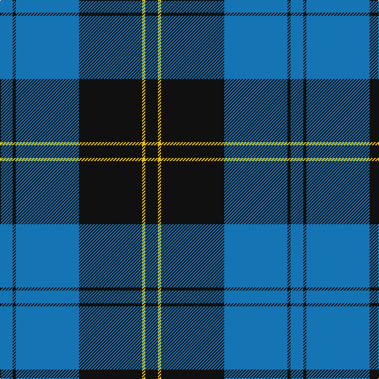

In pattern [BKBKYK](/patterns/bkbkyk/).

This was sourced from tartans-authority.  It is a [6 stripes tartan](/stripes/stripes6/).

Original link http://www.tartansauthority.com/tartan-ferret/display/6017/

## Thread count
B/16 K4 B80 K80 Y4 K/16

## Palette
Each colour and its ΔE from the base-6 reference it is a variant of.

| Colour | Shade | Base | ΔE (OKLab) |
|---|---|---|---|
| B | <code style="background-color:#1474B4;">#1474B4</code> `#1474B4` | B <code style="background-color:#2C4084;">#2C4084</code> | 0.15 |
| K | <code style="background-color:#101010;">#101010</code> `#101010` | K <code style="background-color:#000000;">#000000</code> | 0.17 |
| Y | <code style="background-color:#E8C000;">#E8C000</code> `#E8C000` | Y <code style="background-color:#E8C000;">#E8C000</code> | 0.00 |

# Sample pattern

## Nearest tartans

The nearest existing variants by ΔTartan distance.

1. [Ramsay Blue Hunting](/setts/s6/k8w4k56b60k2b6-b1474b4-k101010-wc0c0c0/) — ΔT 0.69
1. [Sorbie (Name)](/setts/s6/r4b4k68b68k4w4-b1474b4-k101010-rc80000-wfcfcfc/) — ΔT 1.10
1. [Slanj (Corporate)](/setts/s6/r8k56b6k6b50k6-b1474b4-k101010-r9c68a4/) — ΔT 1.21
1. [St Andrews, Earl of](/setts/s6/b52k28w5k3w2k10-b304080-k000030-we0e0e0/) — ΔT 1.26
1. [Micron](/setts/s6/k60b80y6b10w4b12-b1474b4-k101010-wfcfcfc-ye8c000/) — ΔT 1.31
1. [Bro-Spirit of Northmen (Corporate)](/setts/s5/r6k2b54k54w6-b1474b4-k101010-r880000-we0e0e0/) — ΔT 1.31
1. [Gracie](/setts/s8/g94r6g12b70y6b70g12r6-b1c0070-g006818-r880000-yd09800/) — ΔT 1.33
1. [Home (Clan)](/setts/s8/k72r6k6r6k18b72g6b4-b1474b4-g289c18-k101010-rc80000/) — ΔT 1.35
1. [Roxburgh, Green (District)](/setts/s8/b92w4b4w4b32g88r4b12-b1c0070-g006818-rc80000-wf8f8f8/) — ΔT 1.35
1. [Jon's Theme](/setts/s6/b2y4b6ba24b36w2-b010542-ba555b7c-wffffff-y9e8f00/) — ΔT 1.37

## Neighbour map

Every grey dot is one of 15726 variants placed by the first two principal components of the ΔTartan feature space (44% of its variance). Red is this tartan; blue dots are its nearest — click one to open its page.

<svg viewBox="0 0 640 380" role="img" style="max-width:100%;height:auto;border:1px solid #e0e0e0;border-radius:4px;display:block" xmlns="http://www.w3.org/2000/svg"><image href="/nn/cloud.v1.png" width="640" height="380"/><a href="/setts/s6/k8w4k56b60k2b6-b1474b4-k101010-wc0c0c0/"><circle cx="362.5" cy="175.7" r="4" fill="#3465a4"><title>Ramsay Blue Hunting</title></circle></a><a href="/setts/s6/r4b4k68b68k4w4-b1474b4-k101010-rc80000-wfcfcfc/"><circle cx="312.0" cy="170.7" r="4" fill="#3465a4"><title>Sorbie (Name)</title></circle></a><a href="/setts/s6/r8k56b6k6b50k6-b1474b4-k101010-r9c68a4/"><circle cx="320.9" cy="225.1" r="4" fill="#3465a4"><title>Slanj (Corporate)</title></circle></a><a href="/setts/s6/b52k28w5k3w2k10-b304080-k000030-we0e0e0/"><circle cx="365.2" cy="185.4" r="4" fill="#3465a4"><title>St Andrews, Earl of</title></circle></a><a href="/setts/s6/k60b80y6b10w4b12-b1474b4-k101010-wfcfcfc-ye8c000/"><circle cx="352.2" cy="173.5" r="4" fill="#3465a4"><title>Micron</title></circle></a><a href="/setts/s5/r6k2b54k54w6-b1474b4-k101010-r880000-we0e0e0/"><circle cx="300.1" cy="172.3" r="4" fill="#3465a4"><title>Bro-Spirit of Northmen (Corporate)</title></circle></a><a href="/setts/s8/g94r6g12b70y6b70g12r6-b1c0070-g006818-r880000-yd09800/"><circle cx="322.4" cy="185.9" r="4" fill="#3465a4"><title>Gracie</title></circle></a><a href="/setts/s8/k72r6k6r6k18b72g6b4-b1474b4-g289c18-k101010-rc80000/"><circle cx="314.6" cy="158.4" r="4" fill="#3465a4"><title>Home (Clan)</title></circle></a><a href="/setts/s8/b92w4b4w4b32g88r4b12-b1c0070-g006818-rc80000-wf8f8f8/"><circle cx="370.8" cy="155.0" r="4" fill="#3465a4"><title>Roxburgh, Green (District)</title></circle></a><a href="/setts/s6/b2y4b6ba24b36w2-b010542-ba555b7c-wffffff-y9e8f00/"><circle cx="363.0" cy="184.0" r="4" fill="#3465a4"><title>Jon's Theme</title></circle></a><circle cx="349.9" cy="197.9" r="5" fill="#c00000"/></svg>

ID: /setts/s6/b16k4b80k80y4k16-b1474b4-k101010-ye8c000/
