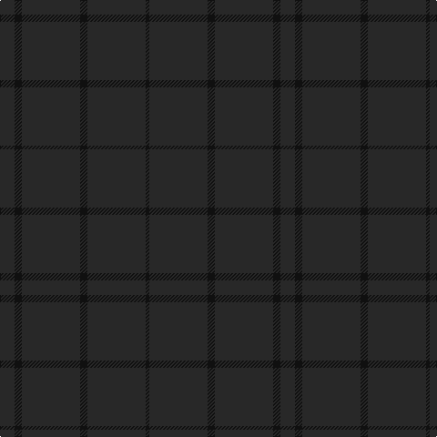

In pattern [BKBKBK](/patterns/bkbkbk/).

This was sourced from register-of-tartans.  It is a [6 stripes tartan](/stripes/stripes6/).

Original link https://www.tartanregister.gov.uk/tartanDetails.aspx?ref=5881

## Thread count
K/16 Ka8 K64 Ka8 K64 Ka/4

## Palette
Each colour and its ΔE from the base-6 reference it is a variant of.

| Colour | Shade | Base | ΔE (OKLab) |
|---|---|---|---|
| K | <code style="background-color:#282828;">#282828</code> `#282828` | B <code style="background-color:#2C4084;">#2C4084</code> | 0.17 |
| Ka | <code style="background-color:#101010;">#101010</code> `#101010` | K <code style="background-color:#000000;">#000000</code> | 0.17 |

# Sample pattern

ID: /setts/s6/b16k8b64k8b64k4-b282828-k101010/
