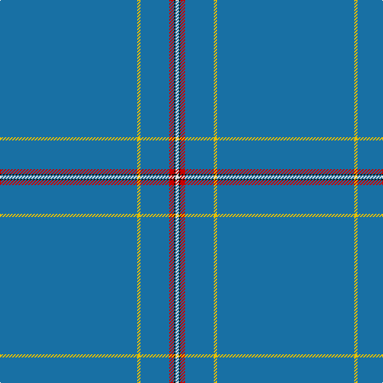

In pattern [BYBRKW](/patterns/bybrkw/).

This was sourced from register-of-tartans.  It is a [6 stripes tartan](/stripes/stripes6/).

Original link https://www.tartanregister.gov.uk/tartanDetails.aspx?ref=4789

## Thread count
B/172 Y4 B36 R6 K2 LN/4

## Palette
Each colour and its ΔE from the base-6 reference it is a variant of.

| Colour | Shade | Base | ΔE (OKLab) |
|---|---|---|---|
| B | <code style="background-color:#1870A4;">#1870A4</code> `#1870A4` | B <code style="background-color:#2C4084;">#2C4084</code> | 0.14 |
| K | <code style="background-color:#101010;">#101010</code> `#101010` | K <code style="background-color:#000000;">#000000</code> | 0.17 |
| LN | <code style="background-color:#E0E0E0;">#E0E0E0</code> `#E0E0E0` | W <code style="background-color:#F4F4F0;">#F4F4F0</code> | 0.06 |
| R | <code style="background-color:#C80000;">#C80000</code> `#C80000` | R <code style="background-color:#C80000;">#C80000</code> | 0.00 |
| Y | <code style="background-color:#E8C000;">#E8C000</code> `#E8C000` | Y <code style="background-color:#E8C000;">#E8C000</code> | 0.00 |

# Sample pattern

## Nearest tartans

The nearest existing variants by ΔTartan distance.

1. [Cullen (Christian Hill) (Personal)](/setts/s7/b16y4b16g14b114k6w2-b5f749c-g003c14-k101010-w98c8e8-ydc943c/) — ΔT 2.00
1. [Wylie (Name)](/setts/s6/b180y12b40r16k4w8-b587488-k101010-rc04c08-wfcfcfc-yfccc00/) — ΔT 2.58
1. [Eternity, Dedicated 2 Weddings](/setts/s5/b176r6y4k4ya2-b433e3b-k101010-r8c7853-yeec591-yab0b0b0/) — ΔT 2.68
1. [Cullen (Christian Hill)](/setts/s7/b16y4b16g14b114k6ba2-b202060-ba5c8ca8-g285800-k101010-yd09800/) — ΔT 2.79
1. [Norwich No.030](/setts/s6/b66g6r2b66g6r2-b2c2c80-g006818-rc80000/) — ΔT 2.93
1. [Lochaber Old](/setts/s7/b12r4b140r4b64ba4b8-b2c4084-ba3c82af-rdc0000/) — ΔT 2.94
1. [Wylie](/setts/s6/b180k12b40r16ka4w8-b587488-k000000-ka101010-rc04c08-wfcfcfc/) — ΔT 2.95
1. [RAAF #3](/setts/s9/b96w4b14w4b14w4b40ba22r4-b5c8ca8-ba2c2c80-rc80000-we0e0e0/) — ΔT 3.08
1. [European](/setts/s8/b140y8b6y8b14k4b4r14-b506878-k101010-rc80000-ye8c000/) — ΔT 3.10
1. [Eternity Fashion Tartan Tartan Number: 10214. Earliest known date: 01/02/2010 This tartan was designed for day wear grey tweed jackets. It has been shown in the Dedicated to Wedding magazine (April 2010). Perfection leads to eternity is the goal for all eternal marriage. See products available Copyright © Blair Urquhart, Comrie, 2015](/setts/s5/b176g6y4k4ka2-b5c5c5c-g604000-k101010-ka000000-ya08858/) — ΔT 3.12

## Neighbour map

Every grey dot is one of 15726 variants placed by the first two principal components of the ΔTartan feature space (44% of its variance). Red is this tartan; blue dots are its nearest — click one to open its page.

<svg viewBox="0 0 640 380" role="img" style="max-width:100%;height:auto;border:1px solid #e0e0e0;border-radius:4px;display:block" xmlns="http://www.w3.org/2000/svg"><image href="/nn/cloud.v1.png" width="640" height="380"/><a href="/setts/s7/b16y4b16g14b114k6w2-b5f749c-g003c14-k101010-w98c8e8-ydc943c/"><circle cx="626.0" cy="127.3" r="4" fill="#3465a4"><title>Cullen (Christian Hill) (Personal)</title></circle></a><a href="/setts/s6/b180y12b40r16k4w8-b587488-k101010-rc04c08-wfcfcfc-yfccc00/"><circle cx="621.4" cy="130.0" r="4" fill="#3465a4"><title>Wylie (Name)</title></circle></a><a href="/setts/s5/b176r6y4k4ya2-b433e3b-k101010-r8c7853-yeec591-yab0b0b0/"><circle cx="626.0" cy="148.8" r="4" fill="#3465a4"><title>Eternity, Dedicated 2 Weddings</title></circle></a><a href="/setts/s7/b16y4b16g14b114k6ba2-b202060-ba5c8ca8-g285800-k101010-yd09800/"><circle cx="626.0" cy="144.2" r="4" fill="#3465a4"><title>Cullen (Christian Hill)</title></circle></a><a href="/setts/s6/b66g6r2b66g6r2-b2c2c80-g006818-rc80000/"><circle cx="626.0" cy="218.1" r="4" fill="#3465a4"><title>Norwich No.030</title></circle></a><a href="/setts/s7/b12r4b140r4b64ba4b8-b2c4084-ba3c82af-rdc0000/"><circle cx="626.0" cy="211.6" r="4" fill="#3465a4"><title>Lochaber Old</title></circle></a><a href="/setts/s6/b180k12b40r16ka4w8-b587488-k000000-ka101010-rc04c08-wfcfcfc/"><circle cx="597.6" cy="122.0" r="4" fill="#3465a4"><title>Wylie</title></circle></a><a href="/setts/s9/b96w4b14w4b14w4b40ba22r4-b5c8ca8-ba2c2c80-rc80000-we0e0e0/"><circle cx="572.4" cy="161.6" r="4" fill="#3465a4"><title>RAAF #3</title></circle></a><a href="/setts/s8/b140y8b6y8b14k4b4r14-b506878-k101010-rc80000-ye8c000/"><circle cx="625.9" cy="129.1" r="4" fill="#3465a4"><title>European</title></circle></a><a href="/setts/s5/b176g6y4k4ka2-b5c5c5c-g604000-k101010-ka000000-ya08858/"><circle cx="626.0" cy="166.2" r="4" fill="#3465a4"><title>Eternity Fashion Tartan Tartan Number: 10214. Earliest known date: 01/02/2010 This tartan was designed for day wear grey tweed jackets. It has been shown in the Dedicated to Wedding magazine (April 2010). Perfection leads to eternity is the goal for all eternal marriage. See products available Copyright © Blair Urquhart, Comrie, 2015</title></circle></a><circle cx="626.0" cy="140.9" r="5" fill="#c00000"/></svg>

ID: /setts/s6/b172y4b36r6k2w4-b1870a4-k101010-rc80000-we0e0e0-ye8c000/
