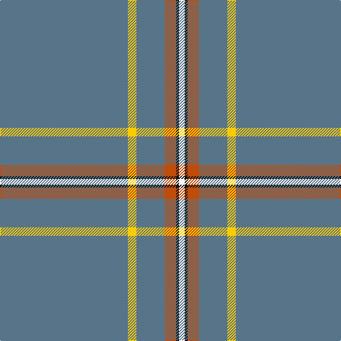

In pattern [BYBRKW](/patterns/bybrkw/).

This was sourced from tartans-authority.  It is a [6 stripes tartan](/stripes/stripes6/).

Original link http://www.tartansauthority.com/tartan-ferret/display/2465/

## Thread count
B/180 Y12 B40 DO16 K4 W/8

## Palette
Each colour and its ΔE from the base-6 reference it is a variant of.

| Colour | Shade | Base | ΔE (OKLab) |
|---|---|---|---|
| B | <code style="background-color:#587488;">#587488</code> `#587488` | B <code style="background-color:#2C4084;">#2C4084</code> | 0.17 |
| DO | <code style="background-color:#C04C08;">#C04C08</code> `#C04C08` | R <code style="background-color:#C80000;">#C80000</code> | 0.08 |
| K | <code style="background-color:#101010;">#101010</code> `#101010` | K <code style="background-color:#000000;">#000000</code> | 0.17 |
| W | <code style="background-color:#FCFCFC;">#FCFCFC</code> `#FCFCFC` | W <code style="background-color:#F4F4F0;">#F4F4F0</code> | 0.03 |
| Y | <code style="background-color:#FCCC00;">#FCCC00</code> `#FCCC00` | Y <code style="background-color:#E8C000;">#E8C000</code> | 0.04 |

# Sample pattern

## Nearest tartans

The nearest existing variants by ΔTartan distance.

1. [Wylie](/setts/s6/b180k12b40r16ka4w8-b587488-k000000-ka101010-rc04c08-wfcfcfc/) — ΔT 0.93
1. [Cullen (Christian Hill) (Personal)](/setts/s7/b16y4b16g14b114k6w2-b5f749c-g003c14-k101010-w98c8e8-ydc943c/) — ΔT 1.03
1. [European](/setts/s8/b140y8b6y8b14k4b4r14-b506878-k101010-rc80000-ye8c000/) — ΔT 1.34
1. [Reece (Name)](/setts/s7/w4y88b16y4b4y6r2-b2c2c80-rc80000-we0e0e0-ya08858/) — ΔT 1.83
1. [RAAF #3](/setts/s9/b96w4b14w4b14w4b40ba22r4-b5c8ca8-ba2c2c80-rc80000-we0e0e0/) — ΔT 1.90
1. [St Giles Check Tartan Tartan Number: 387. Earliest known date: 1984 St Giles Church is in the Royal Mile, Edinburgh See products available Copyright © Blair Urquhart, Comrie, 2015](/setts/s7/b6r2w2r50w2r2ba6-b2c2c80-ba780078-r888888-we0e0e0/) — ΔT 1.91
1. [St. Giles Check (Corporate)](/setts/s7/b12r4w4r100w4r4ba12-b2c2c80-ba780078-r888888-wfcfcfc/) — ΔT 1.97
1. [St Giles, Check](/setts/s7/b6g2w2g50w2g2ba6-b304080-ba800080-g808080-we0e0e0/) — ΔT 1.97
1. [Highland Dusk (Fashion)](/setts/s13/b86ba4b4ba2b2r22b4ba4b2b2b40w8b14-b586478-ba2c2c80-re87878-we4e0b8/) — ΔT 2.00
1. [St. Giles Check](/setts/s12/b12r4w4r100w4r4ba12r4w4r100w4r4-b2c2c80-ba780078-r888888-wfcfcfc/) — ΔT 2.02

## Neighbour map

Every grey dot is one of 15726 variants placed by the first two principal components of the ΔTartan feature space (44% of its variance). Red is this tartan; blue dots are its nearest — click one to open its page.

<svg viewBox="0 0 640 380" role="img" style="max-width:100%;height:auto;border:1px solid #e0e0e0;border-radius:4px;display:block" xmlns="http://www.w3.org/2000/svg"><image href="/nn/cloud.v1.png" width="640" height="380"/><a href="/setts/s6/b180k12b40r16ka4w8-b587488-k000000-ka101010-rc04c08-wfcfcfc/"><circle cx="597.6" cy="122.0" r="4" fill="#3465a4"><title>Wylie</title></circle></a><a href="/setts/s7/b16y4b16g14b114k6w2-b5f749c-g003c14-k101010-w98c8e8-ydc943c/"><circle cx="626.0" cy="127.3" r="4" fill="#3465a4"><title>Cullen (Christian Hill) (Personal)</title></circle></a><a href="/setts/s8/b140y8b6y8b14k4b4r14-b506878-k101010-rc80000-ye8c000/"><circle cx="625.9" cy="129.1" r="4" fill="#3465a4"><title>European</title></circle></a><a href="/setts/s7/w4y88b16y4b4y6r2-b2c2c80-rc80000-we0e0e0-ya08858/"><circle cx="589.0" cy="116.9" r="4" fill="#3465a4"><title>Reece (Name)</title></circle></a><a href="/setts/s9/b96w4b14w4b14w4b40ba22r4-b5c8ca8-ba2c2c80-rc80000-we0e0e0/"><circle cx="572.4" cy="161.6" r="4" fill="#3465a4"><title>RAAF #3</title></circle></a><a href="/setts/s7/b6r2w2r50w2r2ba6-b2c2c80-ba780078-r888888-we0e0e0/"><circle cx="556.3" cy="141.0" r="4" fill="#3465a4"><title>St Giles Check Tartan Tartan Number: 387. Earliest known date: 1984 St Giles Church is in the Royal Mile, Edinburgh See products available Copyright © Blair Urquhart, Comrie, 2015</title></circle></a><a href="/setts/s7/b12r4w4r100w4r4ba12-b2c2c80-ba780078-r888888-wfcfcfc/"><circle cx="544.0" cy="135.5" r="4" fill="#3465a4"><title>St. Giles Check (Corporate)</title></circle></a><a href="/setts/s7/b6g2w2g50w2g2ba6-b304080-ba800080-g808080-we0e0e0/"><circle cx="573.1" cy="149.3" r="4" fill="#3465a4"><title>St Giles, Check</title></circle></a><a href="/setts/s13/b86ba4b4ba2b2r22b4ba4b2b2b40w8b14-b586478-ba2c2c80-re87878-we4e0b8/"><circle cx="581.3" cy="98.4" r="4" fill="#3465a4"><title>Highland Dusk (Fashion)</title></circle></a><a href="/setts/s12/b12r4w4r100w4r4ba12r4w4r100w4r4-b2c2c80-ba780078-r888888-wfcfcfc/"><circle cx="610.8" cy="121.2" r="4" fill="#3465a4"><title>St. Giles Check</title></circle></a><circle cx="621.4" cy="130.0" r="5" fill="#c00000"/></svg>

ID: /setts/s6/b180y12b40r16k4w8-b587488-k101010-rc04c08-wfcfcfc-yfccc00/
