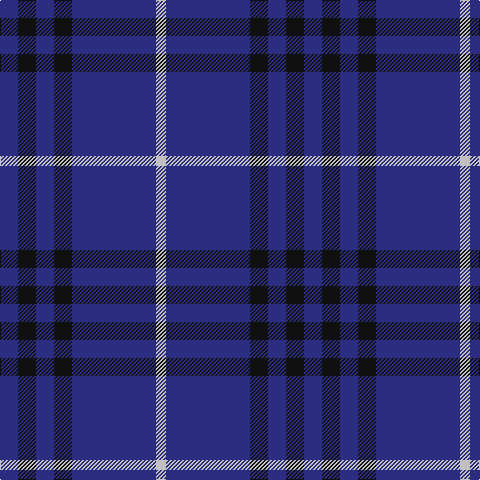

In pattern [BKBKBW](/patterns/bkbkbw/).

This was sourced from register-of-tartans.  It is a [6 stripes tartan](/stripes/stripes6/).

Original link https://www.tartanregister.gov.uk/tartanDetails.aspx?ref=945

## Thread count
DB/18 K18 DB18 K18 DB84 N/10

## Palette
Each colour and its ΔE from the base-6 reference it is a variant of.

| Colour | Shade | Base | ΔE (OKLab) |
|---|---|---|---|
| DB | <code style="background-color:#2C2C80;">#2C2C80</code> `#2C2C80` | B <code style="background-color:#2A418A;">#2A418A</code> | 0.06 |
| K | <code style="background-color:#101010;">#101010</code> `#101010` | K <code style="background-color:#000000;">#000000</code> | 0.17 |
| N | <code style="background-color:#C0C0C0;">#C0C0C0</code> `#C0C0C0` | W <code style="background-color:#F7F7F7;">#F7F7F7</code> | 0.17 |

# Sample pattern

## Nearest tartans

The nearest existing variants by ΔTartan distance.

1. [Dollar Academy (1930s) (Corporate)](/setts/s6/b18k18b18k18b84w10-b2c2c80-k101010-we0e0e0/) — ΔT 0.52
1. [Oxford University](/setts/s6/g32b118y8b118g32ba18-b1c0070-ba2c2c80-g006818-yc4bc68/) — ΔT 1.31
1. [Gulfmark (Corporate)](/setts/s5/b144ba12b24ba34w12-b2c2c80-ba2888c4-we0e0e0/) — ΔT 1.34
1. [Scottish Nuclear](/setts/s6/b36k16w4k16b36r4-b2c2c80-k101010-rc80000-wc0c0c0/) — ΔT 1.52
1. [JetBlue (Corporate)](/setts/s7/b8w6ba12b80ba16b24g6-b2c2c80-ba1474b4-g289c18-wfcfcfc/) — ΔT 1.55
1. [Brooks Brothers Tattersall Blue](/setts/s5/r4b36y8b36y4-b202060-r880000-ya08858/) — ΔT 1.56
1. [Pringle, James (Fashion)](/setts/s7/b40ba4b6ba4b28g36b8-b2c2c80-ba64008c-g146400/) — ΔT 1.58
1. [GulfMark](/setts/s5/b144ba12b24ba34w12-b3c4266-ba6675a0-wffffff/) — ΔT 1.61
1. [Dollar, Academy](/setts/s6/b18k18b18k18b84w10-b304080-k000000-we0e0e0/) — ΔT 1.66
1. [Gallaecia - Galicia National](/setts/s5/b48ba26b8ba8w4-b141e46-ba07648c-we0e0e0/) — ΔT 1.70

## Neighbour map

Every grey dot is one of 15726 variants placed by the first two principal components of the ΔTartan feature space (44% of its variance). Red is this tartan; blue dots are its nearest — click one to open its page.

<svg viewBox="0 0 640 380" role="img" style="max-width:100%;height:auto;border:1px solid #e0e0e0;border-radius:4px;display:block" xmlns="http://www.w3.org/2000/svg"><image href="/nn/cloud.v1.png" width="640" height="380"/><a href="/setts/s6/b18k18b18k18b84w10-b2c2c80-k101010-we0e0e0/"><circle cx="447.4" cy="246.7" r="4" fill="#3465a4"><title>Dollar Academy (1930s) (Corporate)</title></circle></a><a href="/setts/s6/g32b118y8b118g32ba18-b1c0070-ba2c2c80-g006818-yc4bc68/"><circle cx="452.5" cy="226.1" r="4" fill="#3465a4"><title>Oxford University</title></circle></a><a href="/setts/s5/b144ba12b24ba34w12-b2c2c80-ba2888c4-we0e0e0/"><circle cx="495.2" cy="229.5" r="4" fill="#3465a4"><title>Gulfmark (Corporate)</title></circle></a><a href="/setts/s6/b36k16w4k16b36r4-b2c2c80-k101010-rc80000-wc0c0c0/"><circle cx="380.6" cy="252.6" r="4" fill="#3465a4"><title>Scottish Nuclear</title></circle></a><a href="/setts/s7/b8w6ba12b80ba16b24g6-b2c2c80-ba1474b4-g289c18-wfcfcfc/"><circle cx="468.9" cy="196.4" r="4" fill="#3465a4"><title>JetBlue (Corporate)</title></circle></a><a href="/setts/s5/r4b36y8b36y4-b202060-r880000-ya08858/"><circle cx="544.6" cy="266.1" r="4" fill="#3465a4"><title>Brooks Brothers Tattersall Blue</title></circle></a><a href="/setts/s7/b40ba4b6ba4b28g36b8-b2c2c80-ba64008c-g146400/"><circle cx="433.0" cy="257.4" r="4" fill="#3465a4"><title>Pringle, James (Fashion)</title></circle></a><a href="/setts/s5/b144ba12b24ba34w12-b3c4266-ba6675a0-wffffff/"><circle cx="511.5" cy="233.0" r="4" fill="#3465a4"><title>GulfMark</title></circle></a><a href="/setts/s6/b18k18b18k18b84w10-b304080-k000000-we0e0e0/"><circle cx="415.6" cy="234.0" r="4" fill="#3465a4"><title>Dollar, Academy</title></circle></a><a href="/setts/s5/b48ba26b8ba8w4-b141e46-ba07648c-we0e0e0/"><circle cx="395.2" cy="249.4" r="4" fill="#3465a4"><title>Gallaecia - Galicia National</title></circle></a><circle cx="463.0" cy="253.6" r="5" fill="#c00000"/></svg>

ID: /setts/s6/b18k18b18k18b84w10-b2c2c80-k101010-wc0c0c0/
