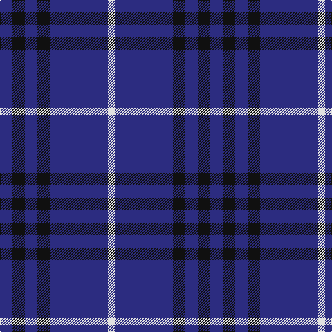

In pattern [BKBKBW](/patterns/bkbkbw/).

This was sourced from tartans-authority.  It is a [6 stripes tartan](/stripes/stripes6/).

Original link http://www.tartansauthority.com/tartan-ferret/display/290/

## Attestations

This cloth appears in 2 source records; the oldest owns this page.

- 1930s — Dollar Academy (1930s) (Corporate) (tartans-authority, [record](http://www.tartansauthority.com/tartan-ferret/display/290/))
- undated — Dollar Academy Corporate Tartan Tartan Number: 290. Earliest known date: pre 2003 No information on the original of this school tartan. See products available Copyright © Blair Urquhart, Comrie, 2015 (house-of-tartan, [record](http://www.house-of-tartan.scotland.net/house/TartanViewjs.asp?colr=Def&tnam=290))

## Thread count
DB/18 K18 DB18 K18 DB84 LN/10

## Palette
Each colour and its ΔE from the base-6 reference it is a variant of.

| Colour | Shade | Base | ΔE (OKLab) |
|---|---|---|---|
| DB | <code style="background-color:#2C2C80;">#2C2C80</code> `#2C2C80` | B <code style="background-color:#2C4084;">#2C4084</code> | 0.05 |
| K | <code style="background-color:#101010;">#101010</code> `#101010` | K <code style="background-color:#000000;">#000000</code> | 0.17 |
| LN | <code style="background-color:#E0E0E0;">#E0E0E0</code> `#E0E0E0` | W <code style="background-color:#F4F4F0;">#F4F4F0</code> | 0.06 |

# Sample pattern

ID: /setts/s6/b18k18b18k18b84w10-b2c2c80-k101010-we0e0e0/
