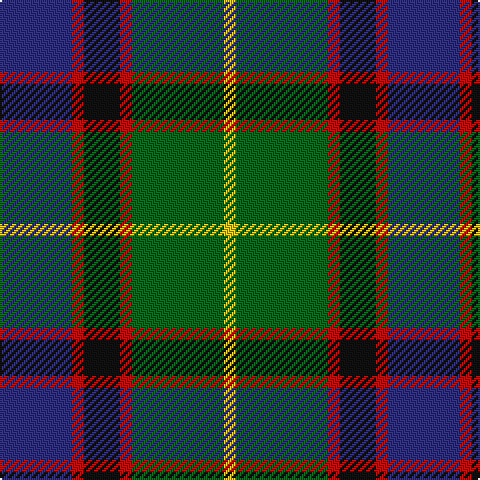

In pattern [BRKRGY](/patterns/brkrgy/).

This was sourced from tartans-authority.  It is a [6 stripes tartan](/stripes/stripes6/).

Original link http://www.tartansauthority.com/tartan-ferret/display/2350/

## Attestations

This cloth appears in 2 source records; the oldest owns this page.

- September 1996 — Royal College of Physicians (Corp) (tartans-authority, [record](http://www.tartansauthority.com/tartan-ferret/display/2350/))
- 01/01/1997 — Royal College of Physicians of Edinburgh (register-of-tartans, [record](https://www.tartanregister.gov.uk/tartanDetails.aspx?ref=3597))

## Thread count
DB/36 R6 K18 R6 G46 Y/6

## Palette
Each colour and its ΔE from the base-6 reference it is a variant of.

| Colour | Shade | Base | ΔE (OKLab) |
|---|---|---|---|
| DB | <code style="background-color:#2C2C80;">#2C2C80</code> `#2C2C80` | B <code style="background-color:#2A418A;">#2A418A</code> | 0.06 |
| G | <code style="background-color:#006818;">#006818</code> `#006818` | G <code style="background-color:#006100;">#006100</code> | 0.02 |
| K | <code style="background-color:#101010;">#101010</code> `#101010` | K <code style="background-color:#000000;">#000000</code> | 0.17 |
| R | <code style="background-color:#C80000;">#C80000</code> `#C80000` | R <code style="background-color:#CC0000;">#CC0000</code> | 0.01 |
| Y | <code style="background-color:#E8C000;">#E8C000</code> `#E8C000` | Y <code style="background-color:#F2BF00;">#F2BF00</code> | 0.02 |

# Sample pattern

## Nearest tartans

The nearest existing variants by ΔTartan distance.

1. [Unidentified No 79](/setts/s6/r5g18y2k14b5k4~b3c82af-g005020-k101010-rdc0000-ye8c000~x2/) — ΔT 0.74
1. [MacLeod of Assynt Clan Tartan Tartan Number: 1582. Earliest known date: 1906 In a portrait of the 24th chief, John Norman, painted posthumously (perhaps by Julius Jacobson, born 1811) in 1835, John Norman is shown in the costume worn for the visit of George IV to Edinburgh in 1822. The snuff-box may be evidence that the Vestiarium 'loud' design, which is very similar to that of the snuff box, had particular significance for John Norman or his wife, Ann Stephenson. (Ruairidh MacLeod, Tartans of Clan MacLeod, 1990.) See products available Copyright © Blair Urquhart, Comrie, 2015](/setts/s6/r3k2g15k10b20y2~b2c2c80-g006818-k101010-rc80000-ye8c000~x2/) — ΔT 0.77
1. [Mantle (Personal)](/setts/s8/g3b16w2k14g18r3g2r3~b2c2c80-g006818-k101010-r880000-we0e0e0~x2/) — ΔT 0.79
1. [Nelson Mandela (Personal)](/setts/s7/b27g5y8k20y3g15r3~b202060-g006818-k101010-rc80000-yd8b000~x2/) — ΔT 0.84
1. [Galbraith](/setts/s6/k2g17k16r2b17w2~b2c2c80-g006818-k101010-rc80000-wfcfcfc~x2/) — ΔT 0.85
1. [Leslie Hunting Clan Tartan Tartan Number: 1113. Earliest known date: 1810-15 Said to have been worn by George 14th Earl of Rothes who died in 1841. This sett is shown by Smibert (1850) and by W & A Smith (1850) but without the definition of 'Hunting'. This sett is very similar to Duncan, the difference lies in the broad black present in the Leslie Hunting which is green in the Duncan See products available Copyright © Blair Urquhart, Comrie, 2015](/setts/s6/r2b8k8w1g8k1~b2c2c80-g006818-k101010-rc80000-we0e0e0~x2/) — ΔT 0.86
1. [Wilson's No.111](/setts/s8/b19w2g12ba3k4ba3g12w2~b440044-ba5c8ca8-g006818-k101010-we0e0e0~x2/) — ΔT 0.86
1. [Leslie Hunting](/setts/s6/k1g8w1k8b8r1~b202060-g006818-k101010-rc80000-we0e0e0~x4/) — ΔT 0.86
1. [Syme (Clan)](/setts/s6/k1g8w1k8b8r1~b1c1c50-g408060-k101010-rc80000-wf8f8f8~x4/) — ΔT 0.87
1. [MacLean, Donald (Personal)](/setts/s7/g16w3g3k10b12r2b3~b1c0070-g006818-k101010-r880000-wa8ace8~x2/) — ΔT 0.87

## Neighbour map

Every grey dot is one of 15726 variants placed by the first two principal components of the ΔTartan feature space (44% of its variance). Red is this tartan; blue dots are its nearest — click one to open its page.

<svg viewBox="0 0 640 380" role="img" style="max-width:100%;height:auto;border:1px solid #e0e0e0;border-radius:4px;display:block" xmlns="http://www.w3.org/2000/svg"><image href="/nn/cloud.v1.png" width="640" height="380"/><a href="/setts/s6/r5g18y2k14b5k4~b3c82af-g005020-k101010-rdc0000-ye8c000~x2/"><circle cx="168.0" cy="210.8" r="4" fill="#3465a4"><title>Unidentified No 79</title></circle></a><a href="/setts/s6/r3k2g15k10b20y2~b2c2c80-g006818-k101010-rc80000-ye8c000~x2/"><circle cx="182.8" cy="204.3" r="4" fill="#3465a4"><title>MacLeod of Assynt Clan Tartan Tartan Number: 1582. Earliest known date: 1906 In a portrait of the 24th chief, John Norman, painted posthumously (perhaps by Julius Jacobson, born 1811) in 1835, John Norman is shown in the costume worn for the visit of George IV to Edinburgh in 1822. The snuff-box may be evidence that the Vestiarium 'loud' design, which is very similar to that of the snuff box, had particular significance for John Norman or his wife, Ann Stephenson. (Ruairidh MacLeod, Tartans of Clan MacLeod, 1990.) See products available Copyright © Blair Urquhart, Comrie, 2015</title></circle></a><a href="/setts/s8/g3b16w2k14g18r3g2r3~b2c2c80-g006818-k101010-r880000-we0e0e0~x2/"><circle cx="171.3" cy="191.2" r="4" fill="#3465a4"><title>Mantle (Personal)</title></circle></a><a href="/setts/s7/b27g5y8k20y3g15r3~b202060-g006818-k101010-rc80000-yd8b000~x2/"><circle cx="123.9" cy="196.8" r="4" fill="#3465a4"><title>Nelson Mandela (Personal)</title></circle></a><a href="/setts/s6/k2g17k16r2b17w2~b2c2c80-g006818-k101010-rc80000-wfcfcfc~x2/"><circle cx="147.7" cy="209.8" r="4" fill="#3465a4"><title>Galbraith</title></circle></a><a href="/setts/s6/r2b8k8w1g8k1~b2c2c80-g006818-k101010-rc80000-we0e0e0~x2/"><circle cx="135.7" cy="216.9" r="4" fill="#3465a4"><title>Leslie Hunting Clan Tartan Tartan Number: 1113. Earliest known date: 1810-15 Said to have been worn by George 14th Earl of Rothes who died in 1841. This sett is shown by Smibert (1850) and by W &amp; A Smith (1850) but without the definition of 'Hunting'. This sett is very similar to Duncan, the difference lies in the broad black present in the Leslie Hunting which is green in the Duncan See products available Copyright © Blair Urquhart, Comrie, 2015</title></circle></a><a href="/setts/s8/b19w2g12ba3k4ba3g12w2~b440044-ba5c8ca8-g006818-k101010-we0e0e0~x2/"><circle cx="180.3" cy="182.0" r="4" fill="#3465a4"><title>Wilson's No.111</title></circle></a><a href="/setts/s6/k1g8w1k8b8r1~b202060-g006818-k101010-rc80000-we0e0e0~x4/"><circle cx="157.1" cy="217.0" r="4" fill="#3465a4"><title>Leslie Hunting</title></circle></a><a href="/setts/s6/k1g8w1k8b8r1~b1c1c50-g408060-k101010-rc80000-wf8f8f8~x4/"><circle cx="144.8" cy="209.8" r="4" fill="#3465a4"><title>Syme (Clan)</title></circle></a><a href="/setts/s7/g16w3g3k10b12r2b3~b1c0070-g006818-k101010-r880000-wa8ace8~x2/"><circle cx="160.7" cy="211.6" r="4" fill="#3465a4"><title>MacLean, Donald (Personal)</title></circle></a><circle cx="165.6" cy="208.1" r="5" fill="#c00000"/></svg>

ID: /setts/s6/b18r3k9r3g23y3~b2c2c80-g006818-k101010-rc80000-ye8c000~x2/
