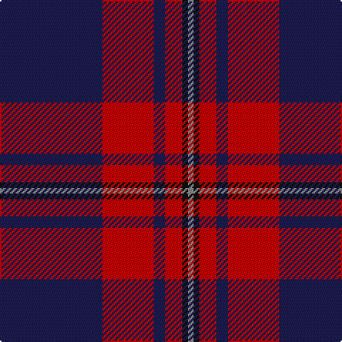

In pattern [BRBRKR](/patterns/brbrkr/).

This was sourced from register-of-tartans.  It is a [6 stripes tartan](/stripes/stripes6/).

Original link https://www.tartanregister.gov.uk/tartanDetails.aspx?ref=5690

## Attestations

This cloth appears in 2 source records; the oldest owns this page.

- undated — MacGregor, Modern (register-of-tartans, [record](https://www.tartanregister.gov.uk/tartanDetails.aspx?ref=5690))
- c2004 — MacGregor - 2004 (Pipe Band) (tartans-authority, [record](http://www.tartansauthority.com/tartan-ferret/display/7691/))

## Thread count
DB/72 R36 DB8 R12 K4 N/4

## Palette
Each colour and its ΔE from the base-6 reference it is a variant of.

| Colour | Shade | Base | ΔE (OKLab) |
|---|---|---|---|
| DB | <code style="background-color:#1C1C50;">#1C1C50</code> `#1C1C50` | B <code style="background-color:#2A418A;">#2A418A</code> | 0.14 |
| K | <code style="background-color:#101010;">#101010</code> `#101010` | K <code style="background-color:#000000;">#000000</code> | 0.17 |
| N | <code style="background-color:#888888;">#888888</code> `#888888` | R <code style="background-color:#CC0000;">#CC0000</code> | 0.24 |
| R | <code style="background-color:#C80000;">#C80000</code> `#C80000` | R <code style="background-color:#CC0000;">#CC0000</code> | 0.01 |

# Sample pattern

## Nearest tartans

The nearest existing variants by ΔTartan distance.

1. [Clan Gregor Tartan Tartan Number: 3089. Earliest known date: See products available Copyright © Blair Urquhart, Comrie, 2015](/setts/s6/b25r8b3r4k1w3~b38356a-k080808-rc80000-we0e0e0~x2/) — ΔT 0.94
1. [Robinson Dress (Pendleton) #1](/setts/s6/g1b16r7k1r7k1~b2c2c80-g006818-k101010-rc80000~x4/) — ΔT 1.13
1. [Robinson Dress Dress Clan Tartan Tartan Number: 739. Earliest known date: pre 2003 Colour variation of 'MacQueen' See products available Copyright © Blair Urquhart, Comrie, 2015](/setts/s6/g1b16r7k1r7k1~b2c2c80-g006818-k101010-rc80000~x2/) — ΔT 1.13
1. [Robinson, dress](/setts/s6/g1b16r7k1r7k1~b304080-g008000-k000000-rc00000~x2/) — ΔT 1.15
1. [Heritage of Wales (Fashion)](/setts/s7/r10b4r6b30k10b5w2~b2c2c80-k101010-rc80000-we0e0e0~x2/) — ΔT 1.22
1. [Ayllu Thuban (Corporate)](/setts/s5/b46k6g9y9r4~b440044-g006818-k101010-rc80000-ydc943c/) — ΔT 1.28
1. [Ikelman #4 (Personal)](/setts/s7/r10b15g2b2w1b1w1~b1c0070-g006818-r880000-we0e0e0~x4/) — ΔT 1.32
1. [Doten (2013)](/setts/s5/r14y6b38k3g2~b202060-g006818-k101010-rc80000-yb8b8b8~x2/) — ΔT 1.35
1. [Lothian Buses (Corporate?)](/setts/s6/w2b15r3g3r3b1~b2c2c80-g006818-rc80000-we0e0e0~x8/) — ΔT 1.39
1. [Calgary Firefighters](/setts/s5/g4k48g16r12b3~b4876ff-g696969-k101010-rdb2929~x2/) — ΔT 1.42

## Neighbour map

Every grey dot is one of 15726 variants placed by the first two principal components of the ΔTartan feature space (44% of its variance). Red is this tartan; blue dots are its nearest — click one to open its page.

<svg viewBox="0 0 640 380" role="img" style="max-width:100%;height:auto;border:1px solid #e0e0e0;border-radius:4px;display:block" xmlns="http://www.w3.org/2000/svg"><image href="/nn/cloud.v1.png" width="640" height="380"/><a href="/setts/s6/b25r8b3r4k1w3~b38356a-k080808-rc80000-we0e0e0~x2/"><circle cx="415.5" cy="160.9" r="4" fill="#3465a4"><title>Clan Gregor Tartan Tartan Number: 3089. Earliest known date: See products available Copyright © Blair Urquhart, Comrie, 2015</title></circle></a><a href="/setts/s6/g1b16r7k1r7k1~b2c2c80-g006818-k101010-rc80000~x4/"><circle cx="327.9" cy="183.4" r="4" fill="#3465a4"><title>Robinson Dress (Pendleton) #1</title></circle></a><a href="/setts/s6/g1b16r7k1r7k1~b2c2c80-g006818-k101010-rc80000~x2/"><circle cx="327.9" cy="183.4" r="4" fill="#3465a4"><title>Robinson Dress Dress Clan Tartan Tartan Number: 739. Earliest known date: pre 2003 Colour variation of 'MacQueen' See products available Copyright © Blair Urquhart, Comrie, 2015</title></circle></a><a href="/setts/s6/g1b16r7k1r7k1~b304080-g008000-k000000-rc00000~x2/"><circle cx="323.7" cy="182.8" r="4" fill="#3465a4"><title>Robinson, dress</title></circle></a><a href="/setts/s7/r10b4r6b30k10b5w2~b2c2c80-k101010-rc80000-we0e0e0~x2/"><circle cx="338.3" cy="188.2" r="4" fill="#3465a4"><title>Heritage of Wales (Fashion)</title></circle></a><a href="/setts/s5/b46k6g9y9r4~b440044-g006818-k101010-rc80000-ydc943c/"><circle cx="345.4" cy="184.3" r="4" fill="#3465a4"><title>Ayllu Thuban (Corporate)</title></circle></a><a href="/setts/s7/r10b15g2b2w1b1w1~b1c0070-g006818-r880000-we0e0e0~x4/"><circle cx="338.0" cy="171.5" r="4" fill="#3465a4"><title>Ikelman #4 (Personal)</title></circle></a><a href="/setts/s5/r14y6b38k3g2~b202060-g006818-k101010-rc80000-yb8b8b8~x2/"><circle cx="346.4" cy="165.2" r="4" fill="#3465a4"><title>Doten (2013)</title></circle></a><a href="/setts/s6/w2b15r3g3r3b1~b2c2c80-g006818-rc80000-we0e0e0~x8/"><circle cx="340.0" cy="179.0" r="4" fill="#3465a4"><title>Lothian Buses (Corporate?)</title></circle></a><a href="/setts/s5/g4k48g16r12b3~b4876ff-g696969-k101010-rdb2929~x2/"><circle cx="340.6" cy="195.1" r="4" fill="#3465a4"><title>Calgary Firefighters</title></circle></a><circle cx="389.4" cy="177.9" r="5" fill="#c00000"/></svg>

ID: /setts/s6/b18r9b2r3k1ra1~b1c1c50-k101010-rc80000-ra888888~x4/
