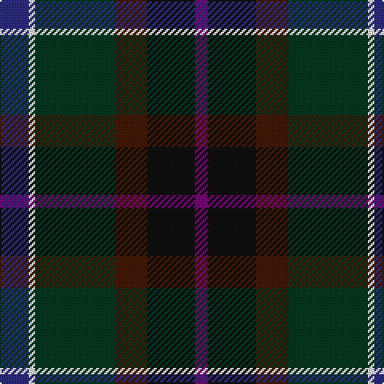

In pattern [BKBGWB](/patterns/bkbgwb/).

This was sourced from tartans-authority.  It is a [6 stripes tartan](/stripes/stripes6/).

Original link http://www.tartansauthority.com/tartan-ferret/display/11185/

## Thread count
DB/18 W4 DG50 DR20 K30 P/8

## Palette
Each colour and its ΔE from the base-6 reference it is a variant of.

| Colour | Shade | Base | ΔE (OKLab) |
|---|---|---|---|
| DB | <code style="background-color:#2C2C80;">#2C2C80</code> `#2C2C80` | B <code style="background-color:#2C4084;">#2C4084</code> | 0.05 |
| DG | <code style="background-color:#003820;">#003820</code> `#003820` | G <code style="background-color:#006400;">#006400</code> | 0.16 |
| DR | <code style="background-color:#441800;">#441800</code> `#441800` | B <code style="background-color:#2C4084;">#2C4084</code> | 0.22 |
| K | <code style="background-color:#101010;">#101010</code> `#101010` | K <code style="background-color:#000000;">#000000</code> | 0.17 |
| P | <code style="background-color:#780078;">#780078</code> `#780078` | B <code style="background-color:#2C4084;">#2C4084</code> | 0.16 |
| W | <code style="background-color:#FCFCFC;">#FCFCFC</code> `#FCFCFC` | W <code style="background-color:#F4F4F0;">#F4F4F0</code> | 0.03 |

# Sample pattern

## Nearest tartans

The nearest existing variants by ΔTartan distance.

1. [Meeson Hunting](/setts/s6/k52b20ba38r12y4bb18-b646464-ba184458-bb105088-k101010-r880000-yc89800/) — ΔT 0.58
1. [Meeson Hunting Name Tartan Tartan Number: 6027. Earliest known date: 2007 Hunting version. The black and gray were originally woven with a melange or marled yarn. See products available Copyright © Blair Urquhart, Comrie, 2015](/setts/s6/k52g20b38r12y4ba18-b184458-ba105088-g787478-k101010-r880000-yc4a820/) — ΔT 0.84
1. [Staley (2014)](/setts/s6/b18w4ba50bb20k30bc8-b2c4084-ba002814-bb441800-bc3d1130-k101010-wf8f4d0/) — ΔT 0.84
1. [McHale, Barry Name Tartan Tartan Number: 10708. Earliest known date: 27 September 2012 Barry McHale commissioned the production of this tartan to be worn at his wedding. It may be worn by any of his McHale relatives. See products available Copyright © Blair Urquhart, Comrie, 2015](/setts/s6/b30k20ba60g22w6y10-b3f4b60-ba3f4441-g4e3d20-k120a01-wf7f1e8-y6aa28c/) — ΔT 0.99
1. [Cowie](/setts/s6/r6b48k14ba22g22y4-b003c64-ba2c2c80-g006818-k101010-rc80000-ye8c000/) — ΔT 1.06
1. [Haughfoot (Commemorative)](/setts/s6/g8ga48b30ba8k30r8-b14283c-ba5c8ca8-g789484-ga003820-k101010-rc80000/) — ΔT 1.20
1. [Ancient Atlantic (Fashion)](/setts/s6/w6b34ba32bb4g34y4-b1c0070-ba441800-bb14283c-g003820-wc0c0c0-yd09800/) — ΔT 1.24
1. [Waterford, County (District)](/setts/s6/g48y4ga32b14ba32r10-b202060-ba441800-g003820-ga5c6428-rc80000-yd09800/) — ΔT 1.27
1. [Lenaghan (Personal)](/setts/s7/b20g10ga10k2y4k2ba20-b202060-ba2c2c80-g003820-ga006818-k101010-ye8c000/) — ΔT 1.38
1. [Hunter Graham](/setts/s9/k20g18w4g18k20r2b16ba24k6-b1c1c50-ba543858-g285800-k101010-rc80000-we0e0e0/) — ΔT 1.39

## Neighbour map

Every grey dot is one of 15726 variants placed by the first two principal components of the ΔTartan feature space (44% of its variance). Red is this tartan; blue dots are its nearest — click one to open its page.

<svg viewBox="0 0 640 380" role="img" style="max-width:100%;height:auto;border:1px solid #e0e0e0;border-radius:4px;display:block" xmlns="http://www.w3.org/2000/svg"><image href="/nn/cloud.v1.png" width="640" height="380"/><a href="/setts/s6/k52b20ba38r12y4bb18-b646464-ba184458-bb105088-k101010-r880000-yc89800/"><circle cx="176.4" cy="207.6" r="4" fill="#3465a4"><title>Meeson Hunting</title></circle></a><a href="/setts/s6/k52g20b38r12y4ba18-b184458-ba105088-g787478-k101010-r880000-yc4a820/"><circle cx="163.5" cy="201.1" r="4" fill="#3465a4"><title>Meeson Hunting Name Tartan Tartan Number: 6027. Earliest known date: 2007 Hunting version. The black and gray were originally woven with a melange or marled yarn. See products available Copyright © Blair Urquhart, Comrie, 2015</title></circle></a><a href="/setts/s6/b18w4ba50bb20k30bc8-b2c4084-ba002814-bb441800-bc3d1130-k101010-wf8f4d0/"><circle cx="204.2" cy="219.9" r="4" fill="#3465a4"><title>Staley (2014)</title></circle></a><a href="/setts/s6/b30k20ba60g22w6y10-b3f4b60-ba3f4441-g4e3d20-k120a01-wf7f1e8-y6aa28c/"><circle cx="188.3" cy="212.9" r="4" fill="#3465a4"><title>McHale, Barry Name Tartan Tartan Number: 10708. Earliest known date: 27 September 2012 Barry McHale commissioned the production of this tartan to be worn at his wedding. It may be worn by any of his McHale relatives. See products available Copyright © Blair Urquhart, Comrie, 2015</title></circle></a><a href="/setts/s6/r6b48k14ba22g22y4-b003c64-ba2c2c80-g006818-k101010-rc80000-ye8c000/"><circle cx="192.1" cy="201.2" r="4" fill="#3465a4"><title>Cowie</title></circle></a><a href="/setts/s6/g8ga48b30ba8k30r8-b14283c-ba5c8ca8-g789484-ga003820-k101010-rc80000/"><circle cx="153.1" cy="237.6" r="4" fill="#3465a4"><title>Haughfoot (Commemorative)</title></circle></a><a href="/setts/s6/w6b34ba32bb4g34y4-b1c0070-ba441800-bb14283c-g003820-wc0c0c0-yd09800/"><circle cx="138.3" cy="208.2" r="4" fill="#3465a4"><title>Ancient Atlantic (Fashion)</title></circle></a><a href="/setts/s6/g48y4ga32b14ba32r10-b202060-ba441800-g003820-ga5c6428-rc80000-yd09800/"><circle cx="177.6" cy="215.7" r="4" fill="#3465a4"><title>Waterford, County (District)</title></circle></a><a href="/setts/s7/b20g10ga10k2y4k2ba20-b202060-ba2c2c80-g003820-ga006818-k101010-ye8c000/"><circle cx="125.6" cy="200.8" r="4" fill="#3465a4"><title>Lenaghan (Personal)</title></circle></a><a href="/setts/s9/k20g18w4g18k20r2b16ba24k6-b1c1c50-ba543858-g285800-k101010-rc80000-we0e0e0/"><circle cx="140.7" cy="204.0" r="4" fill="#3465a4"><title>Hunter Graham</title></circle></a><circle cx="186.7" cy="209.2" r="5" fill="#c00000"/></svg>

ID: /setts/s6/b18w4g50ba20k30bb8-b2c2c80-ba441800-bb780078-g003820-k101010-wfcfcfc/
