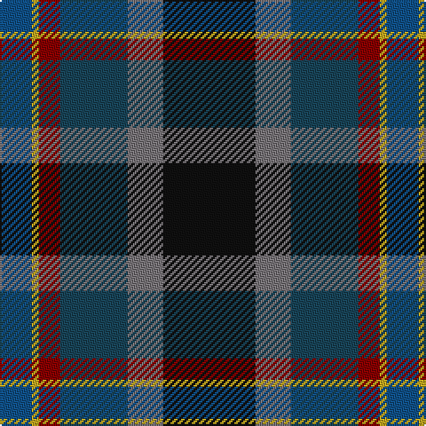

In pattern [BYRBGK](/patterns/byrbgk/).

This was sourced from house-of-tartan.  It is a [6 stripes tartan](/stripes/stripes6/).

Original link http://www.house-of-tartan.scotland.net/house/TartanViewjs.asp?colr=Def&tnam=6027

## Thread count
Ba/18 Y4 DR12 DBa38 N20 K/52

## Palette
Each colour and its ΔE from the base-6 reference it is a variant of.

| Colour | Shade | Base | ΔE (OKLab) |
|---|---|---|---|
| B | <code style="background-color:#2C74A4;">#2C74A4</code> `#2C74A4` | B <code style="background-color:#2C4084;">#2C4084</code> | 0.15 |
| Ba | <code style="background-color:#105088;">#105088</code> `#105088` | B <code style="background-color:#2C4084;">#2C4084</code> | 0.05 |
| DB | <code style="background-color:#003C64;">#003C64</code> `#003C64` | B <code style="background-color:#2C4084;">#2C4084</code> | 0.07 |
| DBa | <code style="background-color:#184458;">#184458</code> `#184458` | B <code style="background-color:#2C4084;">#2C4084</code> | 0.08 |
| DG | <code style="background-color:#003820;">#003820</code> `#003820` | G <code style="background-color:#006400;">#006400</code> | 0.16 |
| DR | <code style="background-color:#880000;">#880000</code> `#880000` | R <code style="background-color:#C80000;">#C80000</code> | 0.14 |
| K | <code style="background-color:#101010;">#101010</code> `#101010` | K <code style="background-color:#000000;">#000000</code> | 0.17 |
| N | <code style="background-color:#787478;">#787478</code> `#787478` | G <code style="background-color:#006400;">#006400</code> | 0.20 |
| Na | <code style="background-color:#A4A8A8;">#A4A8A8</code> `#A4A8A8` | Y <code style="background-color:#E8C000;">#E8C000</code> | 0.19 |
| Y | <code style="background-color:#C4A820;">#C4A820</code> `#C4A820` | Y <code style="background-color:#E8C000;">#E8C000</code> | 0.09 |

# Sample pattern

ID: /setts/s6/b18y4r12ba38g20k52-b105088-ba184458-g787478-k101010-r880000-yc4a820/
