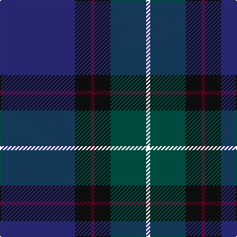

In pattern [BKBKGK](/patterns/bkbkgk/).

This was sourced from house-of-tartan.  It is a [6 stripes tartan](/stripes/stripes6/).

Original link http://www.house-of-tartan.scotland.net/house/TartanViewjs.asp?colr=Def&tnam=2222

## Thread count
DB/76 K16 DR4 K16 G36 W/4

## Palette
Each colour and its ΔE from the base-6 reference it is a variant of.

| Colour | Shade | Base | ΔE (OKLab) |
|---|---|---|---|
| DB | <code style="background-color:#2C2C80;">#2C2C80</code> `#2C2C80` | B <code style="background-color:#2A418A;">#2A418A</code> | 0.06 |
| DR | <code style="background-color:#680028;">#680028</code> `#680028` | B <code style="background-color:#2A418A;">#2A418A</code> | 0.21 |
| G | <code style="background-color:#005448;">#005448</code> `#005448` | G <code style="background-color:#006100;">#006100</code> | 0.10 |
| K | <code style="background-color:#101010;">#101010</code> `#101010` | K <code style="background-color:#000000;">#000000</code> | 0.17 |

# Sample pattern

## Nearest tartans

The nearest existing variants by ΔTartan distance.

1. [Bouncing Blackie (Personal)](/setts/s7/b5ba8bb13g21ba34bb55r3~b700070-ba24246c-bb1c1c1c-g007040-r742800/) — ΔT 0.94
1. [Monarchs](/setts/s6/b19k4ba1k4g9ba1x4~b2c2c80-ba680028-g005448-k101010/) — ΔT 0.95
1. [Passion of Scotland (Fashion)](/setts/s7/b6r4b2ba25k30g2k2x2~b344054-ba1c1c50-g408060-k101010-r888888/) — ΔT 1.17
1. [Laurie](/setts/s7/b6r2b1g25ba16k2ba4x2~b6c006c-ba28287c-g005c34-k101010-rc80000/) — ΔT 1.22
1. [Riley's Theme (Fashion)](/setts/s6/b20k4g5ba14w1b2x2~b2c2c80-ba440044-g006818-k101010-wfcfcfc/) — ΔT 1.27
1. [Hutchesons' Grammar (Corporate)](/setts/s6/b8r4ba30bb30ra3bb4x2~b5c8ca8-ba2c2c80-bb14283c-r888888-rac80000/) — ΔT 1.34
1. [Stewmann (Personal)](/setts/s9/g24b4g3ba11bb8ba37k3ba2r4x2~b5c8ca8-ba2c2c80-bb440044-g003820-k101010-re87878/) — ΔT 1.36
1. [Hardie (Name)](/setts/s6/r4g9w2g24b37ra3x2~b202044-g003820-rb468ac-rac80000-we0e0e0/) — ΔT 1.42
1. [Round Table (1997)](/setts/s6/b47g14ba5bb2r3g7x2~b202060-ba440044-bb4c3428-g285800-r880000/) — ΔT 1.45
1. [Edinburgh & Lothian T.B. (Corporate)](/setts/s7/b40ba8y3ba6k3ba6r4x2~b1c1c50-ba2c2c80-k101010-rc80000-ybc8c00/) — ΔT 1.45

## Neighbour map

Every grey dot is one of 15726 variants placed by the first two principal components of the ΔTartan feature space (44% of its variance). Red is this tartan; blue dots are its nearest — click one to open its page.

<svg viewBox="0 0 640 380" role="img" style="max-width:100%;height:auto;border:1px solid #e0e0e0;border-radius:4px;display:block" xmlns="http://www.w3.org/2000/svg"><image href="/nn/cloud.v1.png" width="640" height="380"/><a href="/setts/s7/b5ba8bb13g21ba34bb55r3~b700070-ba24246c-bb1c1c1c-g007040-r742800/"><circle cx="342.5" cy="206.9" r="4" fill="#3465a4"><title>Bouncing Blackie (Personal)</title></circle></a><a href="/setts/s6/b19k4ba1k4g9ba1x4~b2c2c80-ba680028-g005448-k101010/"><circle cx="378.7" cy="221.2" r="4" fill="#3465a4"><title>Monarchs</title></circle></a><a href="/setts/s7/b6r4b2ba25k30g2k2x2~b344054-ba1c1c50-g408060-k101010-r888888/"><circle cx="332.6" cy="198.7" r="4" fill="#3465a4"><title>Passion of Scotland (Fashion)</title></circle></a><a href="/setts/s7/b6r2b1g25ba16k2ba4x2~b6c006c-ba28287c-g005c34-k101010-rc80000/"><circle cx="321.9" cy="169.3" r="4" fill="#3465a4"><title>Laurie</title></circle></a><a href="/setts/s6/b20k4g5ba14w1b2x2~b2c2c80-ba440044-g006818-k101010-wfcfcfc/"><circle cx="309.0" cy="189.8" r="4" fill="#3465a4"><title>Riley's Theme (Fashion)</title></circle></a><a href="/setts/s6/b8r4ba30bb30ra3bb4x2~b5c8ca8-ba2c2c80-bb14283c-r888888-rac80000/"><circle cx="277.2" cy="218.8" r="4" fill="#3465a4"><title>Hutchesons' Grammar (Corporate)</title></circle></a><a href="/setts/s9/g24b4g3ba11bb8ba37k3ba2r4x2~b5c8ca8-ba2c2c80-bb440044-g003820-k101010-re87878/"><circle cx="323.4" cy="155.5" r="4" fill="#3465a4"><title>Stewmann (Personal)</title></circle></a><a href="/setts/s6/r4g9w2g24b37ra3x2~b202044-g003820-rb468ac-rac80000-we0e0e0/"><circle cx="331.6" cy="193.4" r="4" fill="#3465a4"><title>Hardie (Name)</title></circle></a><a href="/setts/s6/b47g14ba5bb2r3g7x2~b202060-ba440044-bb4c3428-g285800-r880000/"><circle cx="440.5" cy="183.1" r="4" fill="#3465a4"><title>Round Table (1997)</title></circle></a><a href="/setts/s7/b40ba8y3ba6k3ba6r4x2~b1c1c50-ba2c2c80-k101010-rc80000-ybc8c00/"><circle cx="398.0" cy="193.0" r="4" fill="#3465a4"><title>Edinburgh &amp; Lothian T.B. (Corporate)</title></circle></a><circle cx="348.6" cy="201.1" r="5" fill="#c00000"/></svg>

ID: /setts/s6/b19k4ba1k4g9ka1x4~b2c2c80-ba680028-g005448-k101010-ka000000/
