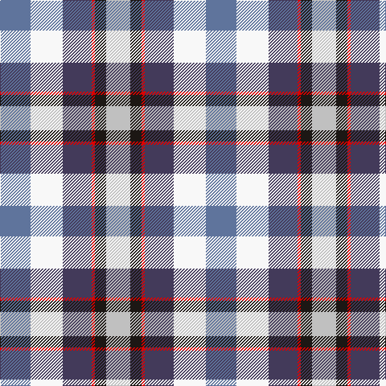

In pattern [BWBRKW](/patterns/bwbrkw/).

This was sourced from register-of-tartans.  It is a [6 stripes tartan](/stripes/stripes6/).

Original link https://www.tartanregister.gov.uk/tartanDetails.aspx?ref=11109

## Thread count
B/38 W40 N36 R4 K14 Na/30

## Palette
Each colour and its ΔE from the base-6 reference it is a variant of.

| Colour | Shade | Base | ΔE (OKLab) |
|---|---|---|---|
| B | <code style="background-color:#5F749C;">#5F749C</code> `#5F749C` | B <code style="background-color:#2A418A;">#2A418A</code> | 0.17 |
| K | <code style="background-color:#1C1714;">#1C1714</code> `#1C1714` | K <code style="background-color:#000000;">#000000</code> | 0.21 |
| N | <code style="background-color:#433A5A;">#433A5A</code> `#433A5A` | B <code style="background-color:#2A418A;">#2A418A</code> | 0.09 |
| Na | <code style="background-color:#C0C0C0;">#C0C0C0</code> `#C0C0C0` | W <code style="background-color:#F7F7F7;">#F7F7F7</code> | 0.17 |
| R | <code style="background-color:#DC0000;">#DC0000</code> `#DC0000` | R <code style="background-color:#CC0000;">#CC0000</code> | 0.03 |
| W | <code style="background-color:#F8F8F8;">#F8F8F8</code> `#F8F8F8` | W <code style="background-color:#F7F7F7;">#F7F7F7</code> | 0.00 |

# Sample pattern

## Nearest tartans

The nearest existing variants by ΔTartan distance.

1. [Sirrell (2014)](/setts/s6/b19w20ba18r2k7wa15~b5c8ca8-ba14283c-k101010-rc80000-wfcfcfc-wa98c8e8~x2/) — ΔT 0.61
1. [Isle of Jura](/setts/s7/w18b18ba10wa3r15ra3y8~b5c8ca8-ba000048-rb84c00-rae86000-w98c8e8-waffffff-yf8e38c~x2/) — ΔT 1.31
1. [Edinburgh Military Tattoo Dress](/setts/s8/k6w11b11r13ba17w10k2w4~b0596fa-ba2c4084-k101010-rdc0000-we0e0e0~x2/) — ΔT 1.38
1. [Edinburgh Tatttoo Dress (Corporate)](/setts/s8/k6w11b11r13ba17w10k2w4~b2888c4-ba2c2c80-k101010-rc80000-wfcfcfc~x2/) — ΔT 1.45
1. [Manderson #1 (Personal)](/setts/s11/b8g22g8w16b24w8w32wa32w7wa12w4~b4c0000-g005448-wa8ace8-wac0c0c0/) — ΔT 1.53
1. [Edinburgh, Military Tattoo dress](/setts/s8/k6w11b11r13ba17w10k2w4~b8080d0-ba304080-k000000-rc00000-we0e0e0~x2/) — ΔT 1.54
1. [Wombles 3 (Corporate)](/setts/s9/w4b8w1ba1g6ba3r6ba1w4~b2c2c80-ba202060-g006818-rc80000-wfcfcfc~x4/) — ΔT 1.60
1. [Womble](/setts/s9/w4b8w1ba1g6ba3r6ba1w4~b304080-ba000050-g008000-rc00000-we0e0e0~x2/) — ΔT 1.64
1. [Ainslie, Lake](/setts/s7/b6w10g10r2y3r1b3~b2c2c80-g006818-rc80000-wfcfcfc-ye8c000~x2/) — ΔT 1.64
1. [Ainslie Lake.. District Tartan Tartan Number: 586. Earliest known date: 1985 On the occasion of the Cape Breton Bicentennial. See products available Copyright © Blair Urquhart, Comrie, 2015](/setts/s7/b6w10g10r2y3r1b3~b2c2c80-g006818-rc80000-we0e0e0-ye8c000~x2/) — ΔT 1.64

## Neighbour map

Every grey dot is one of 15726 variants placed by the first two principal components of the ΔTartan feature space (44% of its variance). Red is this tartan; blue dots are its nearest — click one to open its page.

<svg viewBox="0 0 640 380" role="img" style="max-width:100%;height:auto;border:1px solid #e0e0e0;border-radius:4px;display:block" xmlns="http://www.w3.org/2000/svg"><image href="/nn/cloud.v1.png" width="640" height="380"/><a href="/setts/s6/b19w20ba18r2k7wa15~b5c8ca8-ba14283c-k101010-rc80000-wfcfcfc-wa98c8e8~x2/"><circle cx="14.0" cy="184.3" r="4" fill="#3465a4"><title>Sirrell (2014)</title></circle></a><a href="/setts/s7/w18b18ba10wa3r15ra3y8~b5c8ca8-ba000048-rb84c00-rae86000-w98c8e8-waffffff-yf8e38c~x2/"><circle cx="14.0" cy="173.5" r="4" fill="#3465a4"><title>Isle of Jura</title></circle></a><a href="/setts/s8/k6w11b11r13ba17w10k2w4~b0596fa-ba2c4084-k101010-rdc0000-we0e0e0~x2/"><circle cx="60.5" cy="192.4" r="4" fill="#3465a4"><title>Edinburgh Military Tattoo Dress</title></circle></a><a href="/setts/s8/k6w11b11r13ba17w10k2w4~b2888c4-ba2c2c80-k101010-rc80000-wfcfcfc~x2/"><circle cx="53.1" cy="188.9" r="4" fill="#3465a4"><title>Edinburgh Tatttoo Dress (Corporate)</title></circle></a><a href="/setts/s11/b8g22g8w16b24w8w32wa32w7wa12w4~b4c0000-g005448-wa8ace8-wac0c0c0/"><circle cx="40.4" cy="159.6" r="4" fill="#3465a4"><title>Manderson #1 (Personal)</title></circle></a><a href="/setts/s8/k6w11b11r13ba17w10k2w4~b8080d0-ba304080-k000000-rc00000-we0e0e0~x2/"><circle cx="58.3" cy="191.0" r="4" fill="#3465a4"><title>Edinburgh, Military Tattoo dress</title></circle></a><a href="/setts/s9/w4b8w1ba1g6ba3r6ba1w4~b2c2c80-ba202060-g006818-rc80000-wfcfcfc~x4/"><circle cx="36.5" cy="174.7" r="4" fill="#3465a4"><title>Wombles 3 (Corporate)</title></circle></a><a href="/setts/s9/w4b8w1ba1g6ba3r6ba1w4~b304080-ba000050-g008000-rc00000-we0e0e0~x2/"><circle cx="40.3" cy="178.6" r="4" fill="#3465a4"><title>Womble</title></circle></a><a href="/setts/s7/b6w10g10r2y3r1b3~b2c2c80-g006818-rc80000-wfcfcfc-ye8c000~x2/"><circle cx="69.8" cy="172.5" r="4" fill="#3465a4"><title>Ainslie, Lake</title></circle></a><a href="/setts/s7/b6w10g10r2y3r1b3~b2c2c80-g006818-rc80000-we0e0e0-ye8c000~x2/"><circle cx="78.2" cy="176.8" r="4" fill="#3465a4"><title>Ainslie Lake.. District Tartan Tartan Number: 586. Earliest known date: 1985 On the occasion of the Cape Breton Bicentennial. See products available Copyright © Blair Urquhart, Comrie, 2015</title></circle></a><circle cx="19.6" cy="184.7" r="5" fill="#c00000"/></svg>

ID: /setts/s6/b19w20ba18r2k7wa15~b5f749c-ba433a5a-k1c1714-rdc0000-wf8f8f8-wac0c0c0~x2/
