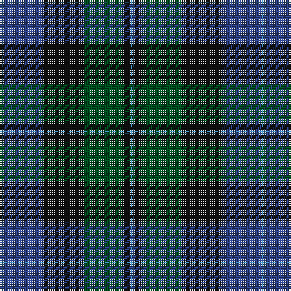

In pattern [BBKGKB](/patterns/bbkgkb/).

This was sourced from register-of-tartans.  It is a [6 stripes tartan](/stripes/stripes6/).

Original link https://www.tartanregister.gov.uk/tartanDetails.aspx?ref=4329

## Thread count
B/2 Ba22 K22 G22 K4 B/2

## Palette
Each colour and its ΔE from the base-6 reference it is a variant of.

| Colour | Shade | Base | ΔE (OKLab) |
|---|---|---|---|
| B | <code style="background-color:#3C82AF;">#3C82AF</code> `#3C82AF` | B <code style="background-color:#2A418A;">#2A418A</code> | 0.19 |
| Ba | <code style="background-color:#2C4084;">#2C4084</code> `#2C4084` | B <code style="background-color:#2A418A;">#2A418A</code> | 0.01 |
| G | <code style="background-color:#005020;">#005020</code> `#005020` | G <code style="background-color:#006100;">#006100</code> | 0.07 |
| K | <code style="background-color:#101010;">#101010</code> `#101010` | K <code style="background-color:#000000;">#000000</code> | 0.17 |

# Sample pattern

## Nearest tartans

The nearest existing variants by ΔTartan distance.

1. [Ferguson of Balquhidder](/setts/s6/g2b12r1k12g12k2x2~b2c4084-g005020-k101010-rdc0000/) — ΔT 0.34
1. [Unidentified No 115](/setts/s8/b10k6ba1g6k1g6ba1k6x2~b2c4084-ba3c82af-g005020-k101010/) — ΔT 0.77
1. [Renfrew](/setts/s7/b6k2b18k18g18k3r2x2~b2c2c80-g006818-k101010-rc80000/) — ΔT 1.00
1. [Graham of Montrose](/setts/s6/g4b15w2k16g19k4x2~b2c4084-g005020-k101010-we0e0e0/) — ΔT 1.00
1. [Reid and Taylor](/setts/s7/b2k1r1b9k9g10k2x2~b2c2c80-g006818-k101010-rc80000/) — ΔT 1.00
1. [National Galleries of Scotland Corporate Tartan Tartan Number: 2050. Earliest known date: November 1991 Based on the Black Watch or Government tartan. The three claret stripes represent the three galleries and the colour is that of William Playfair's original colour scheme for the National Gallery. See products available Copyright © Blair Urquhart, Comrie, 2015](/setts/s7/k7g22k22b6r2b15r2x2~b202060-g006818-k101010-rc80000/) — ΔT 1.04
1. [Lamont](/setts/s8/b10k1b1k1b2k8g10w1x4~b2c4084-g005020-k101010-we0e0e0/) — ΔT 1.07
1. [Aitchison Family (Kinghorn) (Personal)](/setts/s9/b2g25k11ba2k11ba18k2ba3k2x2~b6a1ab5-ba1a4576-g116f5f-k101010/) — ΔT 1.07
1. [Murray #3](/setts/s6/b2k2b12k8g11r2x2~b2c4084-g005020-k101010-rdc0000/) — ΔT 1.07
1. [Dundas #2](/setts/s7/k4b16k12g12r1g2k2x2~b2c2c80-g006818-k101010-rc80000/) — ΔT 1.10

## Neighbour map

Every grey dot is one of 15726 variants placed by the first two principal components of the ΔTartan feature space (44% of its variance). Red is this tartan; blue dots are its nearest — click one to open its page.

<svg viewBox="0 0 640 380" role="img" style="max-width:100%;height:auto;border:1px solid #e0e0e0;border-radius:4px;display:block" xmlns="http://www.w3.org/2000/svg"><image href="/nn/cloud.v1.png" width="640" height="380"/><a href="/setts/s6/g2b12r1k12g12k2x2~b2c4084-g005020-k101010-rdc0000/"><circle cx="247.2" cy="242.0" r="4" fill="#3465a4"><title>Ferguson of Balquhidder</title></circle></a><a href="/setts/s8/b10k6ba1g6k1g6ba1k6x2~b2c4084-ba3c82af-g005020-k101010/"><circle cx="220.6" cy="244.1" r="4" fill="#3465a4"><title>Unidentified No 115</title></circle></a><a href="/setts/s7/b6k2b18k18g18k3r2x2~b2c2c80-g006818-k101010-rc80000/"><circle cx="216.1" cy="233.0" r="4" fill="#3465a4"><title>Renfrew</title></circle></a><a href="/setts/s6/g4b15w2k16g19k4x2~b2c4084-g005020-k101010-we0e0e0/"><circle cx="219.8" cy="248.1" r="4" fill="#3465a4"><title>Graham of Montrose</title></circle></a><a href="/setts/s7/b2k1r1b9k9g10k2x2~b2c2c80-g006818-k101010-rc80000/"><circle cx="218.0" cy="225.9" r="4" fill="#3465a4"><title>Reid and Taylor</title></circle></a><a href="/setts/s7/k7g22k22b6r2b15r2x2~b202060-g006818-k101010-rc80000/"><circle cx="226.7" cy="228.9" r="4" fill="#3465a4"><title>National Galleries of Scotland Corporate Tartan Tartan Number: 2050. Earliest known date: November 1991 Based on the Black Watch or Government tartan. The three claret stripes represent the three galleries and the colour is that of William Playfair's original colour scheme for the National Gallery. See products available Copyright © Blair Urquhart, Comrie, 2015</title></circle></a><a href="/setts/s8/b10k1b1k1b2k8g10w1x4~b2c4084-g005020-k101010-we0e0e0/"><circle cx="240.7" cy="212.4" r="4" fill="#3465a4"><title>Lamont</title></circle></a><a href="/setts/s9/b2g25k11ba2k11ba18k2ba3k2x2~b6a1ab5-ba1a4576-g116f5f-k101010/"><circle cx="244.2" cy="203.6" r="4" fill="#3465a4"><title>Aitchison Family (Kinghorn) (Personal)</title></circle></a><a href="/setts/s6/b2k2b12k8g11r2x2~b2c4084-g005020-k101010-rdc0000/"><circle cx="214.5" cy="265.0" r="4" fill="#3465a4"><title>Murray #3</title></circle></a><a href="/setts/s7/k4b16k12g12r1g2k2x2~b2c2c80-g006818-k101010-rc80000/"><circle cx="245.5" cy="210.6" r="4" fill="#3465a4"><title>Dundas #2</title></circle></a><circle cx="240.3" cy="241.4" r="5" fill="#c00000"/></svg>

ID: /setts/s6/b1ba11k11g11k2b1x2~b3c82af-ba2c4084-g005020-k101010/
