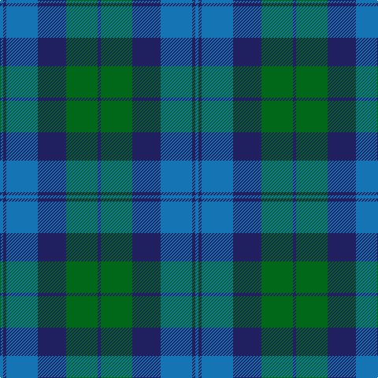

In pattern [BBBBGB](/patterns/bbbbgb/).

This was sourced from register-of-tartans.  It is a [6 stripes tartan](/stripes/stripes6/).

Original link https://www.tartanregister.gov.uk/tartanDetails.aspx?ref=5372

## Thread count
B/4 DB4 B40 DB36 G40 DB/4

## Palette
Each colour and its ΔE from the base-6 reference it is a variant of.

| Colour | Shade | Base | ΔE (OKLab) |
|---|---|---|---|
| B | <code style="background-color:#1474B4;">#1474B4</code> `#1474B4` | B <code style="background-color:#2A418A;">#2A418A</code> | 0.15 |
| DB | <code style="background-color:#202060;">#202060</code> `#202060` | B <code style="background-color:#2A418A;">#2A418A</code> | 0.11 |
| G | <code style="background-color:#006818;">#006818</code> `#006818` | G <code style="background-color:#006100;">#006100</code> | 0.02 |

# Sample pattern

## Nearest tartans

The nearest existing variants by ΔTartan distance.

1. [Scott Green (Sir Walter)](/setts/s6/g3b1ba7b1g3k1~b5c8ca8-ba2c2c80-g006818-k101010~x8/) — ΔT 1.35
1. [Wallace Blue Clan Tartan Tartan Number: 46. Earliest known date: pre 2003 The design is based on the sett from the Vestiarium Scoticum (1842). See products available Copyright © Blair Urquhart, Comrie, 2015](/setts/s5/b2ba29b12g29w2~b5c8ca8-ba2c2c80-g006818-we0e0e0~x2/) — ΔT 1.39
1. [Unnamed, No 17](/setts/s7/g10b2g2b6ba5b1ba2~b304080-ba5480b0-g008000~x2/) — ΔT 1.39
1. [Flower of Scotland Commemorative Tartan Tartan Number: 2059. Earliest known date: September 1990 Designed as a tribute to Roy Williamson, writer of the words and music of 'The Flower of Scotland'. Roy wore the Gunn tartan which has been used as the framework of the new tartan. Cornflower blue and Zephyr green have been used to suggest the bluebell and the thistle. Worn by the Seafield and District pipe band, Strathallan Games, 1994 (UK Reg. Design No.600421) See products available Copyright © Blair Urquhart, Comrie, 2015](/setts/s6/b1g7b1k4b7r1~b40649c-g00643c-k101010-re86000~x4/) — ΔT 1.43
1. [Flower of Scotland MINI Tartan Tartan Number: 20599. Earliest known date: Dupion Silk. Generated only for display purposes. reduced copy of the original 2059 Flower of Scotland. See products available Copyright © Blair Urquhart, Comrie, 2015](/setts/s6/b1g7b1k4b7r1~b40649c-g00643c-k101010-re86000~x2/) — ΔT 1.43
1. [MacKay (Logan)](/setts/s6/g4b23g2k23g23k4~b000080-g006818-k101010~x2/) — ΔT 1.43
1. [Graham of Menteith](/setts/s6/g8b1g1k6ba6k1~b2474e8-ba28287c-g006c3c-k101010~x4/) — ΔT 1.44
1. [Wallace Blue (Fashion)](/setts/s5/b2ba29b12g29w2~b5c8ca8-ba2c2c80-g006818-wf8f8f8~x2/) — ΔT 1.46
1. [Unidentified No 29](/setts/s6/b3g11ba2b11bb6g3~b2c4084-ba3c82af-bb0596fa-g005020~x2/) — ΔT 1.51
1. [Unidentified No 59](/setts/s6/b1ba11k11g11k2b1~b3c82af-ba2c4084-g005020-k101010~x2/) — ΔT 1.52

## Neighbour map

Every grey dot is one of 15726 variants placed by the first two principal components of the ΔTartan feature space (44% of its variance). Red is this tartan; blue dots are its nearest — click one to open its page.

<svg viewBox="0 0 640 380" role="img" style="max-width:100%;height:auto;border:1px solid #e0e0e0;border-radius:4px;display:block" xmlns="http://www.w3.org/2000/svg"><image href="/nn/cloud.v1.png" width="640" height="380"/><a href="/setts/s6/g3b1ba7b1g3k1~b5c8ca8-ba2c2c80-g006818-k101010~x8/"><circle cx="246.5" cy="246.6" r="4" fill="#3465a4"><title>Scott Green (Sir Walter)</title></circle></a><a href="/setts/s5/b2ba29b12g29w2~b5c8ca8-ba2c2c80-g006818-we0e0e0~x2/"><circle cx="250.1" cy="220.9" r="4" fill="#3465a4"><title>Wallace Blue Clan Tartan Tartan Number: 46. Earliest known date: pre 2003 The design is based on the sett from the Vestiarium Scoticum (1842). See products available Copyright © Blair Urquhart, Comrie, 2015</title></circle></a><a href="/setts/s7/g10b2g2b6ba5b1ba2~b304080-ba5480b0-g008000~x2/"><circle cx="273.7" cy="251.3" r="4" fill="#3465a4"><title>Unnamed, No 17</title></circle></a><a href="/setts/s6/b1g7b1k4b7r1~b40649c-g00643c-k101010-re86000~x4/"><circle cx="235.8" cy="247.1" r="4" fill="#3465a4"><title>Flower of Scotland Commemorative Tartan Tartan Number: 2059. Earliest known date: September 1990 Designed as a tribute to Roy Williamson, writer of the words and music of 'The Flower of Scotland'. Roy wore the Gunn tartan which has been used as the framework of the new tartan. Cornflower blue and Zephyr green have been used to suggest the bluebell and the thistle. Worn by the Seafield and District pipe band, Strathallan Games, 1994 (UK Reg. Design No.600421) See products available Copyright © Blair Urquhart, Comrie, 2015</title></circle></a><a href="/setts/s6/b1g7b1k4b7r1~b40649c-g00643c-k101010-re86000~x2/"><circle cx="235.8" cy="247.1" r="4" fill="#3465a4"><title>Flower of Scotland MINI Tartan Tartan Number: 20599. Earliest known date: Dupion Silk. Generated only for display purposes. reduced copy of the original 2059 Flower of Scotland. See products available Copyright © Blair Urquhart, Comrie, 2015</title></circle></a><a href="/setts/s6/g4b23g2k23g23k4~b000080-g006818-k101010~x2/"><circle cx="241.0" cy="250.6" r="4" fill="#3465a4"><title>MacKay (Logan)</title></circle></a><a href="/setts/s6/g8b1g1k6ba6k1~b2474e8-ba28287c-g006c3c-k101010~x4/"><circle cx="217.0" cy="244.6" r="4" fill="#3465a4"><title>Graham of Menteith</title></circle></a><a href="/setts/s5/b2ba29b12g29w2~b5c8ca8-ba2c2c80-g006818-wf8f8f8~x2/"><circle cx="245.7" cy="219.1" r="4" fill="#3465a4"><title>Wallace Blue (Fashion)</title></circle></a><a href="/setts/s6/b3g11ba2b11bb6g3~b2c4084-ba3c82af-bb0596fa-g005020~x2/"><circle cx="209.3" cy="276.7" r="4" fill="#3465a4"><title>Unidentified No 29</title></circle></a><a href="/setts/s6/b1ba11k11g11k2b1~b3c82af-ba2c4084-g005020-k101010~x2/"><circle cx="240.3" cy="241.4" r="4" fill="#3465a4"><title>Unidentified No 59</title></circle></a><circle cx="247.3" cy="251.4" r="5" fill="#c00000"/></svg>

ID: /setts/s6/b1ba1b10ba9g10ba1~b1474b4-ba202060-g006818~x4/
