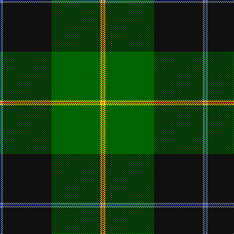

In pattern [BBKGYR](/patterns/bbkgyr/).

This was sourced from register-of-tartans.  It is a [6 stripes tartan](/stripes/stripes6/).

Original link https://www.tartanregister.gov.uk/tartanDetails.aspx?ref=10427

## Thread count
B/2 N4 K100 G100 Y4 R/2

## Palette
Each colour and its ΔE from the base-6 reference it is a variant of.

| Colour | Shade | Base | ΔE (OKLab) |
|---|---|---|---|
| B | <code style="background-color:#0000CD;">#0000CD</code> `#0000CD` | B <code style="background-color:#2A418A;">#2A418A</code> | 0.14 |
| G | <code style="background-color:#006400;">#006400</code> `#006400` | G <code style="background-color:#006100;">#006100</code> | 0.01 |
| K | <code style="background-color:#101010;">#101010</code> `#101010` | K <code style="background-color:#000000;">#000000</code> | 0.17 |
| N | <code style="background-color:#778899;">#778899</code> `#778899` | B <code style="background-color:#2A418A;">#2A418A</code> | 0.24 |
| R | <code style="background-color:#FF0000;">#FF0000</code> `#FF0000` | R <code style="background-color:#CC0000;">#CC0000</code> | 0.11 |
| Y | <code style="background-color:#FFE700;">#FFE700</code> `#FFE700` | Y <code style="background-color:#F2BF00;">#F2BF00</code> | 0.10 |

# Sample pattern

## Nearest tartans

The nearest existing variants by ΔTartan distance.

1. [Josse (Personal)](/setts/s6/b1w2k50g50y2r1~b2c2c80-g285800-k101010-rc80000-wc0c0c0-ybc8c00~x2/) — ΔT 0.73
1. [Roderick Dhu Canada Tartan Tartan Number: 153. Earliest known date: 1967 Roderick Dhu is linked to the MacNeil Clan. There is also a whisky of the same name. See products available Copyright © Blair Urquhart, Comrie, 2015](/setts/s9/b4k1r2k32g32y2k1g3ba2~b1c2c90-ba5c8ca8-g006818-k101010-rc80000-ye8c000~x2/) — ΔT 1.29
1. [Duffy](/setts/s7/g8ga60w1k33g9y4g4~g006818-ga003c00-k000000-wfcfcfc-ye8c000~x2/) — ΔT 1.43
1. [Moran Family Tartan Tartan Number: 675. Earliest known date: 1986 The designers requested that the threadcount be Restricted. See products available Copyright © Blair Urquhart, Comrie, 2015](/setts/s6/g55k17r9k11y2b4~b202060-g006818-k101010-rc8002c-ye8c000~x2/) — ΔT 1.61
1. [Kilmaine Saints (Corporate)](/setts/s6/k54r11g13y1b13w1~b1474b4-g006818-k101010-r888888-we0e0e0-ybc8c00~x2/) — ΔT 1.65
1. [Nolan Family, John J (Personal)](/setts/s5/b8g19ga42y3r1~b351e14-g649848-ga23321b-ra32d18-ye0a126~x2/) — ΔT 1.71
1. [Wells (2014)](/setts/s7/b50g25y3r8ra1w1ra1~b141e46-g285800-r888888-ra960028-wf8f8f8-yd87c00~x2/) — ΔT 1.73
1. [Bomb Disposal](/setts/s10/k28r3y2r3k13g28w1g3w1g16~g006818-k101010-r880000-we0e0e0-ye8c000~x2/) — ΔT 1.76
1. [Inkster (Name)](/setts/s8/b31y4g68w4b31r2k6r2~b2c2c80-g006818-k101010-rc80000-we0e0e0-ye8c000~x2/) — ΔT 1.77
1. [Mull Millennium](/setts/s8/g92y3k28b18r12ba18w2g12~b5c5c5c-ba2c2c80-g006818-k101010-rc80050-we0e0e0-ye8c000/) — ΔT 1.78

## Neighbour map

Every grey dot is one of 15726 variants placed by the first two principal components of the ΔTartan feature space (44% of its variance). Red is this tartan; blue dots are its nearest — click one to open its page.

<svg viewBox="0 0 640 380" role="img" style="max-width:100%;height:auto;border:1px solid #e0e0e0;border-radius:4px;display:block" xmlns="http://www.w3.org/2000/svg"><image href="/nn/cloud.v1.png" width="640" height="380"/><a href="/setts/s6/b1w2k50g50y2r1~b2c2c80-g285800-k101010-rc80000-wc0c0c0-ybc8c00~x2/"><circle cx="365.8" cy="117.8" r="4" fill="#3465a4"><title>Josse (Personal)</title></circle></a><a href="/setts/s9/b4k1r2k32g32y2k1g3ba2~b1c2c90-ba5c8ca8-g006818-k101010-rc80000-ye8c000~x2/"><circle cx="292.6" cy="98.3" r="4" fill="#3465a4"><title>Roderick Dhu Canada Tartan Tartan Number: 153. Earliest known date: 1967 Roderick Dhu is linked to the MacNeil Clan. There is also a whisky of the same name. See products available Copyright © Blair Urquhart, Comrie, 2015</title></circle></a><a href="/setts/s7/g8ga60w1k33g9y4g4~g006818-ga003c00-k000000-wfcfcfc-ye8c000~x2/"><circle cx="319.2" cy="121.8" r="4" fill="#3465a4"><title>Duffy</title></circle></a><a href="/setts/s6/g55k17r9k11y2b4~b202060-g006818-k101010-rc8002c-ye8c000~x2/"><circle cx="343.0" cy="154.3" r="4" fill="#3465a4"><title>Moran Family Tartan Tartan Number: 675. Earliest known date: 1986 The designers requested that the threadcount be Restricted. See products available Copyright © Blair Urquhart, Comrie, 2015</title></circle></a><a href="/setts/s6/k54r11g13y1b13w1~b1474b4-g006818-k101010-r888888-we0e0e0-ybc8c00~x2/"><circle cx="339.9" cy="109.3" r="4" fill="#3465a4"><title>Kilmaine Saints (Corporate)</title></circle></a><a href="/setts/s5/b8g19ga42y3r1~b351e14-g649848-ga23321b-ra32d18-ye0a126~x2/"><circle cx="376.3" cy="154.7" r="4" fill="#3465a4"><title>Nolan Family, John J (Personal)</title></circle></a><a href="/setts/s7/b50g25y3r8ra1w1ra1~b141e46-g285800-r888888-ra960028-wf8f8f8-yd87c00~x2/"><circle cx="369.2" cy="100.2" r="4" fill="#3465a4"><title>Wells (2014)</title></circle></a><a href="/setts/s10/k28r3y2r3k13g28w1g3w1g16~g006818-k101010-r880000-we0e0e0-ye8c000~x2/"><circle cx="300.7" cy="134.4" r="4" fill="#3465a4"><title>Bomb Disposal</title></circle></a><a href="/setts/s8/b31y4g68w4b31r2k6r2~b2c2c80-g006818-k101010-rc80000-we0e0e0-ye8c000~x2/"><circle cx="292.0" cy="110.9" r="4" fill="#3465a4"><title>Inkster (Name)</title></circle></a><a href="/setts/s8/g92y3k28b18r12ba18w2g12~b5c5c5c-ba2c2c80-g006818-k101010-rc80050-we0e0e0-ye8c000/"><circle cx="319.0" cy="89.0" r="4" fill="#3465a4"><title>Mull Millennium</title></circle></a><circle cx="344.7" cy="111.1" r="5" fill="#c00000"/></svg>

ID: /setts/s6/b1ba2k50g50y2r1~b0000cd-ba778899-g006400-k101010-rff0000-yffe700~x2/
