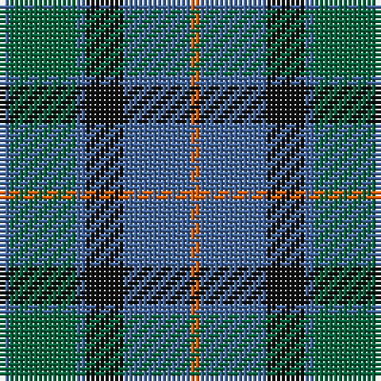

**Bands:** [BGBKBR](/stripes/bgbkbr/) · **Stripes:** [B G B K B O](/stripes/stripes6/) B G B K B O

This was sourced from house-of-tartan.  It is a [6 band tartan](/bands/bands6/).

Original link http://www.house-of-tartan.scotland.net/house/TartanViewjs.asp?colr=Def&tnam=20599

## Variants

Other setts woven to the same stripe pattern.

- [Flower of Scotland Commemorative Tartan Tartan Number: 2059. Earliest known date: September 1990 Designed as a tribute to Roy Williamson, writer of the words and music of 'The Flower of Scotland'. Roy wore the Gunn tartan which has been used as the framework of the new tartan. Cornflower blue and Zephyr green have been used to suggest the bluebell and the thistle. Worn by the Seafield and District pipe band, Strathallan Games, 1994 (UK Reg. Design No.600421) See products available Copyright © Blair Urquhart, Comrie, 2015](/setts/s6/b1g7b1k4b7o1~x4/)

## Thread count
B/2 G14 B2 K8 B14 O/2

## Palette
Each colour and its ΔE from the base-6 reference it is a variant of.

| Colour | Shade | Base | ΔE (OKLab) |
|---|---|---|---|
| B | <code style="background-color:#40649C;">#40649C</code> `#40649C` | B <code style="background-color:#2A418A;">#2A418A</code> | 0.11 |
| DB | <code style="background-color:#2C2C80;">#2C2C80</code> `#2C2C80` | B <code style="background-color:#2A418A;">#2A418A</code> | 0.06 |
| G | <code style="background-color:#00643C;">#00643C</code> `#00643C` | G <code style="background-color:#006100;">#006100</code> | 0.05 |
| Ga | <code style="background-color:#4C8060;">#4C8060</code> `#4C8060` | G <code style="background-color:#006100;">#006100</code> | 0.15 |
| K | <code style="background-color:#101010;">#101010</code> `#101010` | K <code style="background-color:#000000;">#000000</code> | 0.17 |
| O | <code style="background-color:#E86000;">#E86000</code> `#E86000` | R <code style="background-color:#CC0000;">#CC0000</code> | 0.14 |

# Sample pattern

## Nearest tartans

The nearest existing variants by ΔTartan distance.

1. [Flower of Scotland Commemorative Tartan Tartan Number: 2059. Earliest known date: September 1990 Designed as a tribute to Roy Williamson, writer of the words and music of 'The Flower of Scotland'. Roy wore the Gunn tartan which has been used as the framework of the new tartan. Cornflower blue and Zephyr green have been used to suggest the bluebell and the thistle. Worn by the Seafield and District pipe band, Strathallan Games, 1994 (UK Reg. Design No.600421) See products available Copyright © Blair Urquhart, Comrie, 2015](/setts/s6/b1g7b1k4b7o1~x4/) — ΔT 0.00
1. [Scott Green (Sir Walter)](/setts/s6/g3t1db7t1g3k1~x8/) — ΔT 0.46
1. [Graham of Menteith](/setts/s6/g8b1g1k6db6k1~x4/) — ΔT 0.83
1. [Thompson/Thomson/MacTavish Hunting](/setts/s6/t4dy28dg6t12k12t3~x2/) — ΔT 0.87
1. [Graham of Menteith (Clan)](/setts/s6/g8t1g1k6db6k1~x4/) — ΔT 0.94
1. [MacKay (Bonner)](/setts/s6/dg1db5dg1k5dg6ly1~x2/) — ΔT 0.94
1. [MacArthur of Milton (Clan)](/setts/s6/g7db1g1k4dp4k1~x4/) — ΔT 0.96
1. [Scottish Airports](/setts/s6/n4g18n3k17n18p4~x2/) — ΔT 0.99
1. [Blaylock Annandale (Name)](/setts/s7/g24db6t3k6db12k15g4~x2/) — ΔT 1.01
1. [Unnamed, No 29](/setts/s6/db3g11t2db11b6g3~x2/) — ΔT 1.02

## Neighbour map

Every grey dot is one of 14313 variants placed by the first two principal components of the ΔTartan feature space (44% of its variance). Red is this tartan; blue dots are its nearest — click one to open its page.

<svg viewBox="0 0 640 380" role="img" style="max-width:100%;height:auto;border:1px solid #e0e0e0;border-radius:4px;display:block" xmlns="http://www.w3.org/2000/svg"><image href="/nn/cloud.v1.png" width="640" height="380"/><a href="/setts/s6/b1g7b1k4b7o1~x4/"><circle cx="238.6" cy="252.6" r="4" fill="#3465a4"><title>Flower of Scotland Commemorative Tartan Tartan Number: 2059. Earliest known date: September 1990 Designed as a tribute to Roy Williamson, writer of the words and music of 'The Flower of Scotland'. Roy wore the Gunn tartan which has been used as the framework of the new tartan. Cornflower blue and Zephyr green have been used to suggest the bluebell and the thistle. Worn by the Seafield and District pipe band, Strathallan Games, 1994 (UK Reg. Design No.600421) See products available Copyright © Blair Urquhart, Comrie, 2015</title></circle></a><a href="/setts/s6/g3t1db7t1g3k1~x8/"><circle cx="249.6" cy="252.0" r="4" fill="#3465a4"><title>Scott Green (Sir Walter)</title></circle></a><a href="/setts/s6/g8b1g1k6db6k1~x4/"><circle cx="220.2" cy="250.2" r="4" fill="#3465a4"><title>Graham of Menteith</title></circle></a><a href="/setts/s6/t4dy28dg6t12k12t3~x2/"><circle cx="249.9" cy="241.4" r="4" fill="#3465a4"><title>Thompson/Thomson/MacTavish Hunting</title></circle></a><a href="/setts/s6/g8t1g1k6db6k1~x4/"><circle cx="217.8" cy="248.8" r="4" fill="#3465a4"><title>Graham of Menteith (Clan)</title></circle></a><a href="/setts/s6/dg1db5dg1k5dg6ly1~x2/"><circle cx="212.7" cy="265.6" r="4" fill="#3465a4"><title>MacKay (Bonner)</title></circle></a><a href="/setts/s6/g7db1g1k4dp4k1~x4/"><circle cx="233.2" cy="248.6" r="4" fill="#3465a4"><title>MacArthur of Milton (Clan)</title></circle></a><a href="/setts/s6/n4g18n3k17n18p4~x2/"><circle cx="211.2" cy="274.9" r="4" fill="#3465a4"><title>Scottish Airports</title></circle></a><a href="/setts/s7/g24db6t3k6db12k15g4~x2/"><circle cx="212.6" cy="248.1" r="4" fill="#3465a4"><title>Blaylock Annandale (Name)</title></circle></a><a href="/setts/s6/db3g11t2db11b6g3~x2/"><circle cx="198.4" cy="273.1" r="4" fill="#3465a4"><title>Unnamed, No 29</title></circle></a><circle cx="238.6" cy="252.6" r="5" fill="#c00000"/></svg>

ID: /setts/s6/b1g7b1k4b7o1~x2/
