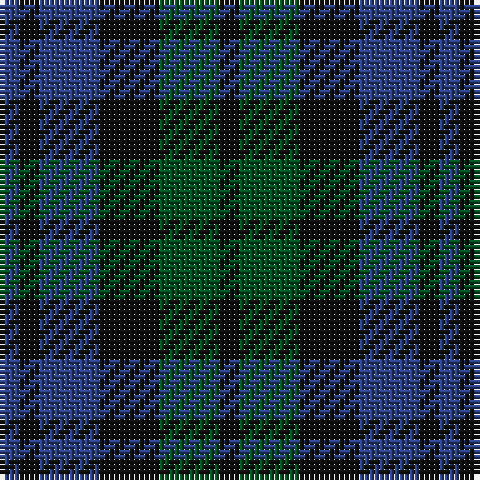

In pattern [BKBKGK](/patterns/bkbkgk/).

This was sourced from register-of-tartans.  It is a [6 stripes tartan](/stripes/stripes6/).

Original link https://www.tartanregister.gov.uk/tartanDetails.aspx?ref=4044

## Register references

External register numbers recorded for this tartan.

- Scottish Register of Tartans: [4044](https://www.tartanregister.gov.uk/tartanDetails.aspx?ref=4044)
- Scottish Tartans World Register: 255

## Thread count
B/4 K4 B12 K12 G12 K/4

## Palette
Each colour and its ΔE from the base-6 reference it is a variant of.

| Colour | Shade | Base | ΔE (OKLab) |
|---|---|---|---|
| B | <code style="background-color:#2C4084;">#2C4084</code> `#2C4084` | B <code style="background-color:#2A418A;">#2A418A</code> | 0.01 |
| G | <code style="background-color:#005020;">#005020</code> `#005020` | G <code style="background-color:#006100;">#006100</code> | 0.07 |
| K | <code style="background-color:#101010;">#101010</code> `#101010` | K <code style="background-color:#000000;">#000000</code> | 0.17 |

# Sample pattern

## Nearest tartans

The nearest existing variants by ΔTartan distance.

1. [Unidentified No 63](/setts/s7/k3g4k1g4k3b4k1~b2c4084-g005020-k101010~x2/) — ΔT 0.88
1. [Unidentified #29](/setts/s5/k5g14k16b12g4~b080848-g005020-k101010~x2/) — ΔT 1.13
1. [Austin Clan](/setts/s5/b4k4b4g9k2~b2c2c80-g006818-k101010~x2/) — ΔT 1.45
1. [Campbell, Sir Walter Scott](/setts/s6/k2g8b2k9ba7k2~b2c4084-ba5a008c-g005020-k101010~x2/) — ΔT 1.48
1. [MacIntyre](/setts/s7/k12g12k2g12k12b12ba3~b2c4084-ba3c82af-g005020-k101010~x2/) — ΔT 1.52
1. [MacCallum #2](/setts/s7/k6g6r1g6k6b6k1~b2c4084-g005020-k101010-rdc0000~x2/) — ΔT 1.55
1. [Strathspey District Tartan Tartan Number: 1039. Earliest known date: 1795 From the back of a waistcoat of a Strathspey Fencible 1794-5. The design, which is a variation of the Black Watch may be attributed to General James Grant of Ballindalloch who raised the fencible unit and whose clan already used the the Black Watch as a hunting sett. The Strathspey tartan is now produced as a District tartan. See products available Copyright © Blair Urquhart, Comrie, 2015](/setts/s7/k1g5k5b5k1b1k1~b2c2c80-g006818-k101010~x4/) — ΔT 1.64
1. [Wandering Shepherd (Personal)](/setts/s5/b2k2g2b1k1~b2c2c80-g006818-k101010~x20/) — ΔT 1.67
1. [Ferguson of Balquhidder #3](/setts/s6/k3b12r2k12g12k3~b2c4084-g005020-k101010-rdc0000~x2/) — ΔT 1.70
1. [Sheffield High School](/setts/s6/b12g8ba4g8b12ba5~b003c64-ba2888c4-g006818/) — ΔT 1.71

## Neighbour map

Every grey dot is one of 15726 variants placed by the first two principal components of the ΔTartan feature space (44% of its variance). Red is this tartan; blue dots are its nearest — click one to open its page.

<svg viewBox="0 0 640 380" role="img" style="max-width:100%;height:auto;border:1px solid #e0e0e0;border-radius:4px;display:block" xmlns="http://www.w3.org/2000/svg"><image href="/nn/cloud.v1.png" width="640" height="380"/><a href="/setts/s7/k3g4k1g4k3b4k1~b2c4084-g005020-k101010~x2/"><circle cx="232.8" cy="334.8" r="4" fill="#3465a4"><title>Unidentified No 63</title></circle></a><a href="/setts/s5/k5g14k16b12g4~b080848-g005020-k101010~x2/"><circle cx="262.0" cy="353.2" r="4" fill="#3465a4"><title>Unidentified #29</title></circle></a><a href="/setts/s5/b4k4b4g9k2~b2c2c80-g006818-k101010~x2/"><circle cx="206.0" cy="318.6" r="4" fill="#3465a4"><title>Austin Clan</title></circle></a><a href="/setts/s6/k2g8b2k9ba7k2~b2c4084-ba5a008c-g005020-k101010~x2/"><circle cx="221.3" cy="286.5" r="4" fill="#3465a4"><title>Campbell, Sir Walter Scott</title></circle></a><a href="/setts/s7/k12g12k2g12k12b12ba3~b2c4084-ba3c82af-g005020-k101010~x2/"><circle cx="209.7" cy="293.9" r="4" fill="#3465a4"><title>MacIntyre</title></circle></a><a href="/setts/s7/k6g6r1g6k6b6k1~b2c4084-g005020-k101010-rdc0000~x2/"><circle cx="218.1" cy="288.5" r="4" fill="#3465a4"><title>MacCallum #2</title></circle></a><a href="/setts/s7/k1g5k5b5k1b1k1~b2c2c80-g006818-k101010~x4/"><circle cx="244.3" cy="279.2" r="4" fill="#3465a4"><title>Strathspey District Tartan Tartan Number: 1039. Earliest known date: 1795 From the back of a waistcoat of a Strathspey Fencible 1794-5. The design, which is a variation of the Black Watch may be attributed to General James Grant of Ballindalloch who raised the fencible unit and whose clan already used the the Black Watch as a hunting sett. The Strathspey tartan is now produced as a District tartan. See products available Copyright © Blair Urquhart, Comrie, 2015</title></circle></a><a href="/setts/s5/b2k2g2b1k1~b2c2c80-g006818-k101010~x20/"><circle cx="151.8" cy="366.0" r="4" fill="#3465a4"><title>Wandering Shepherd (Personal)</title></circle></a><a href="/setts/s6/k3b12r2k12g12k3~b2c4084-g005020-k101010-rdc0000~x2/"><circle cx="222.3" cy="273.1" r="4" fill="#3465a4"><title>Ferguson of Balquhidder #3</title></circle></a><a href="/setts/s6/b12g8ba4g8b12ba5~b003c64-ba2888c4-g006818/"><circle cx="239.5" cy="356.0" r="4" fill="#3465a4"><title>Sheffield High School</title></circle></a><circle cx="231.0" cy="340.3" r="5" fill="#c00000"/></svg>

ID: /setts/s6/b1k1b3k3g3k1~b2c4084-g005020-k101010~x4/
