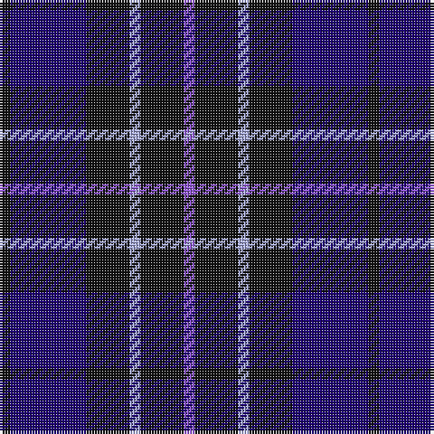

In pattern [BKWKBK](/patterns/bkwkbk/).

This was sourced from register-of-tartans.  It is a [6 stripes tartan](/stripes/stripes6/).

Original link https://www.tartanregister.gov.uk/tartanDetails.aspx?ref=3715

## Attestations

This cloth appears in 2 source records; the oldest owns this page.

- 01/06/1996 — Scottish Express International (register-of-tartans, [record](https://www.tartanregister.gov.uk/tartanDetails.aspx?ref=3715))
- pre 1997 — Scottish Express International (Corp (tartans-authority, [record](http://www.tartansauthority.com/tartan-ferret/display/2309/))

## Thread count
K/4 DB28 K16 LP4 K16 P/4

## Palette
Each colour and its ΔE from the base-6 reference it is a variant of.

| Colour | Shade | Base | ΔE (OKLab) |
|---|---|---|---|
| DB | <code style="background-color:#1C0070;">#1C0070</code> `#1C0070` | B <code style="background-color:#2A418A;">#2A418A</code> | 0.14 |
| K | <code style="background-color:#101010;">#101010</code> `#101010` | K <code style="background-color:#000000;">#000000</code> | 0.17 |
| LP | <code style="background-color:#A8ACE8;">#A8ACE8</code> `#A8ACE8` | W <code style="background-color:#F7F7F7;">#F7F7F7</code> | 0.23 |
| P | <code style="background-color:#9058D8;">#9058D8</code> `#9058D8` | B <code style="background-color:#2A418A;">#2A418A</code> | 0.21 |

# Sample pattern

## Nearest tartans

The nearest existing variants by ΔTartan distance.

1. [Britannia](/setts/s5/k14r4k25b30w4x2~b202060-k101010-rc80000-we0e0e0/) — ΔT 0.96
1. [Daks, Muted blue](/setts/s8/r5b12ba4ra4ba22b3ba4r5~b304080-ba000050-r806050-ra906030/) — ΔT 1.12
1. [Allianz Deutschland 2012 (Corporate)](/setts/s7/b6ba3b6ba20k20ba8w4x2~b2c2c80-ba202060-k101010-wfcfcfc/) — ΔT 1.14
1. [Swan (Name)](/setts/s6/k6b17k6b17k27w3x2~b2c2c80-k101010-we0e0e0/) — ΔT 1.19
1. [College of Radiographers](/setts/s5/k15y2k10b18w3x2~b00008c-k101010-wc8c8c8-yc88c00/) — ΔT 1.19
1. [Royal Scotsman Train (Corporate)](/setts/s6/b5k2b14k14b2y2x2~b2c2c80-k101010-yb8b4b8/) — ΔT 1.20
1. [Gifford (Personal)](/setts/s7/k15r8y2b25k5b13k5x2~b2c2c80-k101010-rc80000-ye8c000/) — ΔT 1.22
1. [Heritage of Scotland](/setts/s7/b6w3b21k16ba6k3ba6x2~b2c2c80-ba780078-k101010-wf8f8f8/) — ΔT 1.24
1. [Davidson of Tulloch Clan Tartan Tartan Number: 1360. Earliest known date: 1984 The Davidsons or Clan Dhai maintained a constant battle for precedence within Clan Chattan. The Davidsons of Tulloch in Ross-shire are one of the main branches of the Davidson family. See products available Copyright © Blair Urquhart, Comrie, 2015](/setts/s5/r6b35k36b36w6~b2c2c80-k101010-rc80000-we0e0e0/) — ΔT 1.34
1. [Komissarov, Dmitry (Personal)](/setts/s7/b30ba30g4ba4g4ba5r6x2~b640044-ba000048-g808080-r880000/) — ΔT 1.35

## Neighbour map

Every grey dot is one of 15726 variants placed by the first two principal components of the ΔTartan feature space (44% of its variance). Red is this tartan; blue dots are its nearest — click one to open its page.

<svg viewBox="0 0 640 380" role="img" style="max-width:100%;height:auto;border:1px solid #e0e0e0;border-radius:4px;display:block" xmlns="http://www.w3.org/2000/svg"><image href="/nn/cloud.v1.png" width="640" height="380"/><a href="/setts/s5/k14r4k25b30w4x2~b202060-k101010-rc80000-we0e0e0/"><circle cx="283.0" cy="260.8" r="4" fill="#3465a4"><title>Britannia</title></circle></a><a href="/setts/s8/r5b12ba4ra4ba22b3ba4r5~b304080-ba000050-r806050-ra906030/"><circle cx="278.0" cy="233.3" r="4" fill="#3465a4"><title>Daks, Muted blue</title></circle></a><a href="/setts/s7/b6ba3b6ba20k20ba8w4x2~b2c2c80-ba202060-k101010-wfcfcfc/"><circle cx="232.1" cy="248.4" r="4" fill="#3465a4"><title>Allianz Deutschland 2012 (Corporate)</title></circle></a><a href="/setts/s6/k6b17k6b17k27w3x2~b2c2c80-k101010-we0e0e0/"><circle cx="329.3" cy="271.7" r="4" fill="#3465a4"><title>Swan (Name)</title></circle></a><a href="/setts/s5/k15y2k10b18w3x2~b00008c-k101010-wc8c8c8-yc88c00/"><circle cx="270.4" cy="252.6" r="4" fill="#3465a4"><title>College of Radiographers</title></circle></a><a href="/setts/s6/b5k2b14k14b2y2x2~b2c2c80-k101010-yb8b4b8/"><circle cx="350.4" cy="267.7" r="4" fill="#3465a4"><title>Royal Scotsman Train (Corporate)</title></circle></a><a href="/setts/s7/k15r8y2b25k5b13k5x2~b2c2c80-k101010-rc80000-ye8c000/"><circle cx="297.4" cy="223.2" r="4" fill="#3465a4"><title>Gifford (Personal)</title></circle></a><a href="/setts/s7/b6w3b21k16ba6k3ba6x2~b2c2c80-ba780078-k101010-wf8f8f8/"><circle cx="223.4" cy="233.8" r="4" fill="#3465a4"><title>Heritage of Scotland</title></circle></a><a href="/setts/s5/r6b35k36b36w6~b2c2c80-k101010-rc80000-we0e0e0/"><circle cx="303.2" cy="273.9" r="4" fill="#3465a4"><title>Davidson of Tulloch Clan Tartan Tartan Number: 1360. Earliest known date: 1984 The Davidsons or Clan Dhai maintained a constant battle for precedence within Clan Chattan. The Davidsons of Tulloch in Ross-shire are one of the main branches of the Davidson family. See products available Copyright © Blair Urquhart, Comrie, 2015</title></circle></a><a href="/setts/s7/b30ba30g4ba4g4ba5r6x2~b640044-ba000048-g808080-r880000/"><circle cx="290.0" cy="222.1" r="4" fill="#3465a4"><title>Komissarov, Dmitry (Personal)</title></circle></a><circle cx="282.7" cy="253.8" r="5" fill="#c00000"/></svg>

ID: /setts/s6/b1k4w1k4ba7k1x4~b9058d8-ba1c0070-k101010-wa8ace8/
