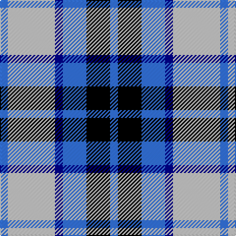

This page is one **sett** — a single exact thread-count. It belongs to the [tartan](/tartans/b1n6db1b3k3b1/)
(the same proportion at any scale), whose colour order is pattern [BKBBWB](/stripes/bkbbwb/).

Sourced from tartans-authority.  It is a [6 stripe tartan](/stripes/stripes6/).

Original link http://www.tartansauthority.com/tartan-ferret/display/5132/

## Thread count
B/8 N48 DB8 B24 K24 B/8

## Palette
Each colour and the base-6 reference it is a variant of.

| Colour | Shade | Base |
|---|---|---|
| B | <code style="background-color:#3474FC;">#3474FC</code> `oklch(59.7% 0.214 262.7)` <small>#3474FC</small> | B <code style="background-color:#2A418A;">#2A418A</code> |
| DB | <code style="background-color:#00008C;">#00008C</code> `oklch(28.9% 0.200 264.1)` <small>#00008C</small> | B <code style="background-color:#2A418A;">#2A418A</code> |
| K | <code style="background-color:#000000;">#000000</code> `oklch(0.0% 0.000 0.0)` <small>#000000</small> | K <code style="background-color:#000000;">#000000</code> |
| N | <code style="background-color:#C8C8C8;">#C8C8C8</code> `oklch(83.3% 0.000 89.9)` <small>#C8C8C8</small> | W <code style="background-color:#F7F7F7;">#F7F7F7</code> |

# Sample pattern

## Nearest tartans

The nearest existing variants by ΔTartan distance, with this tartan at the top so the swatches line up against it.

ΔTartan

Tartan

Sett

—

<a href="/ttd/edit/#slug=b1lb6db1b3k3b1~x8">Thompson (Dance)</a> <a class="nn-out" href="/setts/s6/b1lb6db1b3k3b1~x8/" title="open its dictionary page">↗</a>

0.91

<a href="/ttd/edit/#slug=k4db2k15w10b15db2b4~x2">Strathclyde</a> <a class="nn-out" href="/setts/s7/k4db2k15w10b15db2b4~x2/" title="open its dictionary page">↗</a>

1.04

<a href="/ttd/edit/#slug=k2b16w2k16w15k2w2~x2">Strathclyde</a> <a class="nn-out" href="/setts/s7/k2b16w2k16w15k2w2~x2/" title="open its dictionary page">↗</a>

1.25

<a href="/ttd/edit/#slug=db2lb4k2lb1db4k1db1g1~x4">Culloden - 1977 (Fashion)</a> <a class="nn-out" href="/setts/s8/db2lb4k2lb1db4k1db1g1~x4/" title="open its dictionary page">↗</a>

1.28

<a href="/ttd/edit/#slug=db1g7db7db2w6db1w1~x4">Blue Boy, The (Fashion)</a> <a class="nn-out" href="/setts/s7/db1g7db7db2w6db1w1~x4/" title="open its dictionary page">↗</a>

1.29

<a href="/ttd/edit/#slug=ly2b9r2db6ly1r1~x4">Lauder Primary School</a> <a class="nn-out" href="/setts/s6/ly2b9r2db6ly1r1~x4/" title="open its dictionary page">↗</a>

1.31

<a href="/ttd/edit/#slug=k2lb16w2db16w15k2w2~x2">Strathclyde 1975 (District)</a> <a class="nn-out" href="/setts/s7/k2lb16w2db16w15k2w2~x2/" title="open its dictionary page">↗</a>

1.35

<a href="/ttd/edit/#slug=r3db15w13o6db2o2r2~x2">Thom(p)son, Navy</a> <a class="nn-out" href="/setts/s7/r3db15w13o6db2o2r2~x2/" title="open its dictionary page">↗</a>

1.40

<a href="/ttd/edit/#slug=w20db14dt14w4db2b2dt7~x2">Earl of St. Andrews Dress</a> <a class="nn-out" href="/setts/s7/w20db14dt14w4db2b2dt7~x2/" title="open its dictionary page">↗</a>

1.42

<a href="/ttd/edit/#slug=lb7k2w2k2w2k2lb7t4k10w2~x4">Investors Group</a> <a class="nn-out" href="/setts/s10/lb7k2w2k2w2k2lb7t4k10w2~x4/" title="open its dictionary page">↗</a>

1.42

<a href="/ttd/edit/#slug=r15w10db48t32r6~x2">Lands of Liberty (Fashion)</a> <a class="nn-out" href="/setts/s5/r15w10db48t32r6~x2/" title="open its dictionary page">↗</a>

## Neighbour map

Every grey dot is one of 14299 variants placed by the first two principal components of the ΔTartan feature space (44% of its variance). Red is this tartan; blue dots are its nearest — click one to open its page.

<svg viewBox="0 0 640 380" role="img" style="max-width:100%;height:auto;border:1px solid #e0e0e0;border-radius:4px;display:block" xmlns="http://www.w3.org/2000/svg"><image href="/nn/cloud.v1.png" width="640" height="380"/><a href="/setts/s7/k4db2k15w10b15db2b4~x2/"><circle cx="129.5" cy="207.5" r="4" fill="#3465a4"><title>Strathclyde</title></circle></a><a href="/setts/s7/k2b16w2k16w15k2w2~x2/"><circle cx="129.1" cy="187.9" r="4" fill="#3465a4"><title>Strathclyde</title></circle></a><a href="/setts/s8/db2lb4k2lb1db4k1db1g1~x4/"><circle cx="124.3" cy="235.4" r="4" fill="#3465a4"><title>Culloden - 1977 (Fashion)</title></circle></a><a href="/setts/s7/db1g7db7db2w6db1w1~x4/"><circle cx="116.2" cy="202.4" r="4" fill="#3465a4"><title>Blue Boy, The (Fashion)</title></circle></a><a href="/setts/s6/ly2b9r2db6ly1r1~x4/"><circle cx="178.3" cy="194.6" r="4" fill="#3465a4"><title>Lauder Primary School</title></circle></a><a href="/setts/s7/k2lb16w2db16w15k2w2~x2/"><circle cx="128.5" cy="176.0" r="4" fill="#3465a4"><title>Strathclyde 1975 (District)</title></circle></a><a href="/setts/s7/r3db15w13o6db2o2r2~x2/"><circle cx="151.7" cy="188.8" r="4" fill="#3465a4"><title>Thom(p)son, Navy</title></circle></a><a href="/setts/s7/w20db14dt14w4db2b2dt7~x2/"><circle cx="129.1" cy="171.7" r="4" fill="#3465a4"><title>Earl of St. Andrews Dress</title></circle></a><a href="/setts/s10/lb7k2w2k2w2k2lb7t4k10w2~x4/"><circle cx="119.4" cy="200.1" r="4" fill="#3465a4"><title>Investors Group</title></circle></a><a href="/setts/s5/r15w10db48t32r6~x2/"><circle cx="186.1" cy="222.9" r="4" fill="#3465a4"><title>Lands of Liberty (Fashion)</title></circle></a><circle cx="134.7" cy="214.5" r="5" fill="#c00000"/></svg>

ID: /setts/s6/b1lb6db1b3k3b1~x8/
