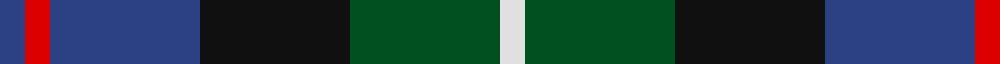

In pattern [BRBKGW](/patterns/brbkgw/).

This was sourced from register-of-tartans.  It is a [6 stripes tartan](/stripes/stripes6/).

Original link https://www.tartanregister.gov.uk/tartanDetails.aspx?ref=4586

## Register references

External register numbers recorded for this tartan.

- Scottish Register of Tartans: [4586](https://www.tartanregister.gov.uk/tartanDetails.aspx?ref=4586)
- Scottish Tartans World Register: 470

## Thread count
B/2 R2 B12 K12 G12 LN/2

## Palette
Each colour and its ΔE from the base-6 reference it is a variant of.

| Colour | Shade | Base | ΔE (OKLab) |
|---|---|---|---|
| B | <code style="background-color:#2C4084;">#2C4084</code> `#2C4084` | B <code style="background-color:#2A418A;">#2A418A</code> | 0.01 |
| G | <code style="background-color:#005020;">#005020</code> `#005020` | G <code style="background-color:#006100;">#006100</code> | 0.07 |
| K | <code style="background-color:#101010;">#101010</code> `#101010` | K <code style="background-color:#000000;">#000000</code> | 0.17 |
| LN | <code style="background-color:#E0E0E0;">#E0E0E0</code> `#E0E0E0` | W <code style="background-color:#F7F7F7;">#F7F7F7</code> | 0.07 |
| N | <code style="background-color:#808080;">#808080</code> `#808080` | G <code style="background-color:#006100;">#006100</code> | 0.23 |
| R | <code style="background-color:#DC0000;">#DC0000</code> `#DC0000` | R <code style="background-color:#CC0000;">#CC0000</code> | 0.03 |

# Sample pattern

## Nearest tartans

The nearest existing variants by ΔTartan distance.

1. [Hogarth of Firhill (Clan)](/setts/s7/b4g14y2k14ba14k2ba3~b5c8ca8-ba2c2c80-g006818-k101010-ye8c000~x2/) — ΔT 0.52
1. [MacEachain (Clan)](/setts/s6/r2k1b6k2g6ra2~b1c0070-g006818-k101010-r880000-ra9c68a4~x4/) — ΔT 0.53
1. [Davidson of Tulloch #2](/setts/s5/r1b6k3g6w1~b2c4084-g005020-k101010-rdc0000-we0e0e0~x4/) — ΔT 0.54
1. [Hogarth of Firhill #2](/setts/s7/b2g6y1k6ba6k1ba1~b0596fa-ba2c4084-g005020-k101010-ye8c000~x2/) — ΔT 0.56
1. [Hogarth of Firhill](/setts/s7/b2g6y1k6ba6k1ba1~b5c8ca8-ba2c2c80-g006818-k101010-ye8c000~x2/) — ΔT 0.56
1. [Dyce #3](/setts/s6/k2y1g6k6b6w1~b2c4084-g005020-k101010-we0e0e0-ye8c000~x4/) — ΔT 0.61
1. [Leslie Hunting Clan Tartan Tartan Number: 1113. Earliest known date: 1810-15 Said to have been worn by George 14th Earl of Rothes who died in 1841. This sett is shown by Smibert (1850) and by W & A Smith (1850) but without the definition of 'Hunting'. This sett is very similar to Duncan, the difference lies in the broad black present in the Leslie Hunting which is green in the Duncan See products available Copyright © Blair Urquhart, Comrie, 2015](/setts/s6/r2b8k8w1g8k1~b2c2c80-g006818-k101010-rc80000-we0e0e0~x2/) — ΔT 0.61
1. [Argyll](/setts/s7/b2k1g8k8ba8k1r2~b5c8ca8-ba2c2c80-g006818-k101010-rc80000~x2/) — ΔT 0.63
1. [Campbell of Cawdor](/setts/s7/b2k1g8k8ba8k1r2~b5c8ca8-ba2c2c80-g006818-k101010-rc80000~x4/) — ΔT 0.63
1. [Campbell of Cawdor Clan Tartan Tartan Number: 2. Earliest known date: 1798 Campbell of Cawdor is one of Wilson's variations based on the military sett. It was originally a numbered pattern, acquiring the name 'Argyle' in 1798 and 'Argylle' in 1819. It is not until W. and A. Smith's work of 1850 that the full title is given, 'Campbell of Cawdor'. This sett is authorized by the present Clan Chief, MacCailien Mor. See products available Copyright © Blair Urquhart, Comrie, 2015](/setts/s7/g2k1ga8k8b8k1r2~b2c2c80-g789484-ga006818-k101010-rc80000~x2/) — ΔT 0.65

## Neighbour map

Every grey dot is one of 15726 variants placed by the first two principal components of the ΔTartan feature space (44% of its variance). Red is this tartan; blue dots are its nearest — click one to open its page.

<svg viewBox="0 0 640 380" role="img" style="max-width:100%;height:auto;border:1px solid #e0e0e0;border-radius:4px;display:block" xmlns="http://www.w3.org/2000/svg"><image href="/nn/cloud.v1.png" width="640" height="380"/><a href="/setts/s7/b4g14y2k14ba14k2ba3~b5c8ca8-ba2c2c80-g006818-k101010-ye8c000~x2/"><circle cx="131.1" cy="216.1" r="4" fill="#3465a4"><title>Hogarth of Firhill (Clan)</title></circle></a><a href="/setts/s6/r2k1b6k2g6ra2~b1c0070-g006818-k101010-r880000-ra9c68a4~x4/"><circle cx="115.1" cy="236.0" r="4" fill="#3465a4"><title>MacEachain (Clan)</title></circle></a><a href="/setts/s5/r1b6k3g6w1~b2c4084-g005020-k101010-rdc0000-we0e0e0~x4/"><circle cx="143.4" cy="243.2" r="4" fill="#3465a4"><title>Davidson of Tulloch #2</title></circle></a><a href="/setts/s7/b2g6y1k6ba6k1ba1~b0596fa-ba2c4084-g005020-k101010-ye8c000~x2/"><circle cx="116.1" cy="223.8" r="4" fill="#3465a4"><title>Hogarth of Firhill #2</title></circle></a><a href="/setts/s7/b2g6y1k6ba6k1ba1~b5c8ca8-ba2c2c80-g006818-k101010-ye8c000~x2/"><circle cx="112.3" cy="221.2" r="4" fill="#3465a4"><title>Hogarth of Firhill</title></circle></a><a href="/setts/s6/k2y1g6k6b6w1~b2c4084-g005020-k101010-we0e0e0-ye8c000~x4/"><circle cx="131.9" cy="235.8" r="4" fill="#3465a4"><title>Dyce #3</title></circle></a><a href="/setts/s6/r2b8k8w1g8k1~b2c2c80-g006818-k101010-rc80000-we0e0e0~x2/"><circle cx="135.7" cy="216.9" r="4" fill="#3465a4"><title>Leslie Hunting Clan Tartan Tartan Number: 1113. Earliest known date: 1810-15 Said to have been worn by George 14th Earl of Rothes who died in 1841. This sett is shown by Smibert (1850) and by W &amp; A Smith (1850) but without the definition of 'Hunting'. This sett is very similar to Duncan, the difference lies in the broad black present in the Leslie Hunting which is green in the Duncan See products available Copyright © Blair Urquhart, Comrie, 2015</title></circle></a><a href="/setts/s7/b2k1g8k8ba8k1r2~b5c8ca8-ba2c2c80-g006818-k101010-rc80000~x2/"><circle cx="147.6" cy="211.6" r="4" fill="#3465a4"><title>Argyll</title></circle></a><a href="/setts/s7/b2k1g8k8ba8k1r2~b5c8ca8-ba2c2c80-g006818-k101010-rc80000~x4/"><circle cx="147.6" cy="211.6" r="4" fill="#3465a4"><title>Campbell of Cawdor</title></circle></a><a href="/setts/s7/g2k1ga8k8b8k1r2~b2c2c80-g789484-ga006818-k101010-rc80000~x2/"><circle cx="146.2" cy="210.8" r="4" fill="#3465a4"><title>Campbell of Cawdor Clan Tartan Tartan Number: 2. Earliest known date: 1798 Campbell of Cawdor is one of Wilson's variations based on the military sett. It was originally a numbered pattern, acquiring the name 'Argyle' in 1798 and 'Argylle' in 1819. It is not until W. and A. Smith's work of 1850 that the full title is given, 'Campbell of Cawdor'. This sett is authorized by the present Clan Chief, MacCailien Mor. See products available Copyright © Blair Urquhart, Comrie, 2015</title></circle></a><circle cx="138.8" cy="231.7" r="5" fill="#c00000"/></svg>

ID: /setts/s6/b1r1b6k6g6w1~b2c4084-g005020-k101010-rdc0000-we0e0e0~x2/
