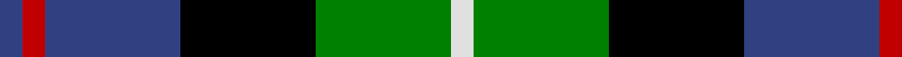
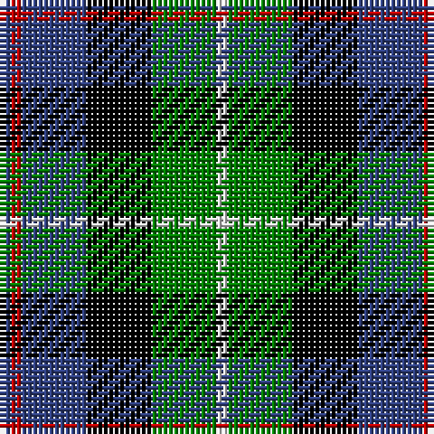

In pattern [BRBKGW](/patterns/brbkgw/).

This was sourced from weddslist.  It is a [6 stripes tartan](/stripes/stripes6/).

Original link http://www.weddslist.com/cgi-bin/tartans/pg.pl?source=sts

## Thread count
B/2 R2 B12 K12 G12 LN/2

## Palette
Each colour and its ΔE from the base-6 reference it is a variant of.

| Colour | Shade | Base | ΔE (OKLab) |
|---|---|---|---|
| B | <code style="background-color:#304080;">#304080</code> `#304080` | B <code style="background-color:#2A418A;">#2A418A</code> | 0.02 |
| G | <code style="background-color:#008000;">#008000</code> `#008000` | G <code style="background-color:#006100;">#006100</code> | 0.10 |
| K | <code style="background-color:#000000;">#000000</code> `#000000` | K <code style="background-color:#000000;">#000000</code> | 0.00 |
| LN | <code style="background-color:#E0E0E0;">#E0E0E0</code> `#E0E0E0` | W <code style="background-color:#F7F7F7;">#F7F7F7</code> | 0.07 |
| R | <code style="background-color:#C00000;">#C00000</code> `#C00000` | R <code style="background-color:#CC0000;">#CC0000</code> | 0.03 |

# Sample pattern

## Nearest tartans

The nearest existing variants by ΔTartan distance.

1. [Royal Highland](/setts/s6/y4g17k17b17r3b3~b304080-g008000-k000000-rc00000-yb0b0b0~x2/) — ΔT 0.23
1. [Hogarth, of Firhill](/setts/s7/b2g6y1k6ba6k1ba1~b8080d0-ba304080-g008000-k000000-yf0c000~x2/) — ΔT 0.45
1. [Hogarth, of Firhill](/setts/s7/b4g14y2k14ba14k2ba3~b5480b0-ba304080-g008000-k000000-yf0c000~x2/) — ΔT 0.48
1. [Leslie, hunting](/setts/s6/r2b8k8w1g8k1~b304080-g008000-k000000-rc00000-we0e0e0~x2/) — ΔT 0.50
1. [Dyce](/setts/s6/k2y1g6k6b6w1~b304080-g008000-k000000-we0e0e0-yf0c000~x4/) — ΔT 0.51
1. [MacNeil 6](/setts/s6/w3b14k12g12k2y3~b304080-g008000-k000000-we0e0e0-yf0c000~x2/) — ΔT 0.55
1. [Birse](/setts/s6/k4g16k14y3b16r4~b304080-g008000-k000000-rc00000-yf0c000~x2/) — ΔT 0.60
1. [Argyll / MacCorquodale](/setts/s7/b2k1g8k8ba8k1r2~b5480b0-ba304080-g008000-k000000-rc00000~x2/) — ΔT 0.65
1. [MacDonald, (Flora.. )](/setts/s7/g17y2k14r2b9r2b10~b304080-g008000-k000000-rc00000-yf0c000~x2/) — ΔT 0.67
1. [Junior Chamber International](/setts/s7/r4g16k16b4g3b12y2~b304080-g008000-k000000-rc00000-yf0c000~x2/) — ΔT 0.67

## Neighbour map

Every grey dot is one of 15726 variants placed by the first two principal components of the ΔTartan feature space (44% of its variance). Red is this tartan; blue dots are its nearest — click one to open its page.

<svg viewBox="0 0 640 380" role="img" style="max-width:100%;height:auto;border:1px solid #e0e0e0;border-radius:4px;display:block" xmlns="http://www.w3.org/2000/svg"><image href="/nn/cloud.v1.png" width="640" height="380"/><a href="/setts/s6/y4g17k17b17r3b3~b304080-g008000-k000000-rc00000-yb0b0b0~x2/"><circle cx="89.4" cy="223.4" r="4" fill="#3465a4"><title>Royal Highland</title></circle></a><a href="/setts/s7/b2g6y1k6ba6k1ba1~b8080d0-ba304080-g008000-k000000-yf0c000~x2/"><circle cx="78.9" cy="209.0" r="4" fill="#3465a4"><title>Hogarth, of Firhill</title></circle></a><a href="/setts/s7/b4g14y2k14ba14k2ba3~b5480b0-ba304080-g008000-k000000-yf0c000~x2/"><circle cx="96.9" cy="204.4" r="4" fill="#3465a4"><title>Hogarth, of Firhill</title></circle></a><a href="/setts/s6/r2b8k8w1g8k1~b304080-g008000-k000000-rc00000-we0e0e0~x2/"><circle cx="103.7" cy="206.4" r="4" fill="#3465a4"><title>Leslie, hunting</title></circle></a><a href="/setts/s6/k2y1g6k6b6w1~b304080-g008000-k000000-we0e0e0-yf0c000~x4/"><circle cx="96.8" cy="223.8" r="4" fill="#3465a4"><title>Dyce</title></circle></a><a href="/setts/s6/w3b14k12g12k2y3~b304080-g008000-k000000-we0e0e0-yf0c000~x2/"><circle cx="73.8" cy="212.4" r="4" fill="#3465a4"><title>MacNeil 6</title></circle></a><a href="/setts/s6/k4g16k14y3b16r4~b304080-g008000-k000000-rc00000-yf0c000~x2/"><circle cx="73.7" cy="229.3" r="4" fill="#3465a4"><title>Birse</title></circle></a><a href="/setts/s7/b2k1g8k8ba8k1r2~b5480b0-ba304080-g008000-k000000-rc00000~x2/"><circle cx="108.3" cy="198.4" r="4" fill="#3465a4"><title>Argyll / MacCorquodale</title></circle></a><a href="/setts/s7/g17y2k14r2b9r2b10~b304080-g008000-k000000-rc00000-yf0c000~x2/"><circle cx="112.9" cy="198.4" r="4" fill="#3465a4"><title>MacDonald, (Flora.. )</title></circle></a><a href="/setts/s7/r4g16k16b4g3b12y2~b304080-g008000-k000000-rc00000-yf0c000~x2/"><circle cx="105.8" cy="200.4" r="4" fill="#3465a4"><title>Junior Chamber International</title></circle></a><circle cx="97.9" cy="217.0" r="5" fill="#c00000"/></svg>

ID: /setts/s6/b1r1b6k6g6w1~b304080-g008000-k000000-rc00000-we0e0e0~x2/
