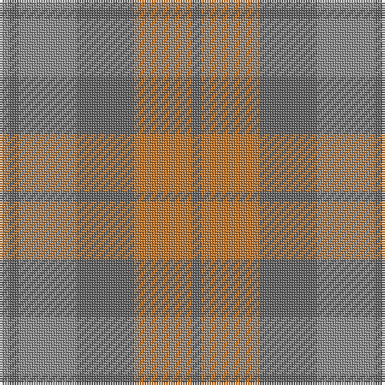

In pattern [BRBRBR](/patterns/brbrbr/).

This was sourced from register-of-tartans.  It is a [6 stripes tartan](/stripes/stripes6/).

Original link https://www.tartanregister.gov.uk/tartanDetails.aspx?ref=1368

## Register references

External register numbers recorded for this tartan.

- Scottish Register of Tartans: [1368](https://www.tartanregister.gov.uk/tartanDetails.aspx?ref=1368)
- Scottish Tartans Authority (ITI): 5000

## Thread count
N/4 Na4 N24 Na24 DO24 Na/4

## Palette
Each colour and its ΔE from the base-6 reference it is a variant of.

| Colour | Shade | Base | ΔE (OKLab) |
|---|---|---|---|
| DO | <code style="background-color:#BE7832;">#BE7832</code> `#BE7832` | R <code style="background-color:#CC0000;">#CC0000</code> | 0.17 |
| N | <code style="background-color:#8C8C8C;">#8C8C8C</code> `#8C8C8C` | R <code style="background-color:#CC0000;">#CC0000</code> | 0.24 |
| Na | <code style="background-color:#646464;">#646464</code> `#646464` | B <code style="background-color:#2A418A;">#2A418A</code> | 0.16 |

# Sample pattern

## Nearest tartans

The nearest existing variants by ΔTartan distance.

1. [Turnberry (MacArthur)](/setts/s8/r24b3r3b3r3b20y22b4~b5c5c5c-r888888-ya0a0a0~x2/) — ΔT 1.36
1. [Daks, (Muted Skye)](/setts/s8/b5g15r4g4r24g4r4b5~b304080-g808080-r806050/) — ΔT 1.50
1. [Outlander #2](/setts/s9/r7b6w1y6b1y6b6w1r6~b5c5c5c-r888888-w98c8e8-ya08858~x8/) — ΔT 1.66
1. [Outlander #2](/setts/s9/g7b6w1y6b1y6b6w1g6~b5c5c5c-g808080-w82cffd-ya08858~x8/) — ΔT 1.67
1. [Outlander #3](/setts/s4/r14b7y7b2~b5c5c5c-r888888-ya08858~x8/) — ΔT 1.67
1. [Brown Heather (Fashion)](/setts/s6/b1g6b6g1ba6g1~b3c2010-ba5c5c5c-g64340c~x8/) — ΔT 1.84
1. [Jardine](/setts/s8/b9r9g9ra1ga1r9ga1ra1~b5c5c5c-g787878-ga789484-ra46000-rac80000~x4/) — ΔT 2.17
1. [Clyde](/setts/s10/r5b3r22ra3b6ba17ra2ba4ra2ba4~b646464-ba5c5c5c-r8c8c8c-ra8c0000~x2/) — ΔT 2.18
1. [Outlander #3](/setts/s4/g14b7y6b2~b5c5c5c-g808080-ya08858~x8/) — ΔT 2.18
1. [Manx Centenary](/setts/s9/b22g3b3g3b3g9r28g3r6~b40748c-g006818-r888888~x2/) — ΔT 2.26

## Neighbour map

Every grey dot is one of 15726 variants placed by the first two principal components of the ΔTartan feature space (44% of its variance). Red is this tartan; blue dots are its nearest — click one to open its page.

<svg viewBox="0 0 640 380" role="img" style="max-width:100%;height:auto;border:1px solid #e0e0e0;border-radius:4px;display:block" xmlns="http://www.w3.org/2000/svg"><image href="/nn/cloud.v1.png" width="640" height="380"/><a href="/setts/s8/r24b3r3b3r3b20y22b4~b5c5c5c-r888888-ya0a0a0~x2/"><circle cx="346.0" cy="265.9" r="4" fill="#3465a4"><title>Turnberry (MacArthur)</title></circle></a><a href="/setts/s8/b5g15r4g4r24g4r4b5~b304080-g808080-r806050/"><circle cx="415.1" cy="291.7" r="4" fill="#3465a4"><title>Daks, (Muted Skye)</title></circle></a><a href="/setts/s9/r7b6w1y6b1y6b6w1r6~b5c5c5c-r888888-w98c8e8-ya08858~x8/"><circle cx="263.8" cy="280.5" r="4" fill="#3465a4"><title>Outlander #2</title></circle></a><a href="/setts/s9/g7b6w1y6b1y6b6w1g6~b5c5c5c-g808080-w82cffd-ya08858~x8/"><circle cx="264.3" cy="281.5" r="4" fill="#3465a4"><title>Outlander #2</title></circle></a><a href="/setts/s4/r14b7y7b2~b5c5c5c-r888888-ya08858~x8/"><circle cx="407.8" cy="350.2" r="4" fill="#3465a4"><title>Outlander #3</title></circle></a><a href="/setts/s6/b1g6b6g1ba6g1~b3c2010-ba5c5c5c-g64340c~x8/"><circle cx="365.5" cy="321.7" r="4" fill="#3465a4"><title>Brown Heather (Fashion)</title></circle></a><a href="/setts/s8/b9r9g9ra1ga1r9ga1ra1~b5c5c5c-g787878-ga789484-ra46000-rac80000~x4/"><circle cx="358.1" cy="246.0" r="4" fill="#3465a4"><title>Jardine</title></circle></a><a href="/setts/s10/r5b3r22ra3b6ba17ra2ba4ra2ba4~b646464-ba5c5c5c-r8c8c8c-ra8c0000~x2/"><circle cx="337.8" cy="220.3" r="4" fill="#3465a4"><title>Clyde</title></circle></a><a href="/setts/s4/g14b7y6b2~b5c5c5c-g808080-ya08858~x8/"><circle cx="437.9" cy="356.4" r="4" fill="#3465a4"><title>Outlander #3</title></circle></a><a href="/setts/s9/b22g3b3g3b3g9r28g3r6~b40748c-g006818-r888888~x2/"><circle cx="369.5" cy="250.8" r="4" fill="#3465a4"><title>Manx Centenary</title></circle></a><circle cx="351.4" cy="308.9" r="5" fill="#c00000"/></svg>

ID: /setts/s6/b1r6b6ra6b1ra1~b646464-rbe7832-ra8c8c8c~x4/
