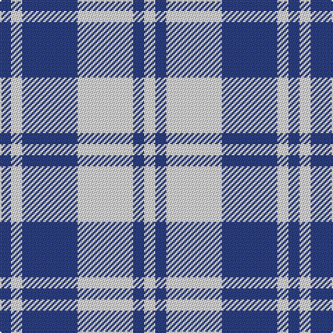

In pattern [BWBWBW](/patterns/bwbwbw/).

This was sourced from register-of-tartans.  It is a [6 stripes tartan](/stripes/stripes6/).

Original link https://www.tartanregister.gov.uk/tartanDetails.aspx?ref=1124

## Register references

External register numbers recorded for this tartan.

- Scottish Register of Tartans: [1124](https://www.tartanregister.gov.uk/tartanDetails.aspx?ref=1124)
- Scottish Tartans World Register: 631

## Thread count
B/8 LN8 B40 LN40 B8 LN/8

## Palette
Each colour and its ΔE from the base-6 reference it is a variant of.

| Colour | Shade | Base | ΔE (OKLab) |
|---|---|---|---|
| B | <code style="background-color:#2C4084;">#2C4084</code> `#2C4084` | B <code style="background-color:#2A418A;">#2A418A</code> | 0.01 |
| LN | <code style="background-color:#E0E0E0;">#E0E0E0</code> `#E0E0E0` | W <code style="background-color:#F7F7F7;">#F7F7F7</code> | 0.07 |

# Sample pattern

## Nearest tartans

The nearest existing variants by ΔTartan distance.

1. [Erskine, Blanket](/setts/s6/b1w1b5w5b1w1~b304080-we0e0e0~x8/) — ΔT 0.09
1. [MacMugen](/setts/s6/b3w16b4w3b12w2~b003c64-wfcf0c8~x3/) — ΔT 1.34
1. [Barbie's Moss Plaid (Blue & White)](/setts/s6/b3w3b20w20b20w3~b003c64-wfcfcfc~x2/) — ΔT 1.38
1. [Unidentified (Shirt)](/setts/s6/w7b16w20b3w3y3~b2c4084-we0e0e0-ye8c000~x2/) — ΔT 1.38
1. [Lewis, Navy (Dance)](/setts/s4/b4w35b31w4~b1c0070-wf0e0c8~x2/) — ΔT 1.39
1. [Unidentified (Shirt)](/setts/s6/w7b16w20b3w3y3~b304080-we0e0e0-yf0c000~x2/) — ΔT 1.41
1. [Queen Margaret University (Corporate](/setts/s7/b1w1b8w4b2w3k1~b2c2c80-k101010-we0e0e0~x6/) — ΔT 1.52
1. [Buchanan Dress Blue Clan Tartan Tartan Number: 1672. Earliest known date: pre 2003 One of a number of dress tartans produced by Hugh Macpherson, a kiltmaker in Edinburgh, intended for dancing and other informal occassions. The 'dress' version of clan tartan is usually created by substituting white for one of the 'ground' colours. See products available Copyright © Blair Urquhart, Comrie, 2015](/setts/s6/w5b16w5b16w33r3~b2c2c80-rc80000-we0e0e0~x2/) — ΔT 1.58
1. [Scott (Abbreviated)](/setts/s7/w2k1w6k6w2k1w1~k101010-we0e0e0~x2/) — ΔT 1.60
1. [Buchanan, dress Blue](/setts/s6/w5b16w5b16w33r3~b304080-rc00000-we0e0e0~x2/) — ΔT 1.60

## Neighbour map

Every grey dot is one of 15726 variants placed by the first two principal components of the ΔTartan feature space (44% of its variance). Red is this tartan; blue dots are its nearest — click one to open its page.

<svg viewBox="0 0 640 380" role="img" style="max-width:100%;height:auto;border:1px solid #e0e0e0;border-radius:4px;display:block" xmlns="http://www.w3.org/2000/svg"><image href="/nn/cloud.v1.png" width="640" height="380"/><a href="/setts/s6/b1w1b5w5b1w1~b304080-we0e0e0~x8/"><circle cx="278.7" cy="253.7" r="4" fill="#3465a4"><title>Erskine, Blanket</title></circle></a><a href="/setts/s6/b3w16b4w3b12w2~b003c64-wfcf0c8~x3/"><circle cx="291.9" cy="234.2" r="4" fill="#3465a4"><title>MacMugen</title></circle></a><a href="/setts/s6/b3w3b20w20b20w3~b003c64-wfcfcfc~x2/"><circle cx="322.6" cy="253.8" r="4" fill="#3465a4"><title>Barbie's Moss Plaid (Blue &amp; White)</title></circle></a><a href="/setts/s6/w7b16w20b3w3y3~b2c4084-we0e0e0-ye8c000~x2/"><circle cx="284.2" cy="225.1" r="4" fill="#3465a4"><title>Unidentified (Shirt)</title></circle></a><a href="/setts/s4/b4w35b31w4~b1c0070-wf0e0c8~x2/"><circle cx="304.9" cy="250.0" r="4" fill="#3465a4"><title>Lewis, Navy (Dance)</title></circle></a><a href="/setts/s6/w7b16w20b3w3y3~b304080-we0e0e0-yf0c000~x2/"><circle cx="284.7" cy="224.8" r="4" fill="#3465a4"><title>Unidentified (Shirt)</title></circle></a><a href="/setts/s7/b1w1b8w4b2w3k1~b2c2c80-k101010-we0e0e0~x6/"><circle cx="277.7" cy="214.5" r="4" fill="#3465a4"><title>Queen Margaret University (Corporate</title></circle></a><a href="/setts/s6/w5b16w5b16w33r3~b2c2c80-rc80000-we0e0e0~x2/"><circle cx="293.1" cy="206.1" r="4" fill="#3465a4"><title>Buchanan Dress Blue Clan Tartan Tartan Number: 1672. Earliest known date: pre 2003 One of a number of dress tartans produced by Hugh Macpherson, a kiltmaker in Edinburgh, intended for dancing and other informal occassions. The 'dress' version of clan tartan is usually created by substituting white for one of the 'ground' colours. See products available Copyright © Blair Urquhart, Comrie, 2015</title></circle></a><a href="/setts/s7/w2k1w6k6w2k1w1~k101010-we0e0e0~x2/"><circle cx="297.8" cy="240.0" r="4" fill="#3465a4"><title>Scott (Abbreviated)</title></circle></a><a href="/setts/s6/w5b16w5b16w33r3~b304080-rc00000-we0e0e0~x2/"><circle cx="297.3" cy="207.5" r="4" fill="#3465a4"><title>Buchanan, dress Blue</title></circle></a><circle cx="278.2" cy="253.9" r="5" fill="#c00000"/></svg>

ID: /setts/s6/b1w1b5w5b1w1~b2c4084-we0e0e0~x8/
