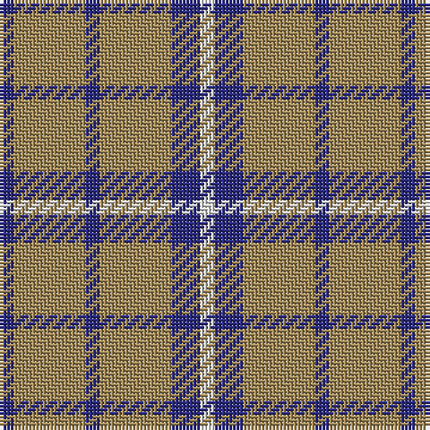

In pattern [BYBYBW](/patterns/bybybw/).

This was sourced from register-of-tartans.  It is a [6 stripes tartan](/stripes/stripes6/).

Original link https://www.tartanregister.gov.uk/tartanDetails.aspx?ref=4133

## Register references

External register numbers recorded for this tartan.

- Scottish Register of Tartans: [4133](https://www.tartanregister.gov.uk/tartanDetails.aspx?ref=4133)
- Scottish Tartans Authority (ITI): 2648
- Scottish Tartans World Register: 2648

## Thread count
DB/4 LT20 DB4 LT20 DB8 LN/4

## Palette
Each colour and its ΔE from the base-6 reference it is a variant of.

| Colour | Shade | Base | ΔE (OKLab) |
|---|---|---|---|
| DB | <code style="background-color:#2C2C80;">#2C2C80</code> `#2C2C80` | B <code style="background-color:#2A418A;">#2A418A</code> | 0.06 |
| LN | <code style="background-color:#E0E0E0;">#E0E0E0</code> `#E0E0E0` | W <code style="background-color:#F7F7F7;">#F7F7F7</code> | 0.07 |
| LT | <code style="background-color:#A08858;">#A08858</code> `#A08858` | Y <code style="background-color:#F2BF00;">#F2BF00</code> | 0.21 |

# Sample pattern

## Nearest tartans

The nearest existing variants by ΔTartan distance.

1. [Tokharian](/setts/s6/b1r5b1r5b2w1~b304080-r906030-we0e0e0~x4/) — ΔT 1.22
1. [Mowdowny (Fashion)](/setts/s9/r1ra6k1ra1k2ra1k1ra6y1~k101010-rc80000-ra888888-ybc8c00~x8/) — ΔT 1.49
1. [Unidentified, Sample](/setts/s6/b11r4y9b4y2b11~b304080-rc00000-yf0c000~x2/) — ΔT 1.53
1. [Justus Dress (Personal)](/setts/s7/b1y4r1y1ya1y4b1~b3850c8-r880000-yb8b8b8-yad09800~x12/) — ΔT 1.54
1. [Unidentified Sample](/setts/s6/b11r4y9b4y2b11~b2c4084-rdc0000-ye8c000~x2/) — ΔT 1.56
1. [Leeds University Corporate Tartan Tartan Number: 980. Earliest known date: pre 2003 Leeds University Scottish Country Dance Club. See products available Copyright © Blair Urquhart, Comrie, 2015](/setts/s8/g9r2g2r2g2r8g11w2~g006818-ra00048-we0e0e0~x4/) — ΔT 1.57
1. [Grange School](/setts/s7/b27y3b14k3b13k3ya23~b606060-k000000-yb0b0b0-yac89800~x2/) — ΔT 1.59
1. [Scott Black & Grey (Corporate)](/setts/s7/r8k3r17k13r6k3r4~k101010-r888888~x2/) — ΔT 1.61
1. [Scott Black and Grey](/setts/s7/g8k3g17k13g6k3g4~g808080-k101010~x2/) — ΔT 1.61
1. [Lucard, Stphane (Personal))](/setts/s6/w11b20y3b8y3b10~b5c8ca8-wfcfcfc-yfccc00~x2/) — ΔT 1.66

## Neighbour map

Every grey dot is one of 15726 variants placed by the first two principal components of the ΔTartan feature space (44% of its variance). Red is this tartan; blue dots are its nearest — click one to open its page.

<svg viewBox="0 0 640 380" role="img" style="max-width:100%;height:auto;border:1px solid #e0e0e0;border-radius:4px;display:block" xmlns="http://www.w3.org/2000/svg"><image href="/nn/cloud.v1.png" width="640" height="380"/><a href="/setts/s6/b1r5b1r5b2w1~b304080-r906030-we0e0e0~x4/"><circle cx="393.9" cy="276.6" r="4" fill="#3465a4"><title>Tokharian</title></circle></a><a href="/setts/s9/r1ra6k1ra1k2ra1k1ra6y1~k101010-rc80000-ra888888-ybc8c00~x8/"><circle cx="368.7" cy="207.7" r="4" fill="#3465a4"><title>Mowdowny (Fashion)</title></circle></a><a href="/setts/s6/b11r4y9b4y2b11~b304080-rc00000-yf0c000~x2/"><circle cx="293.2" cy="271.1" r="4" fill="#3465a4"><title>Unidentified, Sample</title></circle></a><a href="/setts/s7/b1y4r1y1ya1y4b1~b3850c8-r880000-yb8b8b8-yad09800~x12/"><circle cx="342.6" cy="244.8" r="4" fill="#3465a4"><title>Justus Dress (Personal)</title></circle></a><a href="/setts/s6/b11r4y9b4y2b11~b2c4084-rdc0000-ye8c000~x2/"><circle cx="291.9" cy="271.1" r="4" fill="#3465a4"><title>Unidentified Sample</title></circle></a><a href="/setts/s8/g9r2g2r2g2r8g11w2~g006818-ra00048-we0e0e0~x4/"><circle cx="349.0" cy="251.9" r="4" fill="#3465a4"><title>Leeds University Corporate Tartan Tartan Number: 980. Earliest known date: pre 2003 Leeds University Scottish Country Dance Club. See products available Copyright © Blair Urquhart, Comrie, 2015</title></circle></a><a href="/setts/s7/b27y3b14k3b13k3ya23~b606060-k000000-yb0b0b0-yac89800~x2/"><circle cx="333.2" cy="218.4" r="4" fill="#3465a4"><title>Grange School</title></circle></a><a href="/setts/s7/r8k3r17k13r6k3r4~k101010-r888888~x2/"><circle cx="354.2" cy="275.5" r="4" fill="#3465a4"><title>Scott Black &amp; Grey (Corporate)</title></circle></a><a href="/setts/s7/g8k3g17k13g6k3g4~g808080-k101010~x2/"><circle cx="360.9" cy="278.8" r="4" fill="#3465a4"><title>Scott Black and Grey</title></circle></a><a href="/setts/s6/w11b20y3b8y3b10~b5c8ca8-wfcfcfc-yfccc00~x2/"><circle cx="363.7" cy="260.7" r="4" fill="#3465a4"><title>Lucard, Stphane (Personal))</title></circle></a><circle cx="359.5" cy="263.4" r="5" fill="#c00000"/></svg>

ID: /setts/s6/b1y5b1y5b2w1~b2c2c80-we0e0e0-ya08858~x4/
