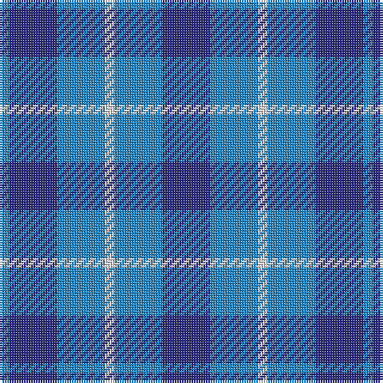

In pattern [BBBWBB](/patterns/bbbwbb/).

This was sourced from register-of-tartans.  It is a [6 stripes tartan](/stripes/stripes6/).

Original link https://www.tartanregister.gov.uk/tartanDetails.aspx?ref=2813

## Thread count
B/4 DB20 B20 LN4 B20 DB/20

## Palette
Each colour and its ΔE from the base-6 reference it is a variant of.

| Colour | Shade | Base | ΔE (OKLab) |
|---|---|---|---|
| B | <code style="background-color:#2888C4;">#2888C4</code> `#2888C4` | B <code style="background-color:#2A418A;">#2A418A</code> | 0.21 |
| DB | <code style="background-color:#2C2C80;">#2C2C80</code> `#2C2C80` | B <code style="background-color:#2A418A;">#2A418A</code> | 0.06 |
| LN | <code style="background-color:#E0E0E0;">#E0E0E0</code> `#E0E0E0` | W <code style="background-color:#F7F7F7;">#F7F7F7</code> | 0.07 |

# Sample pattern

## Nearest tartans

The nearest existing variants by ΔTartan distance.

1. [Langdons](/setts/s7/b8ba16w4ba16b24ba8b8-b144683-ba2194d3-wffffff/) — ΔT 0.78
1. [Manx Cornaa (Personal)](/setts/s4/b4ba20b20w4-b2888c4-ba2c2c80-we0e0e0/) — ΔT 1.20
1. [Manx, Cornaa](/setts/s4/b4ba20b20w4-b8080d0-ba304080-we0e0e0/) — ΔT 1.46
1. [Murray Taylor](/setts/s6/b6ba6b32ba32b32w6-b202060-ba3c82af-wffffff/) — ΔT 1.78
1. [Langdons (Corporate)](/setts/s7/b8w16wa4w16b24w8b8-b1c6894-w98c8e8-wae0e0e0/) — ΔT 1.83
1. [Mercer, Charles](/setts/s8/b36ba8b8y4ba28b8r4ba16-b2c2c80-ba1474b4-rc80000-ye8c000/) — ΔT 2.01
1. [Cathro (Name)](/setts/s5/b72ba48w8g32b16-b9050d8-ba1474b4-g006818-we0e0e0/) — ΔT 2.02
1. [Norris (1957)](/setts/s6/g24b4g28w4b28r4-b3850c8-g408060-rc80000-wfcfcfc/) — ΔT 2.17
1. [Unidentified No 78](/setts/s4/b4g14b14w2-b2c4084-g005020-we0e0e0/) — ΔT 2.18
1. [Omega Delta Sigma, National Veterans](/setts/s4/k30b80k18r20-b2c2c80-k101010-r888888/) — ΔT 2.21

## Neighbour map

Every grey dot is one of 15726 variants placed by the first two principal components of the ΔTartan feature space (44% of its variance). Red is this tartan; blue dots are its nearest — click one to open its page.

<svg viewBox="0 0 640 380" role="img" style="max-width:100%;height:auto;border:1px solid #e0e0e0;border-radius:4px;display:block" xmlns="http://www.w3.org/2000/svg"><image href="/nn/cloud.v1.png" width="640" height="380"/><a href="/setts/s7/b8ba16w4ba16b24ba8b8-b144683-ba2194d3-wffffff/"><circle cx="269.0" cy="285.5" r="4" fill="#3465a4"><title>Langdons</title></circle></a><a href="/setts/s4/b4ba20b20w4-b2888c4-ba2c2c80-we0e0e0/"><circle cx="276.8" cy="292.5" r="4" fill="#3465a4"><title>Manx Cornaa (Personal)</title></circle></a><a href="/setts/s4/b4ba20b20w4-b8080d0-ba304080-we0e0e0/"><circle cx="294.2" cy="292.3" r="4" fill="#3465a4"><title>Manx, Cornaa</title></circle></a><a href="/setts/s6/b6ba6b32ba32b32w6-b202060-ba3c82af-wffffff/"><circle cx="322.5" cy="270.2" r="4" fill="#3465a4"><title>Murray Taylor</title></circle></a><a href="/setts/s7/b8w16wa4w16b24w8b8-b1c6894-w98c8e8-wae0e0e0/"><circle cx="258.5" cy="272.7" r="4" fill="#3465a4"><title>Langdons (Corporate)</title></circle></a><a href="/setts/s8/b36ba8b8y4ba28b8r4ba16-b2c2c80-ba1474b4-rc80000-ye8c000/"><circle cx="302.1" cy="231.6" r="4" fill="#3465a4"><title>Mercer, Charles</title></circle></a><a href="/setts/s5/b72ba48w8g32b16-b9050d8-ba1474b4-g006818-we0e0e0/"><circle cx="268.6" cy="247.1" r="4" fill="#3465a4"><title>Cathro (Name)</title></circle></a><a href="/setts/s6/g24b4g28w4b28r4-b3850c8-g408060-rc80000-wfcfcfc/"><circle cx="310.4" cy="246.0" r="4" fill="#3465a4"><title>Norris (1957)</title></circle></a><a href="/setts/s4/b4g14b14w2-b2c4084-g005020-we0e0e0/"><circle cx="331.8" cy="299.2" r="4" fill="#3465a4"><title>Unidentified No 78</title></circle></a><a href="/setts/s4/k30b80k18r20-b2c2c80-k101010-r888888/"><circle cx="310.0" cy="308.0" r="4" fill="#3465a4"><title>Omega Delta Sigma, National Veterans</title></circle></a><circle cx="276.2" cy="300.5" r="5" fill="#c00000"/></svg>

ID: /setts/s6/b20ba20w4ba20b20ba4-b2c2c80-ba2888c4-we0e0e0/
