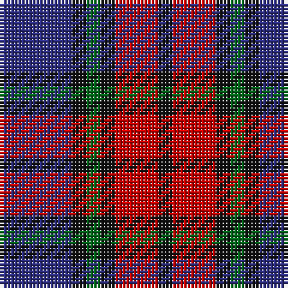

In pattern [BKGKRK](/patterns/bkgkrk/).

This was sourced from house-of-tartan.  It is a [6 stripes tartan](/stripes/stripes6/).

Original link http://www.house-of-tartan.scotland.net/house/TartanViewjs.asp?colr=Def&tnam=326

## Thread count
DB/20 K4 G4 K4 R12 K/4

## Palette
Each colour and its ΔE from the base-6 reference it is a variant of.

| Colour | Shade | Base | ΔE (OKLab) |
|---|---|---|---|
| DB | <code style="background-color:#2C2C80;">#2C2C80</code> `#2C2C80` | B <code style="background-color:#2A418A;">#2A418A</code> | 0.06 |
| G | <code style="background-color:#006818;">#006818</code> `#006818` | G <code style="background-color:#006100;">#006100</code> | 0.02 |
| K | <code style="background-color:#101010;">#101010</code> `#101010` | K <code style="background-color:#000000;">#000000</code> | 0.17 |
| R | <code style="background-color:#C80000;">#C80000</code> `#C80000` | R <code style="background-color:#CC0000;">#CC0000</code> | 0.01 |

# Sample pattern

## Nearest tartans

The nearest existing variants by ΔTartan distance.

1. [Clerk](/setts/s6/b20k4g4k4r12k4-b2c4084-g005020-k101010-rdc0000/) — ΔT 0.28
1. [Grammar School at Leeds (School)](/setts/s6/b32w4b4k24ba29k4-b5c5c5c-ba780078-k101010-we0e0e0/) — ΔT 0.84
1. [MacTavish #2](/setts/s6/b8r48ba8b24k24b8-b5c8ca8-ba1c0070-k101010-r880000/) — ΔT 0.86
1. [Clerk](/setts/s6/b20k4g4k4r12k4-b304080-g008000-k000000-rc00000/) — ΔT 1.04
1. [Baillie (Highland Society)](/setts/s7/b6k2b16k12g16k2w4-b5a008c-g005020-k101010-we0e0e0/) — ΔT 1.20
1. [Gipsy Fancy Tartan Tartan Number: 1137. Earliest known date: 1847 The story goes that both name and design were inspired by the well known free-booter and composer of 'MacPhersons Rant, James MacPherson, who claimed to be the natural son of MacPherson of Invereshee by a gipsy woman. See products available Copyright © Blair Urquhart, Comrie, 2015](/setts/s9/k2r2b10r2w2r2k10r2k2-b2c2c80-k101010-rc80000-we0e0e0/) — ΔT 1.22
1. [Fife (McGill)](/setts/s6/b62ba8b12k38r40y8-b2c2c80-ba5c8ca8-k101010-rc80000-ye8c000/) — ΔT 1.23
1. [Unidentified #61](/setts/s8/b12ba4g20b12r36b4r4b8-b000064-ba00008c-g007800-r8c0000/) — ΔT 1.24
1. [Trinity College, Toronto Uni. (Corp](/setts/s5/k16r32b16ba80y16-b5c8ca8-ba1c1c50-k101010-rc80000-ybc8c00/) — ΔT 1.24
1. [Lanark (Fashion #1)](/setts/s6/r4b12ba4g12ba20w4-b202060-ba680028-g006818-ra00000-wa8ace8/) — ΔT 1.28

## Neighbour map

Every grey dot is one of 15726 variants placed by the first two principal components of the ΔTartan feature space (44% of its variance). Red is this tartan; blue dots are its nearest — click one to open its page.

<svg viewBox="0 0 640 380" role="img" style="max-width:100%;height:auto;border:1px solid #e0e0e0;border-radius:4px;display:block" xmlns="http://www.w3.org/2000/svg"><image href="/nn/cloud.v1.png" width="640" height="380"/><a href="/setts/s6/b20k4g4k4r12k4-b2c4084-g005020-k101010-rdc0000/"><circle cx="193.7" cy="240.5" r="4" fill="#3465a4"><title>Clerk</title></circle></a><a href="/setts/s6/b32w4b4k24ba29k4-b5c5c5c-ba780078-k101010-we0e0e0/"><circle cx="205.0" cy="226.5" r="4" fill="#3465a4"><title>Grammar School at Leeds (School)</title></circle></a><a href="/setts/s6/b8r48ba8b24k24b8-b5c8ca8-ba1c0070-k101010-r880000/"><circle cx="191.2" cy="233.8" r="4" fill="#3465a4"><title>MacTavish #2</title></circle></a><a href="/setts/s6/b20k4g4k4r12k4-b304080-g008000-k000000-rc00000/"><circle cx="170.4" cy="233.1" r="4" fill="#3465a4"><title>Clerk</title></circle></a><a href="/setts/s7/b6k2b16k12g16k2w4-b5a008c-g005020-k101010-we0e0e0/"><circle cx="174.0" cy="223.7" r="4" fill="#3465a4"><title>Baillie (Highland Society)</title></circle></a><a href="/setts/s9/k2r2b10r2w2r2k10r2k2-b2c2c80-k101010-rc80000-we0e0e0/"><circle cx="179.9" cy="206.5" r="4" fill="#3465a4"><title>Gipsy Fancy Tartan Tartan Number: 1137. Earliest known date: 1847 The story goes that both name and design were inspired by the well known free-booter and composer of 'MacPhersons Rant, James MacPherson, who claimed to be the natural son of MacPherson of Invereshee by a gipsy woman. See products available Copyright © Blair Urquhart, Comrie, 2015</title></circle></a><a href="/setts/s6/b62ba8b12k38r40y8-b2c2c80-ba5c8ca8-k101010-rc80000-ye8c000/"><circle cx="186.2" cy="208.1" r="4" fill="#3465a4"><title>Fife (McGill)</title></circle></a><a href="/setts/s8/b12ba4g20b12r36b4r4b8-b000064-ba00008c-g007800-r8c0000/"><circle cx="215.0" cy="205.7" r="4" fill="#3465a4"><title>Unidentified #61</title></circle></a><a href="/setts/s5/k16r32b16ba80y16-b5c8ca8-ba1c1c50-k101010-rc80000-ybc8c00/"><circle cx="204.1" cy="228.3" r="4" fill="#3465a4"><title>Trinity College, Toronto Uni. (Corp</title></circle></a><a href="/setts/s6/r4b12ba4g12ba20w4-b202060-ba680028-g006818-ra00000-wa8ace8/"><circle cx="179.3" cy="243.3" r="4" fill="#3465a4"><title>Lanark (Fashion #1)</title></circle></a><circle cx="198.3" cy="243.3" r="5" fill="#c00000"/></svg>

ID: /setts/s6/b20k4g4k4r12k4-b2c2c80-g006818-k101010-rc80000/
