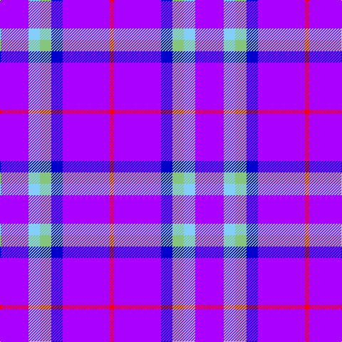

In pattern [BWYBBR](/patterns/bwybbr/).

This was sourced from register-of-tartans.  It is a [6 stripes tartan](/stripes/stripes6/).

Original link https://www.tartanregister.gov.uk/tartanDetails.aspx?ref=10215

## Register references

External register numbers recorded for this tartan.

- Scottish Register of Tartans: [10215](https://www.tartanregister.gov.uk/tartanDetails.aspx?ref=10215)

## Thread count
P/40 LB16 LG16 B16 P66 R/6

## Palette
Each colour and its ΔE from the base-6 reference it is a variant of.

| Colour | Shade | Base | ΔE (OKLab) |
|---|---|---|---|
| B | <code style="background-color:#0000CD;">#0000CD</code> `#0000CD` | B <code style="background-color:#2A418A;">#2A418A</code> | 0.14 |
| LB | <code style="background-color:#82CFFD;">#82CFFD</code> `#82CFFD` | W <code style="background-color:#F7F7F7;">#F7F7F7</code> | 0.18 |
| LG | <code style="background-color:#86C67C;">#86C67C</code> `#86C67C` | Y <code style="background-color:#F2BF00;">#F2BF00</code> | 0.15 |
| P | <code style="background-color:#AA00FF;">#AA00FF</code> `#AA00FF` | B <code style="background-color:#2A418A;">#2A418A</code> | 0.28 |
| R | <code style="background-color:#FF0000;">#FF0000</code> `#FF0000` | R <code style="background-color:#CC0000;">#CC0000</code> | 0.11 |

# Sample pattern

## Nearest tartans

The nearest existing variants by ΔTartan distance.

1. [Instakilt, Blue (Fashion)](/setts/s7/b8w4b50k12b4k15r5~b6840fc-k101010-re40018-wf8f8f8~x2/) — ΔT 2.42
1. [Life Goes on Foundation](/setts/s13/b12k4b5k4b32w5b5k10b5wa5b5wa18wb4~ba000f0-k101010-wc0c0c0-wa98d0f0-wbfafa96/) — ΔT 2.46
1. [Presbyterian College Band (Corp)](/setts/s7/r28k2b36k2w4k2b7~b6840fc-k101010-r901c38-wf8f8f8~x2/) — ΔT 2.59
1. [International Festival of Authors](/setts/s6/b30r5b5ba4b4g12~b59178a-ba009ec7-g00b052-re026a3~x2/) — ΔT 2.87
1. [Cramer (Personal)](/setts/s6/b24k4w10ba3b3wa2~b780078-ba2c2c80-k101010-wc0c0c0-wafcfcfc~x2/) — ΔT 2.88
1. [Doten (2013)](/setts/s5/r14w6b38k3g2~b0000cd-g006400-k101010-rff0000-wffffff~x2/) — ΔT 2.88
1. [Ayllu Thuban](/setts/s5/b46k6g9y9r4~b820bbb-g009900-k000000-ree0000-yffcc11/) — ΔT 2.90
1. [Stephen F Austin State University](/setts/s8/b15w2k3b30k4r3b15w6~b5a008c-k101010-r888888-wffffff~x2/) — ΔT 2.90
1. [McIntosh, Georgina (Personal)](/setts/s6/b9w1g2w1ba4r1~b9050d8-ba2c2c80-g006818-rc80000-w98c8e8~x12/) — ΔT 2.93
1. [Maud, Mary](/setts/s8/b130k9b21y8b21w8b35r70~b2474e8-k101010-rc80000-wfcfcfc-yd8b000/) — ΔT 2.93

## Neighbour map

Every grey dot is one of 15726 variants placed by the first two principal components of the ΔTartan feature space (44% of its variance). Red is this tartan; blue dots are its nearest — click one to open its page.

<svg viewBox="0 0 640 380" role="img" style="max-width:100%;height:auto;border:1px solid #e0e0e0;border-radius:4px;display:block" xmlns="http://www.w3.org/2000/svg"><image href="/nn/cloud.v1.png" width="640" height="380"/><a href="/setts/s7/b8w4b50k12b4k15r5~b6840fc-k101010-re40018-wf8f8f8~x2/"><circle cx="348.9" cy="173.9" r="4" fill="#3465a4"><title>Instakilt, Blue (Fashion)</title></circle></a><a href="/setts/s13/b12k4b5k4b32w5b5k10b5wa5b5wa18wb4~ba000f0-k101010-wc0c0c0-wa98d0f0-wbfafa96/"><circle cx="226.1" cy="143.2" r="4" fill="#3465a4"><title>Life Goes on Foundation</title></circle></a><a href="/setts/s7/r28k2b36k2w4k2b7~b6840fc-k101010-r901c38-wf8f8f8~x2/"><circle cx="326.1" cy="153.4" r="4" fill="#3465a4"><title>Presbyterian College Band (Corp)</title></circle></a><a href="/setts/s6/b30r5b5ba4b4g12~b59178a-ba009ec7-g00b052-re026a3~x2/"><circle cx="347.2" cy="213.6" r="4" fill="#3465a4"><title>International Festival of Authors</title></circle></a><a href="/setts/s6/b24k4w10ba3b3wa2~b780078-ba2c2c80-k101010-wc0c0c0-wafcfcfc~x2/"><circle cx="297.7" cy="160.2" r="4" fill="#3465a4"><title>Cramer (Personal)</title></circle></a><a href="/setts/s5/r14w6b38k3g2~b0000cd-g006400-k101010-rff0000-wffffff~x2/"><circle cx="307.4" cy="151.9" r="4" fill="#3465a4"><title>Doten (2013)</title></circle></a><a href="/setts/s5/b46k6g9y9r4~b820bbb-g009900-k000000-ree0000-yffcc11/"><circle cx="308.3" cy="163.1" r="4" fill="#3465a4"><title>Ayllu Thuban</title></circle></a><a href="/setts/s8/b15w2k3b30k4r3b15w6~b5a008c-k101010-r888888-wffffff~x2/"><circle cx="450.5" cy="178.6" r="4" fill="#3465a4"><title>Stephen F Austin State University</title></circle></a><a href="/setts/s6/b9w1g2w1ba4r1~b9050d8-ba2c2c80-g006818-rc80000-w98c8e8~x12/"><circle cx="246.6" cy="184.7" r="4" fill="#3465a4"><title>McIntosh, Georgina (Personal)</title></circle></a><a href="/setts/s8/b130k9b21y8b21w8b35r70~b2474e8-k101010-rc80000-wfcfcfc-yd8b000/"><circle cx="385.1" cy="150.6" r="4" fill="#3465a4"><title>Maud, Mary</title></circle></a><circle cx="334.2" cy="186.9" r="5" fill="#c00000"/></svg>

ID: /setts/s6/b20w8y8ba8b33r3~baa00ff-ba0000cd-rff0000-w82cffd-y86c67c~x2/
