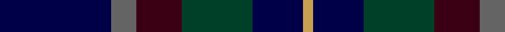

In pattern [BBBGBY](/patterns/bbbgby/).

This was sourced from register-of-tartans.  It is a [6 stripes tartan](/stripes/stripes6/).

Original link https://www.tartanregister.gov.uk/tartanDetails.aspx?ref=5408

## Attestations

This cloth appears in 3 source records; the oldest owns this page.

- 01/01/1997 — Belfrage (register-of-tartans, [record](https://www.tartanregister.gov.uk/tartanDetails.aspx?ref=5408))
- 2000 Oct — Belfrage (Name) (tartans-authority, [record](http://www.tartansauthority.com/tartan-ferret/display/3672/))
- undated — Belfrage Swedish Family Tartan Tartan Number: 3672. Earliest known date: 1997 Based of the Duke of Fife and Spens tartans. Designed by Peter MacDonald in 1997 for the Belfrage Family Society most of whom live in Sweden. The family came from Fife where the name is a variation of Beveridge. It appears to have completely died out in Scotland. See products available Copyright © Blair Urquhart, Comrie, 2015 (house-of-tartan, [record](http://www.house-of-tartan.scotland.net/house/TartanViewjs.asp?colr=Def&tnam=3672))

## Thread count
DB/44 Na10 DR18 DG28 DB20 O/4

## Palette
Each colour and its ΔE from the base-6 reference it is a variant of.

| Colour | Shade | Base | ΔE (OKLab) |
|---|---|---|---|
| DB | <code style="background-color:#000048;">#000048</code> `#000048` | B <code style="background-color:#2A418A;">#2A418A</code> | 0.22 |
| DG | <code style="background-color:#004028;">#004028</code> `#004028` | G <code style="background-color:#006100;">#006100</code> | 0.13 |
| DR | <code style="background-color:#3C0014;">#3C0014</code> `#3C0014` | B <code style="background-color:#2A418A;">#2A418A</code> | 0.24 |
| N | <code style="background-color:#C8C8C8;">#C8C8C8</code> `#C8C8C8` | W <code style="background-color:#F7F7F7;">#F7F7F7</code> | 0.14 |
| Na | <code style="background-color:#646464;">#646464</code> `#646464` | B <code style="background-color:#2A418A;">#2A418A</code> | 0.16 |
| O | <code style="background-color:#C8A050;">#C8A050</code> `#C8A050` | Y <code style="background-color:#F2BF00;">#F2BF00</code> | 0.12 |
| P | <code style="background-color:#64008C;">#64008C</code> `#64008C` | B <code style="background-color:#2A418A;">#2A418A</code> | 0.14 |
| R | <code style="background-color:#C80000;">#C80000</code> `#C80000` | R <code style="background-color:#CC0000;">#CC0000</code> | 0.01 |

# Sample pattern

## Nearest tartans

The nearest existing variants by ΔTartan distance.

1. [Moray (Corporate)](/setts/s8/b15ba3b30k22g18ba3g3w3~b2c2c80-ba780078-g003820-k101010-we0e0e0~x2/) — ΔT 1.26
1. [The Harbour Town, Hilton Head](/setts/s6/k3g11k3b11k18r3~b600030-g004010-k000030-r906030~x2/) — ΔT 1.44
1. [Mackison](/setts/s6/b18ba1b12k14g14r2~b003c64-ba780078-g006818-k101010-rc80000~x2/) — ΔT 1.45
1. [Cultoquhey Hotel Corporate Tartan Tartan Number: 3393. Earliest known date: circa1990 Designed by Peter MacDonald as a Cook tartan for the former owners (David & Anna) of the Cultoquhey Hotel near Crieff. When they left, if became the house tartan of the hotel See products available Copyright © Blair Urquhart, Comrie, 2015](/setts/s5/r3b22k11g32y3~b202060-g003820-k101010-rc80000-yd8b000~x2/) — ΔT 1.48
1. [Haus of RvR](/setts/s11/b13w2b13k3ba13k21y3k18b9k2b2~b2c4084-ba141e46-k101010-we0e0e0-yc88c00~x2/) — ΔT 1.49
1. [Rose, Danny and Hanna (Personal)](/setts/s5/y11b19ba38r7k7~b2c2c80-ba14283c-k101010-r880000-y48a4c0~x2/) — ΔT 1.50
1. [Old Brigade](/setts/s6/b9k9r3b9k9y1~b202060-k101010-rc80000-yfccc00~x4/) — ΔT 1.51
1. [Robert Gordon University](/setts/s6/k4r2k12b12k1y2~b202060-k101010-r880000-yd09800~x2/) — ΔT 1.53
1. [St. Andrew Society](/setts/s7/b16k16ba16w3ba16k2bb3~b2c2c80-ba1c0070-bb2888c4-k101010-we0e0e0~x2/) — ΔT 1.55
1. [Lyle and Scott](/setts/s6/g5b2g9ba19bb9y2~b2c2c80-ba000048-bb4c0000-g005020-yfccc00~x2/) — ΔT 1.56

## Neighbour map

Every grey dot is one of 15726 variants placed by the first two principal components of the ΔTartan feature space (44% of its variance). Red is this tartan; blue dots are its nearest — click one to open its page.

<svg viewBox="0 0 640 380" role="img" style="max-width:100%;height:auto;border:1px solid #e0e0e0;border-radius:4px;display:block" xmlns="http://www.w3.org/2000/svg"><image href="/nn/cloud.v1.png" width="640" height="380"/><a href="/setts/s8/b15ba3b30k22g18ba3g3w3~b2c2c80-ba780078-g003820-k101010-we0e0e0~x2/"><circle cx="252.3" cy="209.1" r="4" fill="#3465a4"><title>Moray (Corporate)</title></circle></a><a href="/setts/s6/k3g11k3b11k18r3~b600030-g004010-k000030-r906030~x2/"><circle cx="265.5" cy="269.0" r="4" fill="#3465a4"><title>The Harbour Town, Hilton Head</title></circle></a><a href="/setts/s6/b18ba1b12k14g14r2~b003c64-ba780078-g006818-k101010-rc80000~x2/"><circle cx="290.6" cy="227.0" r="4" fill="#3465a4"><title>Mackison</title></circle></a><a href="/setts/s5/r3b22k11g32y3~b202060-g003820-k101010-rc80000-yd8b000~x2/"><circle cx="268.8" cy="234.8" r="4" fill="#3465a4"><title>Cultoquhey Hotel Corporate Tartan Tartan Number: 3393. Earliest known date: circa1990 Designed by Peter MacDonald as a Cook tartan for the former owners (David &amp; Anna) of the Cultoquhey Hotel near Crieff. When they left, if became the house tartan of the hotel See products available Copyright © Blair Urquhart, Comrie, 2015</title></circle></a><a href="/setts/s11/b13w2b13k3ba13k21y3k18b9k2b2~b2c4084-ba141e46-k101010-we0e0e0-yc88c00~x2/"><circle cx="241.2" cy="199.9" r="4" fill="#3465a4"><title>Haus of RvR</title></circle></a><a href="/setts/s5/y11b19ba38r7k7~b2c2c80-ba14283c-k101010-r880000-y48a4c0~x2/"><circle cx="216.3" cy="256.2" r="4" fill="#3465a4"><title>Rose, Danny and Hanna (Personal)</title></circle></a><a href="/setts/s6/b9k9r3b9k9y1~b202060-k101010-rc80000-yfccc00~x4/"><circle cx="268.5" cy="275.5" r="4" fill="#3465a4"><title>Old Brigade</title></circle></a><a href="/setts/s6/k4r2k12b12k1y2~b202060-k101010-r880000-yd09800~x2/"><circle cx="336.5" cy="232.6" r="4" fill="#3465a4"><title>Robert Gordon University</title></circle></a><a href="/setts/s7/b16k16ba16w3ba16k2bb3~b2c2c80-ba1c0070-bb2888c4-k101010-we0e0e0~x2/"><circle cx="212.3" cy="237.3" r="4" fill="#3465a4"><title>St. Andrew Society</title></circle></a><a href="/setts/s6/g5b2g9ba19bb9y2~b2c2c80-ba000048-bb4c0000-g005020-yfccc00~x2/"><circle cx="199.6" cy="217.3" r="4" fill="#3465a4"><title>Lyle and Scott</title></circle></a><circle cx="267.9" cy="240.7" r="5" fill="#c00000"/></svg>

ID: /setts/s6/b22ba5bb9g14b10y2~b000048-ba646464-bb3c0014-g004028-yc8a050~x2/
