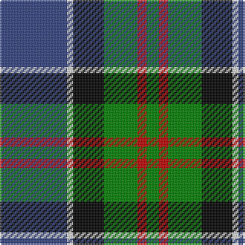

In pattern [BWKGRG](/patterns/bwkgrg/).

This was sourced from weddslist.  It is a [6 stripes tartan](/stripes/stripes6/).

Original link http://www.weddslist.com/cgi-bin/tartans/pg.pl?source=sts

## Thread count
B/44 LN4 K20 G22 R6 G/8

## Palette
Each colour and its ΔE from the base-6 reference it is a variant of.

| Colour | Shade | Base | ΔE (OKLab) |
|---|---|---|---|
| B | <code style="background-color:#304080;">#304080</code> `#304080` | B <code style="background-color:#2A418A;">#2A418A</code> | 0.02 |
| G | <code style="background-color:#008000;">#008000</code> `#008000` | G <code style="background-color:#006100;">#006100</code> | 0.10 |
| K | <code style="background-color:#000000;">#000000</code> `#000000` | K <code style="background-color:#000000;">#000000</code> | 0.00 |
| LN | <code style="background-color:#E0E0E0;">#E0E0E0</code> `#E0E0E0` | W <code style="background-color:#F7F7F7;">#F7F7F7</code> | 0.07 |
| R | <code style="background-color:#C00000;">#C00000</code> `#C00000` | R <code style="background-color:#CC0000;">#CC0000</code> | 0.03 |

# Sample pattern

## Nearest tartans

The nearest existing variants by ΔTartan distance.

1. [Leslie, Hebridean](/setts/s6/k6g15w2b22r2k4~b304080-g008000-k000000-rd03030-we0e0e0~x2/) — ΔT 0.33
1. [MacLeod of Assynt](/setts/s6/r3k2g15k10b20y2~b304080-g008000-k000000-rc00000-yf0c000~x2/) — ΔT 0.46
1. [MacPhail, hunting](/setts/s6/r2b23k14g16k2w2~b304080-g008000-k000000-rc00000-we0e0e0~x2/) — ΔT 0.48
1. [Midlothian](/setts/s6/b31ba4b5k19g20y4~b304080-ba8080d0-g008000-k000000-yf0c000~x2/) — ΔT 0.62
1. [MacLeod, Macleod of Harris](/setts/s7/r3k2g15k10b20k2y2~b304080-g008000-k000000-rc00000-yf0c000~x2/) — ΔT 0.75
1. [Inglis (Name)](/setts/s6/y4g24b10r3b12ya4~b1c0070-g006818-rc80000-yb8b8b8-yad09800~x2/) — ΔT 0.79
1. [MacTaggert](/setts/s7/g9b2g1k6ba6r1ba1~b5480b0-ba304080-g008000-k000000-rc00000~x2/) — ΔT 0.81
1. [MacWilliam](/setts/s6/r2g12k10ra1b16ra2~b304080-g008000-k000000-r806050-rac00000~x2/) — ΔT 0.81
1. [MacThomas](/setts/s7/b3r2b22k11g24w2g3~b304080-g008000-k000000-r900030-wc0a0e0~x2/) — ΔT 0.86
1. [MacPhadran](/setts/s7/g3b12y1k12g13r2g2~b304080-g008000-k000000-rc00000-yb0b0b0~x2/) — ΔT 0.86

## Neighbour map

Every grey dot is one of 15726 variants placed by the first two principal components of the ΔTartan feature space (44% of its variance). Red is this tartan; blue dots are its nearest — click one to open its page.

<svg viewBox="0 0 640 380" role="img" style="max-width:100%;height:auto;border:1px solid #e0e0e0;border-radius:4px;display:block" xmlns="http://www.w3.org/2000/svg"><image href="/nn/cloud.v1.png" width="640" height="380"/><a href="/setts/s6/k6g15w2b22r2k4~b304080-g008000-k000000-rd03030-we0e0e0~x2/"><circle cx="184.4" cy="184.9" r="4" fill="#3465a4"><title>Leslie, Hebridean</title></circle></a><a href="/setts/s6/r3k2g15k10b20y2~b304080-g008000-k000000-rc00000-yf0c000~x2/"><circle cx="150.5" cy="192.8" r="4" fill="#3465a4"><title>MacLeod of Assynt</title></circle></a><a href="/setts/s6/r2b23k14g16k2w2~b304080-g008000-k000000-rc00000-we0e0e0~x2/"><circle cx="163.3" cy="186.0" r="4" fill="#3465a4"><title>MacPhail, hunting</title></circle></a><a href="/setts/s6/b31ba4b5k19g20y4~b304080-ba8080d0-g008000-k000000-yf0c000~x2/"><circle cx="155.2" cy="208.7" r="4" fill="#3465a4"><title>Midlothian</title></circle></a><a href="/setts/s7/r3k2g15k10b20k2y2~b304080-g008000-k000000-rc00000-yf0c000~x2/"><circle cx="147.6" cy="179.0" r="4" fill="#3465a4"><title>MacLeod, Macleod of Harris</title></circle></a><a href="/setts/s6/y4g24b10r3b12ya4~b1c0070-g006818-rc80000-yb8b8b8-yad09800~x2/"><circle cx="180.1" cy="208.1" r="4" fill="#3465a4"><title>Inglis (Name)</title></circle></a><a href="/setts/s7/g9b2g1k6ba6r1ba1~b5480b0-ba304080-g008000-k000000-rc00000~x2/"><circle cx="141.0" cy="191.4" r="4" fill="#3465a4"><title>MacTaggert</title></circle></a><a href="/setts/s6/r2g12k10ra1b16ra2~b304080-g008000-k000000-r806050-rac00000~x2/"><circle cx="166.9" cy="178.2" r="4" fill="#3465a4"><title>MacWilliam</title></circle></a><a href="/setts/s7/b3r2b22k11g24w2g3~b304080-g008000-k000000-r900030-wc0a0e0~x2/"><circle cx="191.5" cy="174.9" r="4" fill="#3465a4"><title>MacThomas</title></circle></a><a href="/setts/s7/g3b12y1k12g13r2g2~b304080-g008000-k000000-rc00000-yb0b0b0~x2/"><circle cx="165.1" cy="179.7" r="4" fill="#3465a4"><title>MacPhadran</title></circle></a><circle cx="171.8" cy="191.3" r="5" fill="#c00000"/></svg>

ID: /setts/s6/b22w2k10g11r3g4~b304080-g008000-k000000-rc00000-we0e0e0~x2/
