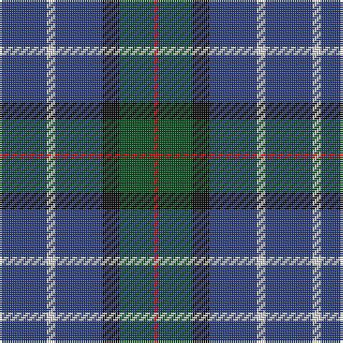

In pattern [BWBKGR](/patterns/bwbkgr/).

This was sourced from register-of-tartans.  It is a [6 stripes tartan](/stripes/stripes6/).

Original link https://www.tartanregister.gov.uk/tartanDetails.aspx?ref=880

## Thread count
B/22 LN4 B22 K8 G16 R/2

## Palette
Each colour and its ΔE from the base-6 reference it is a variant of.

| Colour | Shade | Base | ΔE (OKLab) |
|---|---|---|---|
| B | <code style="background-color:#2C4084;">#2C4084</code> `#2C4084` | B <code style="background-color:#2C4084;">#2C4084</code> | 0.00 |
| G | <code style="background-color:#005020;">#005020</code> `#005020` | G <code style="background-color:#006400;">#006400</code> | 0.08 |
| K | <code style="background-color:#101010;">#101010</code> `#101010` | K <code style="background-color:#000000;">#000000</code> | 0.17 |
| LN | <code style="background-color:#E0E0E0;">#E0E0E0</code> `#E0E0E0` | W <code style="background-color:#F4F4F0;">#F4F4F0</code> | 0.06 |
| R | <code style="background-color:#DC0000;">#DC0000</code> `#DC0000` | R <code style="background-color:#C80000;">#C80000</code> | 0.04 |

# Sample pattern

## Nearest tartans

The nearest existing variants by ΔTartan distance.

1. [HMS Duncan (Military)](/setts/s6/b6r30ba30ra4ba30y6-b780078-ba003c64-r888888-rac80000-ycca800/) — ΔT 0.93
1. [Grainger (Name)](/setts/s7/b72r8b12g36b30k36w8-b2c2c80-g006818-k101010-rc80000-wfcfcfc/) — ΔT 0.94
1. [Ancient Atlantic](/setts/s6/w4b24g20k4b24y4-b2c2c80-g604000-k101010-wfcfcfc-ye8c000/) — ΔT 1.42
1. [MacHardy, Blue](/setts/s8/b12r6g52b52w8b52r10g10-b2c2c80-g006818-rc80000-wfcfcfc/) — ΔT 1.44
1. [Jethart](/setts/s9/k44b32r6b32k6b32g6b6ba10-b304080-ba8080d0-g30a010-k000030-rc00000/) — ΔT 1.45
1. [Dalmeny](/setts/s10/b16k2b16k4g12r2g12k4b16w2-b2c4084-g005020-k101010-rdc0000-we0e0e0/) — ΔT 1.47
1. [Connaught Green](/setts/s6/r2b24g10b4g8w2-b202060-g5c6428-ra00000-wc0c0c0/) — ΔT 1.47
1. [Granger (Personal)](/setts/s6/b80k8b24k42g54w8-b2c2c80-g006818-k101010-we0e0e0/) — ΔT 1.49
1. [Kildare, County (District)](/setts/s8/g16b4g26r8g24ba44g10ra6-b4c3428-ba2c2c80-g74846c-r880000-rab84c00/) — ΔT 1.49
1. [MacWilliam](/setts/s8/g8ga48k40r4b64r8b64r4-b1474b4-g604000-ga006818-k101010-rc80000/) — ΔT 1.51

## Neighbour map

Every grey dot is one of 15726 variants placed by the first two principal components of the ΔTartan feature space (44% of its variance). Red is this tartan; blue dots are its nearest — click one to open its page.

<svg viewBox="0 0 640 380" role="img" style="max-width:100%;height:auto;border:1px solid #e0e0e0;border-radius:4px;display:block" xmlns="http://www.w3.org/2000/svg"><image href="/nn/cloud.v1.png" width="640" height="380"/><a href="/setts/s6/b6r30ba30ra4ba30y6-b780078-ba003c64-r888888-rac80000-ycca800/"><circle cx="277.3" cy="228.6" r="4" fill="#3465a4"><title>HMS Duncan (Military)</title></circle></a><a href="/setts/s7/b72r8b12g36b30k36w8-b2c2c80-g006818-k101010-rc80000-wfcfcfc/"><circle cx="261.0" cy="210.6" r="4" fill="#3465a4"><title>Grainger (Name)</title></circle></a><a href="/setts/s6/w4b24g20k4b24y4-b2c2c80-g604000-k101010-wfcfcfc-ye8c000/"><circle cx="270.2" cy="228.0" r="4" fill="#3465a4"><title>Ancient Atlantic</title></circle></a><a href="/setts/s8/b12r6g52b52w8b52r10g10-b2c2c80-g006818-rc80000-wfcfcfc/"><circle cx="301.1" cy="212.6" r="4" fill="#3465a4"><title>MacHardy, Blue</title></circle></a><a href="/setts/s9/k44b32r6b32k6b32g6b6ba10-b304080-ba8080d0-g30a010-k000030-rc00000/"><circle cx="293.8" cy="217.0" r="4" fill="#3465a4"><title>Jethart</title></circle></a><a href="/setts/s10/b16k2b16k4g12r2g12k4b16w2-b2c4084-g005020-k101010-rdc0000-we0e0e0/"><circle cx="288.5" cy="222.8" r="4" fill="#3465a4"><title>Dalmeny</title></circle></a><a href="/setts/s6/r2b24g10b4g8w2-b202060-g5c6428-ra00000-wc0c0c0/"><circle cx="351.4" cy="215.8" r="4" fill="#3465a4"><title>Connaught Green</title></circle></a><a href="/setts/s6/b80k8b24k42g54w8-b2c2c80-g006818-k101010-we0e0e0/"><circle cx="250.7" cy="234.7" r="4" fill="#3465a4"><title>Granger (Personal)</title></circle></a><a href="/setts/s8/g16b4g26r8g24ba44g10ra6-b4c3428-ba2c2c80-g74846c-r880000-rab84c00/"><circle cx="300.6" cy="203.2" r="4" fill="#3465a4"><title>Kildare, County (District)</title></circle></a><a href="/setts/s8/g8ga48k40r4b64r8b64r4-b1474b4-g604000-ga006818-k101010-rc80000/"><circle cx="270.4" cy="176.7" r="4" fill="#3465a4"><title>MacWilliam</title></circle></a><circle cx="300.2" cy="225.5" r="5" fill="#c00000"/></svg>

ID: /setts/s6/b22w4b22k8g16r2-b2c4084-g005020-k101010-rdc0000-we0e0e0/
