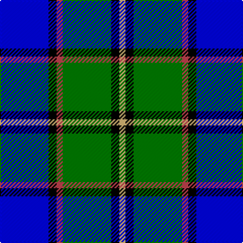

**Bands:** [YKGRKB](/stripes/ykgrkb/) · **Stripes:** [LY K G R K B](/stripes/stripes6/) LY K G R K B

This was sourced from weddslist.  It is a [6 band tartan](/bands/bands6/).

Original link http://www.weddslist.com/cgi-bin/tartans/pg.pl?source=misc

## Register references

External register numbers recorded for this tartan.

- Scottish Register of Tartans: [440](https://www.tartanregister.gov.uk/tartanDetails.aspx?ref=440)
- Scottish Tartans Authority (ITI): 1239
- Scottish Tartans World Register: 1239

## Thread count
B/48 K8 R6 G48 K8 LG/6

## Palette
Each colour and its ΔE from the base-6 reference it is a variant of.

| Colour | Shade | Base | ΔE (OKLab) |
|---|---|---|---|
| B | <code style="background-color:#0004FF;">#0004FF</code> `#0004FF` | B <code style="background-color:#2A418A;">#2A418A</code> | 0.20 |
| G | <code style="background-color:#007D00;">#007D00</code> `#007D00` | G <code style="background-color:#006100;">#006100</code> | 0.09 |
| K | <code style="background-color:#000000;">#000000</code> `#000000` | K <code style="background-color:#000000;">#000000</code> | 0.00 |
| LG | <code style="background-color:#DFB675;">#DFB675</code> `#DFB675` | Y <code style="background-color:#F2BF00;">#F2BF00</code> | 0.08 |
| R | <code style="background-color:#BE414D;">#BE414D</code> `#BE414D` | R <code style="background-color:#CC0000;">#CC0000</code> | 0.07 |

# Sample pattern

## Nearest tartans

The nearest existing variants by ΔTartan distance.

1. [Mina Perhonen](/setts/s7/w4k24ly2n24t5k4ly4~x2/) — ΔT 1.05
1. [Douglas](/setts/s5/k2lt2g8db8w1~x2/) — ΔT 1.11
1. [Loch Ness (Fashion)](/setts/s7/r2t2r2t21lg11k17lb2~x2/) — ΔT 1.20
1. [Loch Ness in Scotland](/setts/s7/g2db14lg6lr1g1lr6r1~x4/) — ΔT 1.30
1. [F.I.A.T.A. Congress of 1990](/setts/s7/dg12b8db4ly2r1ly1db6~x4/) — ΔT 1.37
1. [American Express](/setts/s6/db2b9r1db5g5lb2~x4/) — ΔT 1.40
1. [Lemania](/setts/s8/g12db3g3db3g3k15lg20b3~x2/) — ΔT 1.42
1. [St. Francis Xavier University](/setts/s7/k3lo1lb9lo1db9k3t1~x4/) — ΔT 1.43
1. [Sneddon, Jonathan Taylor (Personal)](/setts/s8/b15k2w2k2w2k16lr22ly2~x4/) — ΔT 1.49
1. [Strathclyde](/setts/s7/k2b16w2k16w15k2w2~x2/) — ΔT 1.50

## Neighbour map

Every grey dot is one of 14299 variants placed by the first two principal components of the ΔTartan feature space (44% of its variance). Red is this tartan; blue dots are its nearest — click one to open its page.

<svg viewBox="0 0 640 380" role="img" style="max-width:100%;height:auto;border:1px solid #e0e0e0;border-radius:4px;display:block" xmlns="http://www.w3.org/2000/svg"><image href="/nn/cloud.v1.png" width="640" height="380"/><a href="/setts/s7/w4k24ly2n24t5k4ly4~x2/"><circle cx="187.5" cy="168.3" r="4" fill="#3465a4"><title>Mina Perhonen</title></circle></a><a href="/setts/s5/k2lt2g8db8w1~x2/"><circle cx="135.5" cy="212.0" r="4" fill="#3465a4"><title>Douglas</title></circle></a><a href="/setts/s7/r2t2r2t21lg11k17lb2~x2/"><circle cx="169.5" cy="170.4" r="4" fill="#3465a4"><title>Loch Ness (Fashion)</title></circle></a><a href="/setts/s7/g2db14lg6lr1g1lr6r1~x4/"><circle cx="200.2" cy="156.6" r="4" fill="#3465a4"><title>Loch Ness in Scotland</title></circle></a><a href="/setts/s7/dg12b8db4ly2r1ly1db6~x4/"><circle cx="148.8" cy="188.9" r="4" fill="#3465a4"><title>F.I.A.T.A. Congress of 1990</title></circle></a><a href="/setts/s6/db2b9r1db5g5lb2~x4/"><circle cx="129.3" cy="208.4" r="4" fill="#3465a4"><title>American Express</title></circle></a><a href="/setts/s8/g12db3g3db3g3k15lg20b3~x2/"><circle cx="110.4" cy="197.3" r="4" fill="#3465a4"><title>Lemania</title></circle></a><a href="/setts/s7/k3lo1lb9lo1db9k3t1~x4/"><circle cx="110.9" cy="168.5" r="4" fill="#3465a4"><title>St. Francis Xavier University</title></circle></a><a href="/setts/s8/b15k2w2k2w2k16lr22ly2~x4/"><circle cx="134.8" cy="147.2" r="4" fill="#3465a4"><title>Sneddon, Jonathan Taylor (Personal)</title></circle></a><a href="/setts/s7/k2b16w2k16w15k2w2~x2/"><circle cx="129.1" cy="187.9" r="4" fill="#3465a4"><title>Strathclyde</title></circle></a><circle cx="152.5" cy="188.5" r="5" fill="#c00000"/></svg>

ID: /setts/s6/b24k4r3g24k4ly3~x2/
