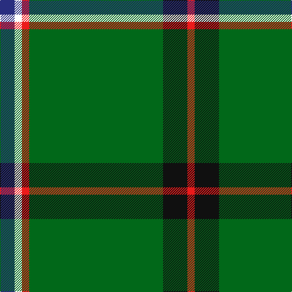

In pattern [BWRGKR](/patterns/bwrgkr/).

This was sourced from register-of-tartans.  It is a [6 stripes tartan](/stripes/stripes6/).

Original link https://www.tartanregister.gov.uk/tartanDetails.aspx?ref=10141

## Thread count
DB/24 W12 R12 G220 K40 R/12

## Palette
Each colour and its ΔE from the base-6 reference it is a variant of.

| Colour | Shade | Base | ΔE (OKLab) |
|---|---|---|---|
| DB | <code style="background-color:#292E7F;">#292E7F</code> `#292E7F` | B <code style="background-color:#2C4084;">#2C4084</code> | 0.05 |
| G | <code style="background-color:#016819;">#016819</code> `#016819` | G <code style="background-color:#006400;">#006400</code> | 0.02 |
| K | <code style="background-color:#101010;">#101010</code> `#101010` | K <code style="background-color:#000000;">#000000</code> | 0.17 |
| R | <code style="background-color:#EC1A1B;">#EC1A1B</code> `#EC1A1B` | R <code style="background-color:#C80000;">#C80000</code> | 0.08 |
| W | <code style="background-color:#FFFFFF;">#FFFFFF</code> `#FFFFFF` | W <code style="background-color:#F4F4F0;">#F4F4F0</code> | 0.03 |

# Sample pattern

## Nearest tartans

The nearest existing variants by ΔTartan distance.

1. [Military Medical Memorial (USA)(Corp](/setts/s6/b24w12r12g220k40r12-b2c2c80-g006818-k101010-rc80000-we0e0e0/) — ΔT 0.37
1. [Selvon-Bruce (Personal)](/setts/s7/k12g8k12g72r8b8y4-b1c1c50-g288028-k101010-r880000-ybc8c00/) — ΔT 0.73
1. [Sarros (Personal) XX](/setts/s8/k4w4b16k8g66r4g32w4-b2c2c80-g006818-k101010-rc8002c-wfcfcfc/) — ΔT 0.89
1. [Celtic Pride](/setts/s8/g20y6w4k4g16k44g86ya8-g006818-k101010-wfcfcfc-ybc8c00-yaec8048/) — ΔT 1.00
1. [Isle of Raasay](/setts/s5/g120y32r16b4ra6-b3c82af-g005020-r9c68a4-ra98481c-yc4bc68/) — ΔT 1.04
1. [Bundanoon (District)](/setts/s9/b34r6g110b6g8b6g8y6w10-b2c2c80-g006818-rc80000-wfcfcfc-ye8c000/) — ΔT 1.07
1. [Seattle District Tartan Tartan Number: 2113. Earliest known date: 1990 Emerald green for the Emerald city - Seattle, Aegean blue for the waters around the city, primrose pink for the wild rhododendrons native to the region, white for the snowy mountains and for the golden sunshine of summer. See products available Copyright © Blair Urquhart, Comrie, 2015](/setts/s10/g56w4b8r4g4r4b8w4g16y4-b2c2c80-g006818-rc80000-we0e0e0-ye8c000/) — ΔT 1.19
1. [Seattle (District)](/setts/s10/g16w4b8r4g4r4b8w4g56y4-b1c0070-g006818-re87878-wc0c0c0-yd09800/) — ΔT 1.20
1. [Mullikin (2013)](/setts/s8/r10w8b12ba4g86ba4b8r6-b2c2c80-ba202060-g006818-rc80000-wfcfcfc/) — ΔT 1.20
1. [Scotts Valley](/setts/s9/g80r4y4r4w4g4r4w4b20-b00008c-g004c00-r8c0000-wc8c8c8-yc89800/) — ΔT 1.23

## Neighbour map

Every grey dot is one of 15726 variants placed by the first two principal components of the ΔTartan feature space (44% of its variance). Red is this tartan; blue dots are its nearest — click one to open its page.

<svg viewBox="0 0 640 380" role="img" style="max-width:100%;height:auto;border:1px solid #e0e0e0;border-radius:4px;display:block" xmlns="http://www.w3.org/2000/svg"><image href="/nn/cloud.v1.png" width="640" height="380"/><a href="/setts/s6/b24w12r12g220k40r12-b2c2c80-g006818-k101010-rc80000-we0e0e0/"><circle cx="419.5" cy="153.3" r="4" fill="#3465a4"><title>Military Medical Memorial (USA)(Corp</title></circle></a><a href="/setts/s7/k12g8k12g72r8b8y4-b1c1c50-g288028-k101010-r880000-ybc8c00/"><circle cx="376.3" cy="152.0" r="4" fill="#3465a4"><title>Selvon-Bruce (Personal)</title></circle></a><a href="/setts/s8/k4w4b16k8g66r4g32w4-b2c2c80-g006818-k101010-rc8002c-wfcfcfc/"><circle cx="403.8" cy="153.7" r="4" fill="#3465a4"><title>Sarros (Personal) XX</title></circle></a><a href="/setts/s8/g20y6w4k4g16k44g86ya8-g006818-k101010-wfcfcfc-ybc8c00-yaec8048/"><circle cx="380.1" cy="148.4" r="4" fill="#3465a4"><title>Celtic Pride</title></circle></a><a href="/setts/s5/g120y32r16b4ra6-b3c82af-g005020-r9c68a4-ra98481c-yc4bc68/"><circle cx="422.6" cy="149.2" r="4" fill="#3465a4"><title>Isle of Raasay</title></circle></a><a href="/setts/s9/b34r6g110b6g8b6g8y6w10-b2c2c80-g006818-rc80000-wfcfcfc-ye8c000/"><circle cx="382.1" cy="125.3" r="4" fill="#3465a4"><title>Bundanoon (District)</title></circle></a><a href="/setts/s10/g56w4b8r4g4r4b8w4g16y4-b2c2c80-g006818-rc80000-we0e0e0-ye8c000/"><circle cx="379.7" cy="135.7" r="4" fill="#3465a4"><title>Seattle District Tartan Tartan Number: 2113. Earliest known date: 1990 Emerald green for the Emerald city - Seattle, Aegean blue for the waters around the city, primrose pink for the wild rhododendrons native to the region, white for the snowy mountains and for the golden sunshine of summer. See products available Copyright © Blair Urquhart, Comrie, 2015</title></circle></a><a href="/setts/s10/g16w4b8r4g4r4b8w4g56y4-b1c0070-g006818-re87878-wc0c0c0-yd09800/"><circle cx="379.8" cy="136.9" r="4" fill="#3465a4"><title>Seattle (District)</title></circle></a><a href="/setts/s8/r10w8b12ba4g86ba4b8r6-b2c2c80-ba202060-g006818-rc80000-wfcfcfc/"><circle cx="363.5" cy="119.5" r="4" fill="#3465a4"><title>Mullikin (2013)</title></circle></a><a href="/setts/s9/g80r4y4r4w4g4r4w4b20-b00008c-g004c00-r8c0000-wc8c8c8-yc89800/"><circle cx="398.9" cy="119.6" r="4" fill="#3465a4"><title>Scotts Valley</title></circle></a><circle cx="408.7" cy="148.1" r="5" fill="#c00000"/></svg>

ID: /setts/s6/b24w12r12g220k40r12-b292e7f-g016819-k101010-rec1a1b-wffffff/
