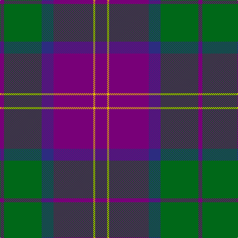

In pattern [BGBBYB](/patterns/bgbbyb/).

This was sourced from tartans-authority.  It is a [6 stripes tartan](/stripes/stripes6/).

Original link http://www.tartansauthority.com/tartan-ferret/display/7683/

## Attestations

This cloth appears in 2 source records; the oldest owns this page.

- pre 2008 — Discover Islay (District) (tartans-authority, [record](http://www.tartansauthority.com/tartan-ferret/display/7683/))
- undated — Discover Islay (register-of-tartans, [record](https://www.tartanregister.gov.uk/tartanDetails.aspx?ref=5685))

## Thread count
P/8 G76 DB24 P80 Y4 P/24

## Palette
Each colour and its ΔE from the base-6 reference it is a variant of.

| Colour | Shade | Base | ΔE (OKLab) |
|---|---|---|---|
| DB | <code style="background-color:#2C2C80;">#2C2C80</code> `#2C2C80` | B <code style="background-color:#2A418A;">#2A418A</code> | 0.06 |
| G | <code style="background-color:#006818;">#006818</code> `#006818` | G <code style="background-color:#006100;">#006100</code> | 0.02 |
| P | <code style="background-color:#780078;">#780078</code> `#780078` | B <code style="background-color:#2A418A;">#2A418A</code> | 0.17 |
| Y | <code style="background-color:#E8C000;">#E8C000</code> `#E8C000` | Y <code style="background-color:#F2BF00;">#F2BF00</code> | 0.02 |

# Sample pattern

## Nearest tartans

The nearest existing variants by ΔTartan distance.

1. [Harvey](/setts/s6/b8r22g22b44y2g8-b2c2c80-g006818-rc80000-ye8c000/) — ΔT 0.91
1. [Unnamed C20th - USA](/setts/s7/b4y2b36g14r14b2g2-b2c2c80-g006818-rc80000-ye8c000/) — ΔT 1.07
1. [Heritage of Wales (Fashion)](/setts/s7/r20b8r12b60k20b10w4-b2c2c80-k101010-rc80000-we0e0e0/) — ΔT 1.13
1. [Wicks Personal Tartan Tartan Number: 5968. Earliest known date: 2003 A tartan for the occasion of the marriage of Christopher Wicks and Nicola Bundle, in Aberdeen 2003. See products available Copyright © Blair Urquhart, Comrie, 2015](/setts/s8/b60r40g16y6g16r40b60y4-b442450-g003820-r888888-ye8c000/) — ΔT 1.14
1. [Robinson, dress](/setts/s6/g2b32r14k2r14k2-b304080-g008000-k000000-rc00000/) — ΔT 1.17
1. [Robinson Dress (Pendleton) #1](/setts/s6/g4b64r28k4r28k4-b2c2c80-g006818-k101010-rc80000/) — ΔT 1.19
1. [Robinson Dress Dress Clan Tartan Tartan Number: 739. Earliest known date: pre 2003 Colour variation of 'MacQueen' See products available Copyright © Blair Urquhart, Comrie, 2015](/setts/s6/g2b32r14k2r14k2-b2c2c80-g006818-k101010-rc80000/) — ΔT 1.19
1. [British Judo Association](/setts/s6/r56ra2b36y4g12b36-b1870a4-g608c28-r780028-rac80000-ye8c000/) — ΔT 1.22
1. [Joker, The](/setts/s6/b36k4b8k12ba24y2-b1474b4-ba780078-k101010-yd87c00/) — ΔT 1.23
1. [Dege, of Saville Row](/setts/s6/r44b4r12ba4b36ra4-b000050-ba304080-r806050-rac00000/) — ΔT 1.24

## Neighbour map

Every grey dot is one of 15726 variants placed by the first two principal components of the ΔTartan feature space (44% of its variance). Red is this tartan; blue dots are its nearest — click one to open its page.

<svg viewBox="0 0 640 380" role="img" style="max-width:100%;height:auto;border:1px solid #e0e0e0;border-radius:4px;display:block" xmlns="http://www.w3.org/2000/svg"><image href="/nn/cloud.v1.png" width="640" height="380"/><a href="/setts/s6/b8r22g22b44y2g8-b2c2c80-g006818-rc80000-ye8c000/"><circle cx="296.1" cy="191.4" r="4" fill="#3465a4"><title>Harvey</title></circle></a><a href="/setts/s7/b4y2b36g14r14b2g2-b2c2c80-g006818-rc80000-ye8c000/"><circle cx="347.6" cy="170.3" r="4" fill="#3465a4"><title>Unnamed C20th - USA</title></circle></a><a href="/setts/s7/r20b8r12b60k20b10w4-b2c2c80-k101010-rc80000-we0e0e0/"><circle cx="338.1" cy="185.5" r="4" fill="#3465a4"><title>Heritage of Wales (Fashion)</title></circle></a><a href="/setts/s8/b60r40g16y6g16r40b60y4-b442450-g003820-r888888-ye8c000/"><circle cx="278.3" cy="200.9" r="4" fill="#3465a4"><title>Wicks Personal Tartan Tartan Number: 5968. Earliest known date: 2003 A tartan for the occasion of the marriage of Christopher Wicks and Nicola Bundle, in Aberdeen 2003. See products available Copyright © Blair Urquhart, Comrie, 2015</title></circle></a><a href="/setts/s6/g2b32r14k2r14k2-b304080-g008000-k000000-rc00000/"><circle cx="323.4" cy="180.4" r="4" fill="#3465a4"><title>Robinson, dress</title></circle></a><a href="/setts/s6/g4b64r28k4r28k4-b2c2c80-g006818-k101010-rc80000/"><circle cx="327.6" cy="181.1" r="4" fill="#3465a4"><title>Robinson Dress (Pendleton) #1</title></circle></a><a href="/setts/s6/g2b32r14k2r14k2-b2c2c80-g006818-k101010-rc80000/"><circle cx="327.6" cy="181.1" r="4" fill="#3465a4"><title>Robinson Dress Dress Clan Tartan Tartan Number: 739. Earliest known date: pre 2003 Colour variation of 'MacQueen' See products available Copyright © Blair Urquhart, Comrie, 2015</title></circle></a><a href="/setts/s6/r56ra2b36y4g12b36-b1870a4-g608c28-r780028-rac80000-ye8c000/"><circle cx="315.9" cy="169.0" r="4" fill="#3465a4"><title>British Judo Association</title></circle></a><a href="/setts/s6/b36k4b8k12ba24y2-b1474b4-ba780078-k101010-yd87c00/"><circle cx="303.5" cy="196.0" r="4" fill="#3465a4"><title>Joker, The</title></circle></a><a href="/setts/s6/r44b4r12ba4b36ra4-b000050-ba304080-r806050-rac00000/"><circle cx="327.1" cy="206.2" r="4" fill="#3465a4"><title>Dege, of Saville Row</title></circle></a><circle cx="335.2" cy="192.5" r="5" fill="#c00000"/></svg>

ID: /setts/s6/b24y4b80ba24g76b8-b780078-ba2c2c80-g006818-ye8c000/
