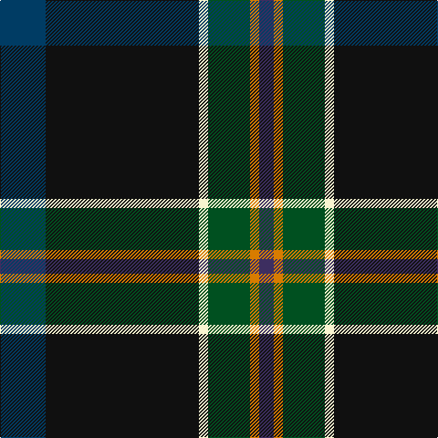

In pattern [BKWGYB](/patterns/bkwgyb/).

This was sourced from register-of-tartans.  It is a [6 stripes tartan](/stripes/stripes6/).

Original link https://www.tartanregister.gov.uk/tartanDetails.aspx?ref=10877

## Register references

External register numbers recorded for this tartan.

- Scottish Register of Tartans: [10877](https://www.tartanregister.gov.uk/tartanDetails.aspx?ref=10877)

## Thread count
DB/50 K168 LY10 G46 O10 DBa/16

## Palette
Each colour and its ΔE from the base-6 reference it is a variant of.

| Colour | Shade | Base | ΔE (OKLab) |
|---|---|---|---|
| DB | <code style="background-color:#003C64;">#003C64</code> `#003C64` | B <code style="background-color:#2A418A;">#2A418A</code> | 0.08 |
| DBa | <code style="background-color:#3D2E60;">#3D2E60</code> `#3D2E60` | B <code style="background-color:#2A418A;">#2A418A</code> | 0.08 |
| G | <code style="background-color:#005020;">#005020</code> `#005020` | G <code style="background-color:#006100;">#006100</code> | 0.07 |
| K | <code style="background-color:#101010;">#101010</code> `#101010` | K <code style="background-color:#000000;">#000000</code> | 0.17 |
| LY | <code style="background-color:#F8F4D0;">#F8F4D0</code> `#F8F4D0` | W <code style="background-color:#F7F7F7;">#F7F7F7</code> | 0.05 |
| O | <code style="background-color:#D87C00;">#D87C00</code> `#D87C00` | Y <code style="background-color:#F2BF00;">#F2BF00</code> | 0.17 |

# Sample pattern

## Nearest tartans

The nearest existing variants by ΔTartan distance.

1. [Woodward, R Glenn](/setts/s6/b25k84w5g32y5ba8~b202060-ba780078-g006818-k101010-wfcfcfc-ye8c000~x2/) — ΔT 0.89
1. [Lambert (Front Royal) Kai](/setts/s8/k3g34b10g5r2k8ra2w3~b5f749c-g23321b-k1c1714-rb62531-raa58065-we0e0e0~x2/) — ΔT 1.03
1. [Black Raven (Fashion)](/setts/s7/k62b15ba15g20y5b5k15~b2c2c80-ba1870a4-g604000-k101010-yc4bc68~x2/) — ΔT 1.22
1. [Glencross, Tynron (Name)](/setts/s6/r3g13b13y2ga34w3~b2c2c80-g5c6428-ga003820-rc80000-we0e0e0-ye8c000~x2/) — ΔT 1.24
1. [Waterford Irish County Tartan Tartan Number: 2255. Earliest known date: 1993 One of a series of Irish District tartans designed by Polly Wittering of the House of Edgar, with colours reminiscent of the Country with soft warm colours dominating. See products available Copyright © Blair Urquhart, Comrie, 2015](/setts/s6/g42y2ga16b7k16r5~b003860-g043828-ga006840-k000000-ra00028-ye4b448~x2/) — ΔT 1.26
1. [Hatfield & Mize (Personal)](/setts/s6/g10w2b10y5ba35r6~b1c1c1c-ba202060-g003820-rc80000-wffffff-ye0a126~x2/) — ΔT 1.40
1. [City of Rome Pipe Band (Corporate)](/setts/s7/r12y6k88b45k6b6ya6~b2c2c80-k101010-r901c38-yd87c00-yae8c000/) — ΔT 1.40
1. [Pipers' Trail, The](/setts/s6/w4b54k53ba4bb8y4~b003c64-ba5a008c-bb1870a4-k101010-wffffff-ye0a126/) — ΔT 1.40
1. [Canadian Centennial](/setts/s8/r3w6r2g32b36k2b4y2~b202060-g003820-k101010-rc80000-we0e0e0-yd09800~x2/) — ΔT 1.40
1. [Scotland’s Golf Coast](/setts/s9/y2w1b16ba2b2ba3b8g20ya2~b141e46-ba780078-g285800-wffffff-y48a4c0-yae0a126~x2/) — ΔT 1.41

## Neighbour map

Every grey dot is one of 15726 variants placed by the first two principal components of the ΔTartan feature space (44% of its variance). Red is this tartan; blue dots are its nearest — click one to open its page.

<svg viewBox="0 0 640 380" role="img" style="max-width:100%;height:auto;border:1px solid #e0e0e0;border-radius:4px;display:block" xmlns="http://www.w3.org/2000/svg"><image href="/nn/cloud.v1.png" width="640" height="380"/><a href="/setts/s6/b25k84w5g32y5ba8~b202060-ba780078-g006818-k101010-wfcfcfc-ye8c000~x2/"><circle cx="262.7" cy="153.5" r="4" fill="#3465a4"><title>Woodward, R Glenn</title></circle></a><a href="/setts/s8/k3g34b10g5r2k8ra2w3~b5f749c-g23321b-k1c1714-rb62531-raa58065-we0e0e0~x2/"><circle cx="324.6" cy="140.0" r="4" fill="#3465a4"><title>Lambert (Front Royal) Kai</title></circle></a><a href="/setts/s7/k62b15ba15g20y5b5k15~b2c2c80-ba1870a4-g604000-k101010-yc4bc68~x2/"><circle cx="302.2" cy="192.6" r="4" fill="#3465a4"><title>Black Raven (Fashion)</title></circle></a><a href="/setts/s6/r3g13b13y2ga34w3~b2c2c80-g5c6428-ga003820-rc80000-we0e0e0-ye8c000~x2/"><circle cx="256.9" cy="160.5" r="4" fill="#3465a4"><title>Glencross, Tynron (Name)</title></circle></a><a href="/setts/s6/g42y2ga16b7k16r5~b003860-g043828-ga006840-k000000-ra00028-ye4b448~x2/"><circle cx="247.6" cy="165.2" r="4" fill="#3465a4"><title>Waterford Irish County Tartan Tartan Number: 2255. Earliest known date: 1993 One of a series of Irish District tartans designed by Polly Wittering of the House of Edgar, with colours reminiscent of the Country with soft warm colours dominating. See products available Copyright © Blair Urquhart, Comrie, 2015</title></circle></a><a href="/setts/s6/g10w2b10y5ba35r6~b1c1c1c-ba202060-g003820-rc80000-wffffff-ye0a126~x2/"><circle cx="251.8" cy="154.1" r="4" fill="#3465a4"><title>Hatfield &amp; Mize (Personal)</title></circle></a><a href="/setts/s7/r12y6k88b45k6b6ya6~b2c2c80-k101010-r901c38-yd87c00-yae8c000/"><circle cx="334.2" cy="165.3" r="4" fill="#3465a4"><title>City of Rome Pipe Band (Corporate)</title></circle></a><a href="/setts/s6/w4b54k53ba4bb8y4~b003c64-ba5a008c-bb1870a4-k101010-wffffff-ye0a126/"><circle cx="242.3" cy="165.7" r="4" fill="#3465a4"><title>Pipers' Trail, The</title></circle></a><a href="/setts/s8/r3w6r2g32b36k2b4y2~b202060-g003820-k101010-rc80000-we0e0e0-yd09800~x2/"><circle cx="260.6" cy="128.8" r="4" fill="#3465a4"><title>Canadian Centennial</title></circle></a><a href="/setts/s9/y2w1b16ba2b2ba3b8g20ya2~b141e46-ba780078-g285800-wffffff-y48a4c0-yae0a126~x2/"><circle cx="255.8" cy="131.5" r="4" fill="#3465a4"><title>Scotland’s Golf Coast</title></circle></a><circle cx="306.8" cy="161.5" r="5" fill="#c00000"/></svg>

ID: /setts/s6/b25k84w5g23y5ba8~b003c64-ba3d2e60-g005020-k101010-wf8f4d0-yd87c00~x2/
