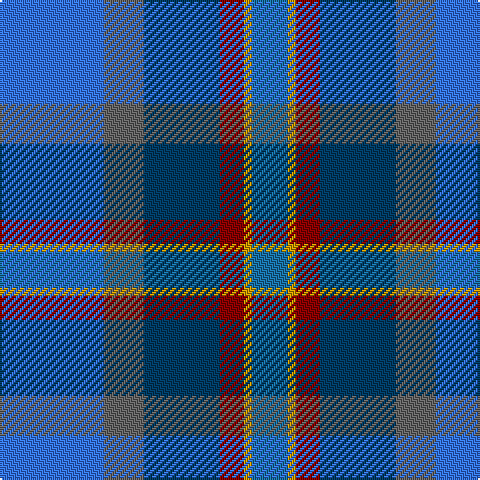

In pattern [BBBRYB](/patterns/bbbryb/).

This was sourced from register-of-tartans.  It is a [6 stripes tartan](/stripes/stripes6/).

Original link https://www.tartanregister.gov.uk/tartanDetails.aspx?ref=6026

## Thread count
B/52 N20 DB38 DR12 DY4 Ba/18

## Palette
Each colour and its ΔE from the base-6 reference it is a variant of.

| Colour | Shade | Base | ΔE (OKLab) |
|---|---|---|---|
| B | <code style="background-color:#3474FC;">#3474FC</code> `#3474FC` | B <code style="background-color:#2A418A;">#2A418A</code> | 0.22 |
| Ba | <code style="background-color:#1870A4;">#1870A4</code> `#1870A4` | B <code style="background-color:#2A418A;">#2A418A</code> | 0.13 |
| DB | <code style="background-color:#003C64;">#003C64</code> `#003C64` | B <code style="background-color:#2A418A;">#2A418A</code> | 0.08 |
| DR | <code style="background-color:#880000;">#880000</code> `#880000` | R <code style="background-color:#CC0000;">#CC0000</code> | 0.15 |
| DY | <code style="background-color:#C89800;">#C89800</code> `#C89800` | Y <code style="background-color:#F2BF00;">#F2BF00</code> | 0.12 |
| N | <code style="background-color:#646464;">#646464</code> `#646464` | B <code style="background-color:#2A418A;">#2A418A</code> | 0.16 |

# Sample pattern

## Nearest tartans

The nearest existing variants by ΔTartan distance.

1. [Scotia](/setts/s8/b6ba6w1y16ba6b22bb14g6x2~b1474b4-ba2c2c80-bb780078-g289c18-wfcfcfc-ya08858/) — ΔT 1.47
1. [Meeson Dress Personal Tartan Tartan Number: 6026. Earliest known date: 2007 Formal Dress version. The gray was originally woven with a melange or marled yarn. See products available Copyright © Blair Urquhart, Comrie, 2015](/setts/s6/b26k10ba19r6y2bb9x2~b2c74a4-ba003c64-bb105088-k000000-r880000-yc4a820/) — ΔT 1.67
1. [Mary Washington](/setts/s7/k1b6ba1bb6ba6k1w1x6~b2c2c80-ba2888c4-bb003c64-k101010-we0e0e0/) — ΔT 1.77
1. [Banff & Buchan (District)](/setts/s8/b17w2b3ba16bb28ba2bb3y2x2~b3c54ac-ba000064-bb3c74a4-wc8c8c8-yc48800/) — ΔT 1.82
1. [Lenaghan (Personal)](/setts/s7/b10g5ga5k1y2k1ba10x2~b202060-ba2c2c80-g003820-ga006818-k101010-ye8c000/) — ΔT 1.83
1. [Cowie](/setts/s6/r3b24k7ba11g11y2x2~b003c64-ba2c2c80-g006818-k101010-rc80000-ye8c000/) — ΔT 1.84
1. [MacFarland-Collins (Name)](/setts/s6/b40ba16k5bb16w2bc6x2~b2c2c80-ba1474b4-bb3850c8-bc780078-k101010-wfcfcfc/) — ΔT 1.87
1. [Scottish Odyssey (Fashion)](/setts/s7/b7ba12k3ba12g12ga25bb3x2~b000048-ba3850c8-bb1c3848-g604000-ga006818-k101010/) — ΔT 1.87
1. [Ancient Gathering](/setts/s8/b1ba12r6w1y3b14bb18w1x2~b1c1c50-ba5c8ca8-bb003c64-rb458ac-wffffff-ybc8c00/) — ΔT 1.88
1. [State Seal of Iowa (Fashion)](/setts/s8/b5ba43b18w4ba6r5g25y5x2~b003c64-ba1474b4-g604000-r880000-we8ccb8-ybc8c00/) — ΔT 1.90

## Neighbour map

Every grey dot is one of 15726 variants placed by the first two principal components of the ΔTartan feature space (44% of its variance). Red is this tartan; blue dots are its nearest — click one to open its page.

<svg viewBox="0 0 640 380" role="img" style="max-width:100%;height:auto;border:1px solid #e0e0e0;border-radius:4px;display:block" xmlns="http://www.w3.org/2000/svg"><image href="/nn/cloud.v1.png" width="640" height="380"/><a href="/setts/s8/b6ba6w1y16ba6b22bb14g6x2~b1474b4-ba2c2c80-bb780078-g289c18-wfcfcfc-ya08858/"><circle cx="164.4" cy="155.6" r="4" fill="#3465a4"><title>Scotia</title></circle></a><a href="/setts/s6/b26k10ba19r6y2bb9x2~b2c74a4-ba003c64-bb105088-k000000-r880000-yc4a820/"><circle cx="135.2" cy="189.5" r="4" fill="#3465a4"><title>Meeson Dress Personal Tartan Tartan Number: 6026. Earliest known date: 2007 Formal Dress version. The gray was originally woven with a melange or marled yarn. See products available Copyright © Blair Urquhart, Comrie, 2015</title></circle></a><a href="/setts/s7/k1b6ba1bb6ba6k1w1x6~b2c2c80-ba2888c4-bb003c64-k101010-we0e0e0/"><circle cx="134.5" cy="220.5" r="4" fill="#3465a4"><title>Mary Washington</title></circle></a><a href="/setts/s8/b17w2b3ba16bb28ba2bb3y2x2~b3c54ac-ba000064-bb3c74a4-wc8c8c8-yc48800/"><circle cx="254.4" cy="176.5" r="4" fill="#3465a4"><title>Banff &amp; Buchan (District)</title></circle></a><a href="/setts/s7/b10g5ga5k1y2k1ba10x2~b202060-ba2c2c80-g003820-ga006818-k101010-ye8c000/"><circle cx="128.1" cy="197.7" r="4" fill="#3465a4"><title>Lenaghan (Personal)</title></circle></a><a href="/setts/s6/r3b24k7ba11g11y2x2~b003c64-ba2c2c80-g006818-k101010-rc80000-ye8c000/"><circle cx="194.1" cy="199.1" r="4" fill="#3465a4"><title>Cowie</title></circle></a><a href="/setts/s6/b40ba16k5bb16w2bc6x2~b2c2c80-ba1474b4-bb3850c8-bc780078-k101010-wfcfcfc/"><circle cx="275.4" cy="175.1" r="4" fill="#3465a4"><title>MacFarland-Collins (Name)</title></circle></a><a href="/setts/s7/b7ba12k3ba12g12ga25bb3x2~b000048-ba3850c8-bb1c3848-g604000-ga006818-k101010/"><circle cx="128.9" cy="207.6" r="4" fill="#3465a4"><title>Scottish Odyssey (Fashion)</title></circle></a><a href="/setts/s8/b1ba12r6w1y3b14bb18w1x2~b1c1c50-ba5c8ca8-bb003c64-rb458ac-wffffff-ybc8c00/"><circle cx="144.7" cy="139.1" r="4" fill="#3465a4"><title>Ancient Gathering</title></circle></a><a href="/setts/s8/b5ba43b18w4ba6r5g25y5x2~b003c64-ba1474b4-g604000-r880000-we8ccb8-ybc8c00/"><circle cx="216.9" cy="168.6" r="4" fill="#3465a4"><title>State Seal of Iowa (Fashion)</title></circle></a><circle cx="162.6" cy="196.8" r="5" fill="#c00000"/></svg>

ID: /setts/s6/b26ba10bb19r6y2bc9x2~b3474fc-ba646464-bb003c64-bc1870a4-r880000-yc89800/
