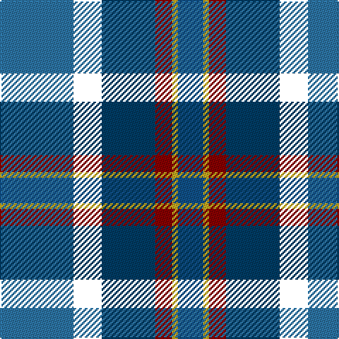

In pattern [BKBRYB](/patterns/bkbryb/).

This was sourced from house-of-tartan.  It is a [6 stripes tartan](/stripes/stripes6/).

Original link http://www.house-of-tartan.scotland.net/house/TartanViewjs.asp?colr=Def&tnam=6026

## Thread count
B/52 DN20 DB38 DR12 Y4 Ba/18

## Palette
Each colour and its ΔE from the base-6 reference it is a variant of.

| Colour | Shade | Base | ΔE (OKLab) |
|---|---|---|---|
| B | <code style="background-color:#2C74A4;">#2C74A4</code> `#2C74A4` | B <code style="background-color:#2A418A;">#2A418A</code> | 0.15 |
| Ba | <code style="background-color:#105088;">#105088</code> `#105088` | B <code style="background-color:#2A418A;">#2A418A</code> | 0.04 |
| DB | <code style="background-color:#003C64;">#003C64</code> `#003C64` | B <code style="background-color:#2A418A;">#2A418A</code> | 0.08 |
| DG | <code style="background-color:#003820;">#003820</code> `#003820` | G <code style="background-color:#006100;">#006100</code> | 0.15 |
| DR | <code style="background-color:#880000;">#880000</code> `#880000` | R <code style="background-color:#CC0000;">#CC0000</code> | 0.15 |
| K | <code style="background-color:#101010;">#101010</code> `#101010` | K <code style="background-color:#000000;">#000000</code> | 0.17 |
| N | <code style="background-color:#A4A8A8;">#A4A8A8</code> `#A4A8A8` | Y <code style="background-color:#F2BF00;">#F2BF00</code> | 0.20 |
| Y | <code style="background-color:#C4A820;">#C4A820</code> `#C4A820` | Y <code style="background-color:#F2BF00;">#F2BF00</code> | 0.10 |

# Sample pattern

## Nearest tartans

The nearest existing variants by ΔTartan distance.

1. [Renfrewshire](/setts/s7/b4ba2bb8ba25k8g13y4x2~b780078-ba2c2c80-bb5c8ca8-g006818-k101010-ye8c000/) — ΔT 0.88
1. [Ayrshire (International Tartans)](/setts/s7/b11ba2bb4ba21k16g19y4x2~b5a008c-ba2c4084-bb3c82af-g005020-k101010-ye8c000/) — ΔT 0.92
1. [Renfrewshire District Tartan Tartan Number: 2560. Earliest known date: 1998 Designed for anyone residing in the County of Renfrewshire See products available Copyright © Blair Urquhart, Comrie, 2015](/setts/s7/r4b2ba7b20k7g10y4x2~b2c2c80-ba5c8ca8-g006818-k101010-ra00048-ye8c000/) — ΔT 0.97
1. [East Lothian](/setts/s7/b6ba17bb4ba2k11g3y4x2~b5c8ca8-ba2c2c80-bb780078-g006818-k101010-ye8c000/) — ΔT 1.15
1. [Moran (Coilessan) (Personal)](/setts/s8/b26ba13k13w2g8k5r3b3x2~b2888c4-ba2c2c80-g006818-k101010-rc80000-we0e0e0/) — ΔT 1.15
1. [Scottish Odyssey (Fashion)](/setts/s7/b7ba12k3ba12g12ga25bb3x2~b000048-ba3850c8-bb1c3848-g604000-ga006818-k101010/) — ΔT 1.20
1. [Renfrewshire Tartan](/setts/s7/b4ba2bb8ba25k8g13y4x2~b800080-ba304080-bb5480b0-g008000-k000000-yf0c000/) — ΔT 1.25
1. [Porteous Family Tartan Tartan Number: 1264. Earliest known date: 1978 Designed for the Porteous Family Association, and submitted to the Monitoring Committee of the Scottish Tartan Society by Captain Barry Porteous who was president of the association at that time. See products available Copyright © Blair Urquhart, Comrie, 2015](/setts/s6/k1y1b8g10ba7w1x2~b2c2c80-ba1c4874-g006818-k101010-we0e0e0-ye8c000/) — ΔT 1.27
1. [Newmill](/setts/s7/r5g20k13b42k13g20y5x2~b304080-g407050-k000030-r802040-yf0c000/) — ΔT 1.28
1. [Cowie](/setts/s6/r3b24k7ba11g11y2x2~b003c64-ba2c2c80-g006818-k101010-rc80000-ye8c000/) — ΔT 1.31

## Neighbour map

Every grey dot is one of 15726 variants placed by the first two principal components of the ΔTartan feature space (44% of its variance). Red is this tartan; blue dots are its nearest — click one to open its page.

<svg viewBox="0 0 640 380" role="img" style="max-width:100%;height:auto;border:1px solid #e0e0e0;border-radius:4px;display:block" xmlns="http://www.w3.org/2000/svg"><image href="/nn/cloud.v1.png" width="640" height="380"/><a href="/setts/s7/b4ba2bb8ba25k8g13y4x2~b780078-ba2c2c80-bb5c8ca8-g006818-k101010-ye8c000/"><circle cx="164.9" cy="169.5" r="4" fill="#3465a4"><title>Renfrewshire</title></circle></a><a href="/setts/s7/b11ba2bb4ba21k16g19y4x2~b5a008c-ba2c4084-bb3c82af-g005020-k101010-ye8c000/"><circle cx="107.7" cy="194.7" r="4" fill="#3465a4"><title>Ayrshire (International Tartans)</title></circle></a><a href="/setts/s7/r4b2ba7b20k7g10y4x2~b2c2c80-ba5c8ca8-g006818-k101010-ra00048-ye8c000/"><circle cx="136.0" cy="180.1" r="4" fill="#3465a4"><title>Renfrewshire District Tartan Tartan Number: 2560. Earliest known date: 1998 Designed for anyone residing in the County of Renfrewshire See products available Copyright © Blair Urquhart, Comrie, 2015</title></circle></a><a href="/setts/s7/b6ba17bb4ba2k11g3y4x2~b5c8ca8-ba2c2c80-bb780078-g006818-k101010-ye8c000/"><circle cx="132.3" cy="183.1" r="4" fill="#3465a4"><title>East Lothian</title></circle></a><a href="/setts/s8/b26ba13k13w2g8k5r3b3x2~b2888c4-ba2c2c80-g006818-k101010-rc80000-we0e0e0/"><circle cx="147.2" cy="155.7" r="4" fill="#3465a4"><title>Moran (Coilessan) (Personal)</title></circle></a><a href="/setts/s7/b7ba12k3ba12g12ga25bb3x2~b000048-ba3850c8-bb1c3848-g604000-ga006818-k101010/"><circle cx="128.9" cy="207.6" r="4" fill="#3465a4"><title>Scottish Odyssey (Fashion)</title></circle></a><a href="/setts/s7/b4ba2bb8ba25k8g13y4x2~b800080-ba304080-bb5480b0-g008000-k000000-yf0c000/"><circle cx="145.7" cy="162.3" r="4" fill="#3465a4"><title>Renfrewshire Tartan</title></circle></a><a href="/setts/s6/k1y1b8g10ba7w1x2~b2c2c80-ba1c4874-g006818-k101010-we0e0e0-ye8c000/"><circle cx="161.5" cy="194.2" r="4" fill="#3465a4"><title>Porteous Family Tartan Tartan Number: 1264. Earliest known date: 1978 Designed for the Porteous Family Association, and submitted to the Monitoring Committee of the Scottish Tartan Society by Captain Barry Porteous who was president of the association at that time. See products available Copyright © Blair Urquhart, Comrie, 2015</title></circle></a><a href="/setts/s7/r5g20k13b42k13g20y5x2~b304080-g407050-k000030-r802040-yf0c000/"><circle cx="159.6" cy="215.7" r="4" fill="#3465a4"><title>Newmill</title></circle></a><a href="/setts/s6/r3b24k7ba11g11y2x2~b003c64-ba2c2c80-g006818-k101010-rc80000-ye8c000/"><circle cx="194.1" cy="199.1" r="4" fill="#3465a4"><title>Cowie</title></circle></a><circle cx="135.2" cy="189.5" r="5" fill="#c00000"/></svg>

ID: /setts/s6/b26k10ba19r6y2bb9x2~b2c74a4-ba003c64-bb105088-k000000-r880000-yc4a820/
