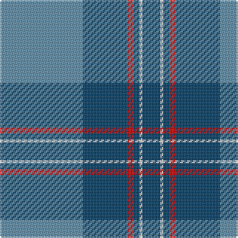

In pattern [BBRBWB](/patterns/bbrbwb/).

This was sourced from register-of-tartans.  It is a [6 stripes tartan](/stripes/stripes6/).

Original link https://www.tartanregister.gov.uk/tartanDetails.aspx?ref=774

## Attestations

This cloth appears in 2 source records; the oldest owns this page.

- 01/01/2006 — Corries (register-of-tartans, [record](https://www.tartanregister.gov.uk/tartanDetails.aspx?ref=774))
- 2006 — Corries (Corporate) (tartans-authority, [record](http://www.tartansauthority.com/tartan-ferret/display/7022/))

## Register references

External register numbers recorded for this tartan.

- Scottish Register of Tartans: [774](https://www.tartanregister.gov.uk/tartanDetails.aspx?ref=774)
- Scottish Tartans Authority (ITI): 7022

## Thread count
B/56 DB30 R4 DB4 LN2 DB/12

## Palette
Each colour and its ΔE from the base-6 reference it is a variant of.

| Colour | Shade | Base | ΔE (OKLab) |
|---|---|---|---|
| B | <code style="background-color:#5C8CA8;">#5C8CA8</code> `#5C8CA8` | B <code style="background-color:#2A418A;">#2A418A</code> | 0.23 |
| DB | <code style="background-color:#003C64;">#003C64</code> `#003C64` | B <code style="background-color:#2A418A;">#2A418A</code> | 0.08 |
| LN | <code style="background-color:#E0E0E0;">#E0E0E0</code> `#E0E0E0` | W <code style="background-color:#F7F7F7;">#F7F7F7</code> | 0.07 |
| R | <code style="background-color:#C80000;">#C80000</code> `#C80000` | R <code style="background-color:#CC0000;">#CC0000</code> | 0.01 |

# Sample pattern

## Nearest tartans

The nearest existing variants by ΔTartan distance.

1. [Port Authority of NY & NJ](/setts/s6/b9ba2b39bb33y2bb5~b5c8ca8-ba1c0070-bb003c64-ybc8c00~x2/) — ΔT 0.71
1. [Connecticut State Police PB (Cor.)](/setts/s6/b42ba2b2ba17y8ba4~b646464-ba00008c-yc88c00~x2/) — ΔT 1.09
1. [U.S. Merchant Marine Academy (Corpo](/setts/s7/r37y2ra6y2r8b49r3~b2c2c80-r888888-ra901c38-ybc8c00~x2/) — ΔT 1.23
1. [Melville (Two black lines)](/setts/s6/b4k2b26g26w1g4~b1474b4-g285800-k101010-wfcfcfc~x4/) — ΔT 1.35
1. [Oliphant Family Tartan Tartan Number: 242. Earliest known date: 1842 Also The Setts No: 210. W & A K Johnston, 1906. Often referred to as 'Oliphant and Melville'. There is a similar pattern listed under 'Melville' which is also worn by the Oliphants. There is no definitive provenance to distinguish one from the other, though the Vestiarium has proved unreliable in many cases. See MELVILLE. See products available Copyright © Blair Urquhart, Comrie, 2015](/setts/s6/b4k4b24g32w1g2~b2c2c80-g006818-k101010-we0e0e0~x2/) — ΔT 1.38
1. [Oliphant (Clan)](/setts/s6/b4k4b24g32w1g2~b2c2c80-g006818-k101010-wfcfcfc~x4/) — ΔT 1.38
1. [Lauder Primary School (Corporate)](/setts/s6/r2b21r2ba6y1r1~b2888c4-ba2c2c80-rc80000-ye8c000~x4/) — ΔT 1.39
1. [Federal Bureaux (FBI) Corporate Tartan Tartan Number: 83. Earliest known date: 1989 Discovered (in 1991) to be the same as a previously accredited tartan, "S.C.O.T.S." designed by Kinloch Anderson in 1988. Twenty kilts have been produced for the F.B.I. pipe band. See products available Copyright © Blair Urquhart, Comrie, 2015](/setts/s6/b60ba19w3ba2r2ba7~b5c8ca8-ba2c2c80-rc80000-we0e0e0~x2/) — ΔT 1.40
1. [Katsushika (Corporate)](/setts/s8/b22y2b1y2b10g2ga11g6~b2c2c80-g808080-ga006818-ye8c000~x2/) — ΔT 1.40
1. [Ewell Castle School](/setts/s6/b4w1b18ba18r1ba4~b1474b4-ba202060-rc80000-wfcfcfc~x4/) — ΔT 1.45

## Neighbour map

Every grey dot is one of 15726 variants placed by the first two principal components of the ΔTartan feature space (44% of its variance). Red is this tartan; blue dots are its nearest — click one to open its page.

<svg viewBox="0 0 640 380" role="img" style="max-width:100%;height:auto;border:1px solid #e0e0e0;border-radius:4px;display:block" xmlns="http://www.w3.org/2000/svg"><image href="/nn/cloud.v1.png" width="640" height="380"/><a href="/setts/s6/b9ba2b39bb33y2bb5~b5c8ca8-ba1c0070-bb003c64-ybc8c00~x2/"><circle cx="379.0" cy="198.4" r="4" fill="#3465a4"><title>Port Authority of NY &amp; NJ</title></circle></a><a href="/setts/s6/b42ba2b2ba17y8ba4~b646464-ba00008c-yc88c00~x2/"><circle cx="379.1" cy="177.4" r="4" fill="#3465a4"><title>Connecticut State Police PB (Cor.)</title></circle></a><a href="/setts/s7/r37y2ra6y2r8b49r3~b2c2c80-r888888-ra901c38-ybc8c00~x2/"><circle cx="344.3" cy="159.1" r="4" fill="#3465a4"><title>U.S. Merchant Marine Academy (Corpo</title></circle></a><a href="/setts/s6/b4k2b26g26w1g4~b1474b4-g285800-k101010-wfcfcfc~x4/"><circle cx="367.6" cy="188.1" r="4" fill="#3465a4"><title>Melville (Two black lines)</title></circle></a><a href="/setts/s6/b4k4b24g32w1g2~b2c2c80-g006818-k101010-we0e0e0~x2/"><circle cx="375.5" cy="176.0" r="4" fill="#3465a4"><title>Oliphant Family Tartan Tartan Number: 242. Earliest known date: 1842 Also The Setts No: 210. W &amp; A K Johnston, 1906. Often referred to as 'Oliphant and Melville'. There is a similar pattern listed under 'Melville' which is also worn by the Oliphants. There is no definitive provenance to distinguish one from the other, though the Vestiarium has proved unreliable in many cases. See MELVILLE. See products available Copyright © Blair Urquhart, Comrie, 2015</title></circle></a><a href="/setts/s6/b4k4b24g32w1g2~b2c2c80-g006818-k101010-wfcfcfc~x4/"><circle cx="371.8" cy="174.5" r="4" fill="#3465a4"><title>Oliphant (Clan)</title></circle></a><a href="/setts/s6/r2b21r2ba6y1r1~b2888c4-ba2c2c80-rc80000-ye8c000~x4/"><circle cx="412.1" cy="164.4" r="4" fill="#3465a4"><title>Lauder Primary School (Corporate)</title></circle></a><a href="/setts/s6/b60ba19w3ba2r2ba7~b5c8ca8-ba2c2c80-rc80000-we0e0e0~x2/"><circle cx="457.8" cy="157.4" r="4" fill="#3465a4"><title>Federal Bureaux (FBI) Corporate Tartan Tartan Number: 83. Earliest known date: 1989 Discovered (in 1991) to be the same as a previously accredited tartan, &quot;S.C.O.T.S.&quot; designed by Kinloch Anderson in 1988. Twenty kilts have been produced for the F.B.I. pipe band. See products available Copyright © Blair Urquhart, Comrie, 2015</title></circle></a><a href="/setts/s8/b22y2b1y2b10g2ga11g6~b2c2c80-g808080-ga006818-ye8c000~x2/"><circle cx="346.7" cy="171.8" r="4" fill="#3465a4"><title>Katsushika (Corporate)</title></circle></a><a href="/setts/s6/b4w1b18ba18r1ba4~b1474b4-ba202060-rc80000-wfcfcfc~x4/"><circle cx="342.5" cy="200.9" r="4" fill="#3465a4"><title>Ewell Castle School</title></circle></a><circle cx="379.3" cy="175.2" r="5" fill="#c00000"/></svg>

ID: /setts/s6/b28ba15r2ba2w1ba6~b5c8ca8-ba003c64-rc80000-we0e0e0~x2/
