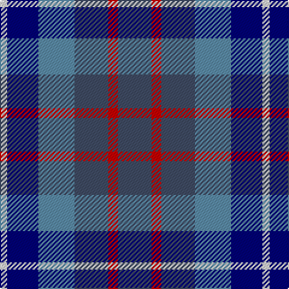

In pattern [BRBBBW](/patterns/brbbbw/).

This was sourced from tartans-authority.  It is a [6 stripes tartan](/stripes/stripes6/).

Original link http://www.tartansauthority.com/tartan-ferret/display/1420/

## Thread count
LN/6 DB26 B30 N28 R8 N/28

## Palette
Each colour and its ΔE from the base-6 reference it is a variant of.

| Colour | Shade | Base | ΔE (OKLab) |
|---|---|---|---|
| B | <code style="background-color:#5C8CA8;">#5C8CA8</code> `#5C8CA8` | B <code style="background-color:#2C4084;">#2C4084</code> | 0.23 |
| DB | <code style="background-color:#000078;">#000078</code> `#000078` | B <code style="background-color:#2C4084;">#2C4084</code> | 0.15 |
| LN | <code style="background-color:#E0E0E0;">#E0E0E0</code> `#E0E0E0` | W <code style="background-color:#F4F4F0;">#F4F4F0</code> | 0.06 |
| N | <code style="background-color:#404C64;">#404C64</code> `#404C64` | B <code style="background-color:#2C4084;">#2C4084</code> | 0.08 |
| R | <code style="background-color:#C80000;">#C80000</code> `#C80000` | R <code style="background-color:#C80000;">#C80000</code> | 0.00 |

# Sample pattern

ID: /setts/s6/b28r8b28ba30bb26w6-b404c64-ba5c8ca8-bb000078-rc80000-we0e0e0/
