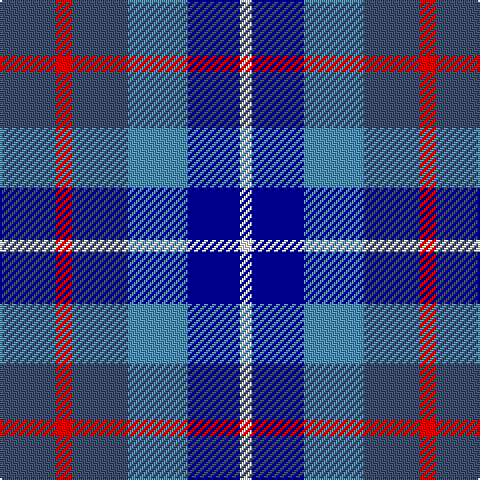

In pattern [BRBBBW](/patterns/brbbbw/).

This was sourced from register-of-tartans.  It is a [6 stripes tartan](/stripes/stripes6/).

Original link https://www.tartanregister.gov.uk/tartanDetails.aspx?ref=301

## Thread count
N/28 R8 N28 Ba30 DB26 W/6

## Palette
Each colour and its ΔE from the base-6 reference it is a variant of.

| Colour | Shade | Base | ΔE (OKLab) |
|---|---|---|---|
| B | <code style="background-color:#3070FC;">#3070FC</code> `#3070FC` | B <code style="background-color:#2A418A;">#2A418A</code> | 0.21 |
| Ba | <code style="background-color:#5C8CA8;">#5C8CA8</code> `#5C8CA8` | B <code style="background-color:#2A418A;">#2A418A</code> | 0.23 |
| DB | <code style="background-color:#000078;">#000078</code> `#000078` | B <code style="background-color:#2A418A;">#2A418A</code> | 0.15 |
| N | <code style="background-color:#404C64;">#404C64</code> `#404C64` | B <code style="background-color:#2A418A;">#2A418A</code> | 0.08 |
| R | <code style="background-color:#C80000;">#C80000</code> `#C80000` | R <code style="background-color:#CC0000;">#CC0000</code> | 0.01 |
| W | <code style="background-color:#FFFFFF;">#FFFFFF</code> `#FFFFFF` | W <code style="background-color:#F7F7F7;">#F7F7F7</code> | 0.02 |

# Sample pattern

## Nearest tartans

The nearest existing variants by ΔTartan distance.

1. [Blue (Name)](/setts/s6/b28r8b28ba30bb26w6-b404c64-ba5c8ca8-bb000078-rc80000-we0e0e0/) — ΔT 0.27
1. [Fox-Eves Wedding](/setts/s6/r18b12ba26b42g36w8-b003c64-ba141e46-g808080-r800028-wf8f4d0/) — ΔT 0.93
1. [Blue](/setts/s7/r4b22r6b22ba24bb20w4-b304080-ba5480b0-bb000050-rc00000-we0e0e0/) — ΔT 0.94
1. [Blue Family Tartan Tartan Number: 1420. Earliest known date: 1985 Blue is a Sept name of MacMillan. See products available Copyright © Blair Urquhart, Comrie, 2015](/setts/s7/r4b22r6b22ba24bb20w4-b2c2c80-ba5c8ca8-bb202060-rc80000-we0e0e0/) — ΔT 1.04
1. [Fox-Eves Wedding (Personal)](/setts/s6/r18b12ba26b42ra36w8-b1870a4-ba003c64-ra00000-ra888888-wfcfcfc/) — ΔT 1.14
1. [Gandy of Myrton (Name)](/setts/s6/r28w10b40k20ba20b20-b003c64-ba5c8ca8-k101010-rc80000-we0e0e0/) — ΔT 1.30
1. [Loch Katrine](/setts/s7/b16ba22w6ba22bb24g20r4-b2888c4-ba003c64-bb1c0070-g289c18-r901c38-wfcfcfc/) — ΔT 1.49
1. [Hummelt, Katherine (Personal)](/setts/s8/b22g20ga12b14w4b6ba20w4-b0000cd-ba6c0070-g004c00-ga767e52-w00fcfc/) — ΔT 1.50
1. [Wellington No 229](/setts/s5/k8b6ba22g28w4-b3c82af-ba5a008c-g005020-k101010-we0e0e0/) — ΔT 1.50
1. [Forbo Nairn Corporate Tartan Tartan Number: 2298. Earliest known date: pre 2002 Designed for Forbo Nairn Ltd - a Swiss based company with two factories in Kirkcaldy, Fife. Tartan is based on the Nairn (#1331) because of an association with Michael Nairn, builder of the first 'floor cloth' (linoleum) factory in Scotland in 1843.STS said Approved by Sir Robert Spencer Nairn. Blue and red used in this graphic in place of dark blue and red so that sett could be seen. See products available Copyright © Blair Urquhart, Comrie, 2015](/setts/s8/g32k28b48r8b48k28g32ba8-b2c2c80-ba5c8ca8-g006818-k101010-rc80000/) — ΔT 1.51

## Neighbour map

Every grey dot is one of 15726 variants placed by the first two principal components of the ΔTartan feature space (44% of its variance). Red is this tartan; blue dots are its nearest — click one to open its page.

<svg viewBox="0 0 640 380" role="img" style="max-width:100%;height:auto;border:1px solid #e0e0e0;border-radius:4px;display:block" xmlns="http://www.w3.org/2000/svg"><image href="/nn/cloud.v1.png" width="640" height="380"/><a href="/setts/s6/b28r8b28ba30bb26w6-b404c64-ba5c8ca8-bb000078-rc80000-we0e0e0/"><circle cx="153.7" cy="263.0" r="4" fill="#3465a4"><title>Blue (Name)</title></circle></a><a href="/setts/s6/r18b12ba26b42g36w8-b003c64-ba141e46-g808080-r800028-wf8f4d0/"><circle cx="120.3" cy="251.6" r="4" fill="#3465a4"><title>Fox-Eves Wedding</title></circle></a><a href="/setts/s7/r4b22r6b22ba24bb20w4-b304080-ba5480b0-bb000050-rc00000-we0e0e0/"><circle cx="159.7" cy="234.4" r="4" fill="#3465a4"><title>Blue</title></circle></a><a href="/setts/s7/r4b22r6b22ba24bb20w4-b2c2c80-ba5c8ca8-bb202060-rc80000-we0e0e0/"><circle cx="165.2" cy="235.2" r="4" fill="#3465a4"><title>Blue Family Tartan Tartan Number: 1420. Earliest known date: 1985 Blue is a Sept name of MacMillan. See products available Copyright © Blair Urquhart, Comrie, 2015</title></circle></a><a href="/setts/s6/r18b12ba26b42ra36w8-b1870a4-ba003c64-ra00000-ra888888-wfcfcfc/"><circle cx="129.0" cy="253.6" r="4" fill="#3465a4"><title>Fox-Eves Wedding (Personal)</title></circle></a><a href="/setts/s6/r28w10b40k20ba20b20-b003c64-ba5c8ca8-k101010-rc80000-we0e0e0/"><circle cx="102.8" cy="266.6" r="4" fill="#3465a4"><title>Gandy of Myrton (Name)</title></circle></a><a href="/setts/s7/b16ba22w6ba22bb24g20r4-b2888c4-ba003c64-bb1c0070-g289c18-r901c38-wfcfcfc/"><circle cx="70.9" cy="229.2" r="4" fill="#3465a4"><title>Loch Katrine</title></circle></a><a href="/setts/s8/b22g20ga12b14w4b6ba20w4-b0000cd-ba6c0070-g004c00-ga767e52-w00fcfc/"><circle cx="104.4" cy="228.3" r="4" fill="#3465a4"><title>Hummelt, Katherine (Personal)</title></circle></a><a href="/setts/s5/k8b6ba22g28w4-b3c82af-ba5a008c-g005020-k101010-we0e0e0/"><circle cx="169.9" cy="228.7" r="4" fill="#3465a4"><title>Wellington No 229</title></circle></a><a href="/setts/s8/g32k28b48r8b48k28g32ba8-b2c2c80-ba5c8ca8-g006818-k101010-rc80000/"><circle cx="160.3" cy="253.8" r="4" fill="#3465a4"><title>Forbo Nairn Corporate Tartan Tartan Number: 2298. Earliest known date: pre 2002 Designed for Forbo Nairn Ltd - a Swiss based company with two factories in Kirkcaldy, Fife. Tartan is based on the Nairn (#1331) because of an association with Michael Nairn, builder of the first 'floor cloth' (linoleum) factory in Scotland in 1843.STS said Approved by Sir Robert Spencer Nairn. Blue and red used in this graphic in place of dark blue and red so that sett could be seen. See products available Copyright © Blair Urquhart, Comrie, 2015</title></circle></a><circle cx="145.8" cy="259.4" r="5" fill="#c00000"/></svg>

ID: /setts/s6/b28r8b28ba30bb26w6-b404c64-ba5c8ca8-bb000078-rc80000-wffffff/
