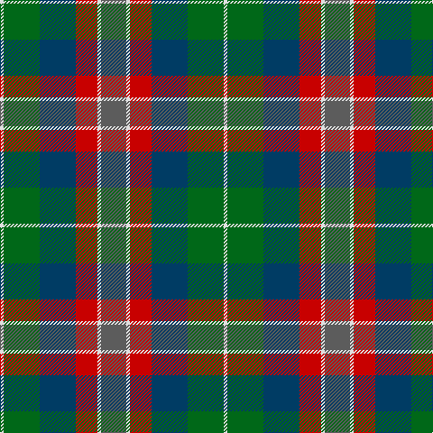

In pattern [BWRBGW](/patterns/bwrbgw/).

This was sourced from tartans-authority.  It is a [6 stripes tartan](/stripes/stripes6/).

Original link http://www.tartansauthority.com/tartan-ferret/display/10765/

## Thread count
LN/4 G40 DB40 R24 LN4 N/28

## Palette
Each colour and its ΔE from the base-6 reference it is a variant of.

| Colour | Shade | Base | ΔE (OKLab) |
|---|---|---|---|
| DB | <code style="background-color:#003C64;">#003C64</code> `#003C64` | B <code style="background-color:#2C4084;">#2C4084</code> | 0.07 |
| G | <code style="background-color:#006818;">#006818</code> `#006818` | G <code style="background-color:#006400;">#006400</code> | 0.02 |
| LN | <code style="background-color:#E0E0E0;">#E0E0E0</code> `#E0E0E0` | W <code style="background-color:#F4F4F0;">#F4F4F0</code> | 0.06 |
| N | <code style="background-color:#5C5C5C;">#5C5C5C</code> `#5C5C5C` | B <code style="background-color:#2C4084;">#2C4084</code> | 0.14 |
| R | <code style="background-color:#C80000;">#C80000</code> `#C80000` | R <code style="background-color:#C80000;">#C80000</code> | 0.00 |

# Sample pattern

## Nearest tartans

The nearest existing variants by ΔTartan distance.

1. [Rothesay](/setts/s7/g8b24y4k20ga20y6ga4-b5c5c5c-g006818-ga8c7038-k101010-yd09800/) — ΔT 1.05
1. [Wicklow County Crest (Fashion)](/setts/s9/b32ba14y8ba4y32ba4g48ba16ya22-b2c2c80-ba1c1c50-g5c6428-ybc8c00-yaa0a0a0/) — ΔT 1.14
1. [Casely (Name)](/setts/s6/r16g44k44g8b44y12-b506878-g30644c-k101010-re87878-ye0b000/) — ΔT 1.14
1. [Thompson's Fancy Personal Tartan Tartan Number: 286. Earliest known date: pre 2003 Designed for his own use. See products available Copyright © Blair Urquhart, Comrie, 2015](/setts/s6/r12g48b12ba24k24ba6-b2c2c80-ba5c8ca8-g604000-k101010-rc80000/) — ΔT 1.16
1. [Canine All Dogs (Fashion)](/setts/s6/r10b6g24ba24r6y3-b2c2c80-ba1c1c50-g006818-rc80000-ye8c000/) — ΔT 1.19
1. [McHale (Personal)](/setts/s6/g30k20b60r22w6g10-b5c5c5c-g74846c-k101010-ra07c58-wfcfcfc/) — ΔT 1.22
1. [Patterson, John](/setts/s6/g6b24w2ga24r24ga4-b304080-g008000-ga003000-rc00000-we0e0e0/) — ΔT 1.24
1. [Casely](/setts/s6/r16g44k44g8b44ga12-b506878-g30644c-ga446428-k101010-rc80000/) — ΔT 1.25
1. [Jardine #2](/setts/s5/b36r36g36ra4ba4-b2a2303-ba3c82af-g808080-rbe7832-radc0000/) — ΔT 1.25
1. [Orkney (District?)](/setts/s8/r18g6b38k6g38r26k6y6-b1870a4-g408060-k101010-r901c38-ybc8c00/) — ΔT 1.29

## Neighbour map

Every grey dot is one of 15726 variants placed by the first two principal components of the ΔTartan feature space (44% of its variance). Red is this tartan; blue dots are its nearest — click one to open its page.

<svg viewBox="0 0 640 380" role="img" style="max-width:100%;height:auto;border:1px solid #e0e0e0;border-radius:4px;display:block" xmlns="http://www.w3.org/2000/svg"><image href="/nn/cloud.v1.png" width="640" height="380"/><a href="/setts/s7/g8b24y4k20ga20y6ga4-b5c5c5c-g006818-ga8c7038-k101010-yd09800/"><circle cx="101.7" cy="225.6" r="4" fill="#3465a4"><title>Rothesay</title></circle></a><a href="/setts/s9/b32ba14y8ba4y32ba4g48ba16ya22-b2c2c80-ba1c1c50-g5c6428-ybc8c00-yaa0a0a0/"><circle cx="102.1" cy="178.8" r="4" fill="#3465a4"><title>Wicklow County Crest (Fashion)</title></circle></a><a href="/setts/s6/r16g44k44g8b44y12-b506878-g30644c-k101010-re87878-ye0b000/"><circle cx="95.5" cy="240.7" r="4" fill="#3465a4"><title>Casely (Name)</title></circle></a><a href="/setts/s6/r12g48b12ba24k24ba6-b2c2c80-ba5c8ca8-g604000-k101010-rc80000/"><circle cx="160.7" cy="222.4" r="4" fill="#3465a4"><title>Thompson's Fancy Personal Tartan Tartan Number: 286. Earliest known date: pre 2003 Designed for his own use. See products available Copyright © Blair Urquhart, Comrie, 2015</title></circle></a><a href="/setts/s6/r10b6g24ba24r6y3-b2c2c80-ba1c1c50-g006818-rc80000-ye8c000/"><circle cx="139.1" cy="212.2" r="4" fill="#3465a4"><title>Canine All Dogs (Fashion)</title></circle></a><a href="/setts/s6/g30k20b60r22w6g10-b5c5c5c-g74846c-k101010-ra07c58-wfcfcfc/"><circle cx="197.8" cy="213.9" r="4" fill="#3465a4"><title>McHale (Personal)</title></circle></a><a href="/setts/s6/g6b24w2ga24r24ga4-b304080-g008000-ga003000-rc00000-we0e0e0/"><circle cx="166.7" cy="198.6" r="4" fill="#3465a4"><title>Patterson, John</title></circle></a><a href="/setts/s6/r16g44k44g8b44ga12-b506878-g30644c-ga446428-k101010-rc80000/"><circle cx="129.7" cy="258.2" r="4" fill="#3465a4"><title>Casely</title></circle></a><a href="/setts/s5/b36r36g36ra4ba4-b2a2303-ba3c82af-g808080-rbe7832-radc0000/"><circle cx="160.8" cy="219.5" r="4" fill="#3465a4"><title>Jardine #2</title></circle></a><a href="/setts/s8/r18g6b38k6g38r26k6y6-b1870a4-g408060-k101010-r901c38-ybc8c00/"><circle cx="148.0" cy="216.8" r="4" fill="#3465a4"><title>Orkney (District?)</title></circle></a><circle cx="127.2" cy="218.6" r="5" fill="#c00000"/></svg>

ID: /setts/s6/b28w4r24ba40g40w4-b5c5c5c-ba003c64-g006818-rc80000-we0e0e0/
