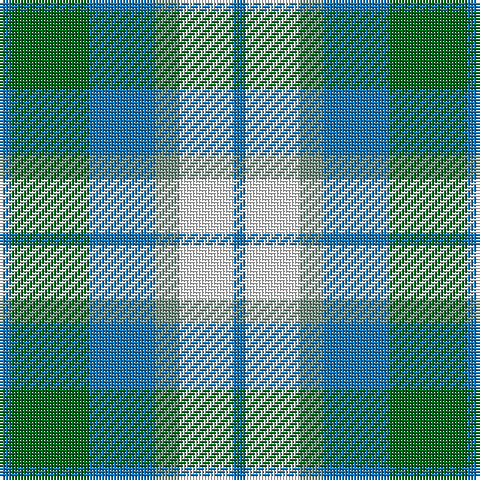

**Bands:** [BGBGWB](/stripes/bgbgwb/) · **Stripes:** [B G B Y W B](/stripes/stripes6/) B G B Y W B

This was sourced from register-of-tartans.  It is a [6 band tartan](/bands/bands6/).

Original link https://www.tartanregister.gov.uk/tartanDetails.aspx?ref=2148

## Attestations

This cloth appears in 2 source records; the oldest owns this page.

- 01/01/1975 — Loch Leven (register-of-tartans, [record](https://www.tartanregister.gov.uk/tartanDetails.aspx?ref=2148))
- 1975 — Loch Leven (District) (tartans-authority, [record](http://www.tartansauthority.com/tartan-ferret/display/108/))

## Register references

External register numbers recorded for this tartan.

- Scottish Register of Tartans: [2148](https://www.tartanregister.gov.uk/tartanDetails.aspx?ref=2148)
- Scottish Tartans Authority (ITI): 108
- Scottish Tartans World Register: 108

## Thread count
B/4 G26 B22 LG8 W18 B/4

## Palette
Each colour and its ΔE from the base-6 reference it is a variant of.

| Colour | Shade | Base | ΔE (OKLab) |
|---|---|---|---|
| B | <code style="background-color:#1474B4;">#1474B4</code> `#1474B4` | B <code style="background-color:#2A418A;">#2A418A</code> | 0.15 |
| G | <code style="background-color:#006818;">#006818</code> `#006818` | G <code style="background-color:#006100;">#006100</code> | 0.02 |
| LG | <code style="background-color:#789484;">#789484</code> `#789484` | G <code style="background-color:#006100;">#006100</code> | 0.24 |
| W | <code style="background-color:#FCFCFC;">#FCFCFC</code> `#FCFCFC` | W <code style="background-color:#F7F7F7;">#F7F7F7</code> | 0.01 |

# Sample pattern

## Nearest tartans

The nearest existing variants by ΔTartan distance.

1. [State Seal of North Carolina (Fash.)](/setts/s7/lb47g6b13dy20g6b6g28~x2/) — ΔT 0.96
1. [Loch Leven Check Trade Tartan Tartan Number: 108. Earliest known date: 1976 Sample presented by Clan Crest Textiles Ltd in 1976. See products available Copyright © Blair Urquhart, Comrie, 2015](/setts/s6/db2g13db11t4w9db2~x2/) — ΔT 1.02
1. [Supporter.com](/setts/s7/t60g9r7ly12g33ly33t26/) — ΔT 1.36
1. [Birnham, Blue (Dance)](/setts/s6/k3w25g16w3n25w3~x2/) — ΔT 1.37
1. [Thistle and Kudzu Scottish Society](/setts/s4/p6lg15g15w2~x2/) — ΔT 1.40
1. [Cercle de Fermières de Saint-Élie d'Orford](/setts/s7/r2ly1b8r1lg7ly1r2~x6/) — ΔT 1.48
1. [Verble (Personal)](/setts/s7/g4ly1k1t4g1ly1k1~x12/) — ΔT 1.52
1. [Thistle and Kudzu Scottish Socie Corporate Tartan Tartan Number: 10655. Earliest known date: 01/09/2010 The Thistle and Kudzu Scottish Society of Athens is an informal group that organizes and supports Scottish activities in Athens, Georgia, USA. Activities include Royal Scottish Country Dance lessons and demonstrations, annual Robert Burns Dinners, a Scottish Festival, and the Thistle & Kudzu Pipes and Drums band and piping lessons. In 2010 a tartan design contest was organized to create a unique tartan that represented the Thistle and Kudzu Scottish Society. Members used an online tartan design programme (http://www.houseoftartan.co.uk/interactive/weaver/index.html) to create and submit various tartan designs that were then voted on by the Scottish dance class. The design that received the most votes was selected as the official tartan of the group. The overall design was submitted by Stephanie Bohan and the thread count established for weaving by Dorothy Harnish. Colours: dark green represents the kudzu vine which grows abundantly throughout Georgia and is well known in that state; light green, purple and white represent the thistle plant and flower in bloom. See products available Copyright © Blair Urquhart, Comrie, 2015](/setts/s4/p6lg15g15k2~x2/) — ΔT 1.52
1. [Loch Leven, Check](/setts/s6/k2g13k11t4w9k2~x2/) — ΔT 1.57
1. [Conquergood (Name)](/setts/s8/k4t2w11t5o5w2k1t2~x2/) — ΔT 1.60

## Neighbour map

Every grey dot is one of 14299 variants placed by the first two principal components of the ΔTartan feature space (44% of its variance). Red is this tartan; blue dots are its nearest — click one to open its page.

<svg viewBox="0 0 640 380" role="img" style="max-width:100%;height:auto;border:1px solid #e0e0e0;border-radius:4px;display:block" xmlns="http://www.w3.org/2000/svg"><image href="/nn/cloud.v1.png" width="640" height="380"/><a href="/setts/s7/lb47g6b13dy20g6b6g28~x2/"><circle cx="165.9" cy="213.9" r="4" fill="#3465a4"><title>State Seal of North Carolina (Fash.)</title></circle></a><a href="/setts/s6/db2g13db11t4w9db2~x2/"><circle cx="131.3" cy="232.4" r="4" fill="#3465a4"><title>Loch Leven Check Trade Tartan Tartan Number: 108. Earliest known date: 1976 Sample presented by Clan Crest Textiles Ltd in 1976. See products available Copyright © Blair Urquhart, Comrie, 2015</title></circle></a><a href="/setts/s7/t60g9r7ly12g33ly33t26/"><circle cx="208.7" cy="216.5" r="4" fill="#3465a4"><title>Supporter.com</title></circle></a><a href="/setts/s6/k3w25g16w3n25w3~x2/"><circle cx="180.6" cy="199.4" r="4" fill="#3465a4"><title>Birnham, Blue (Dance)</title></circle></a><a href="/setts/s4/p6lg15g15w2~x2/"><circle cx="162.8" cy="245.3" r="4" fill="#3465a4"><title>Thistle and Kudzu Scottish Society</title></circle></a><a href="/setts/s7/r2ly1b8r1lg7ly1r2~x6/"><circle cx="150.7" cy="182.5" r="4" fill="#3465a4"><title>Cercle de Fermières de Saint-Élie d'Orford</title></circle></a><a href="/setts/s7/g4ly1k1t4g1ly1k1~x12/"><circle cx="130.9" cy="241.3" r="4" fill="#3465a4"><title>Verble (Personal)</title></circle></a><a href="/setts/s4/p6lg15g15k2~x2/"><circle cx="158.1" cy="245.3" r="4" fill="#3465a4"><title>Thistle and Kudzu Scottish Socie Corporate Tartan Tartan Number: 10655. Earliest known date: 01/09/2010 The Thistle and Kudzu Scottish Society of Athens is an informal group that organizes and supports Scottish activities in Athens, Georgia, USA. Activities include Royal Scottish Country Dance lessons and demonstrations, annual Robert Burns Dinners, a Scottish Festival, and the Thistle &amp; Kudzu Pipes and Drums band and piping lessons. In 2010 a tartan design contest was organized to create a unique tartan that represented the Thistle and Kudzu Scottish Society. Members used an online tartan design programme (http://www.houseoftartan.co.uk/interactive/weaver/index.html) to create and submit various tartan designs that were then voted on by the Scottish dance class. The design that received the most votes was selected as the official tartan of the group. The overall design was submitted by Stephanie Bohan and the thread count established for weaving by Dorothy Harnish. Colours: dark green represents the kudzu vine which grows abundantly throughout Georgia and is well known in that state; light green, purple and white represent the thistle plant and flower in bloom. See products available Copyright © Blair Urquhart, Comrie, 2015</title></circle></a><a href="/setts/s6/k2g13k11t4w9k2~x2/"><circle cx="113.1" cy="227.8" r="4" fill="#3465a4"><title>Loch Leven, Check</title></circle></a><a href="/setts/s8/k4t2w11t5o5w2k1t2~x2/"><circle cx="159.7" cy="178.1" r="4" fill="#3465a4"><title>Conquergood (Name)</title></circle></a><circle cx="131.5" cy="233.2" r="5" fill="#c00000"/></svg>

ID: /setts/s6/b2g13b11y4w9b2~x2/
