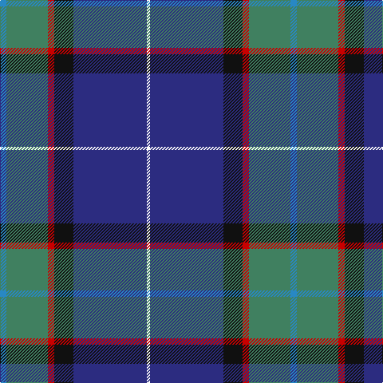

In pattern [BGRKBW](/patterns/bgrkbw/).

This was sourced from register-of-tartans.  It is a [6 stripes tartan](/stripes/stripes6/).

Original link https://www.tartanregister.gov.uk/tartanDetails.aspx?ref=1309

## Attestations

This cloth appears in 2 source records; the oldest owns this page.

- 15/02/2004 — Gamblin Thompson (Personal) (register-of-tartans, [record](https://www.tartanregister.gov.uk/tartanDetails.aspx?ref=1309))
- pre 2004 — Gamblin Thompson (Personal) (tartans-authority, [record](http://www.tartansauthority.com/tartan-ferret/display/6195/))

## Thread count
B/8 G52 R8 K24 DB92 W/4

## Palette
Each colour and its ΔE from the base-6 reference it is a variant of.

| Colour | Shade | Base | ΔE (OKLab) |
|---|---|---|---|
| B | <code style="background-color:#2888C4;">#2888C4</code> `#2888C4` | B <code style="background-color:#2A418A;">#2A418A</code> | 0.21 |
| DB | <code style="background-color:#2C2C80;">#2C2C80</code> `#2C2C80` | B <code style="background-color:#2A418A;">#2A418A</code> | 0.06 |
| G | <code style="background-color:#408060;">#408060</code> `#408060` | G <code style="background-color:#006100;">#006100</code> | 0.14 |
| K | <code style="background-color:#101010;">#101010</code> `#101010` | K <code style="background-color:#000000;">#000000</code> | 0.17 |
| R | <code style="background-color:#C80000;">#C80000</code> `#C80000` | R <code style="background-color:#CC0000;">#CC0000</code> | 0.01 |
| W | <code style="background-color:#FCFCFC;">#FCFCFC</code> `#FCFCFC` | W <code style="background-color:#F7F7F7;">#F7F7F7</code> | 0.01 |

# Sample pattern

## Nearest tartans

The nearest existing variants by ΔTartan distance.

1. [Shearer (2016)](/setts/s6/k4b4ba32r4bb17w2~b646464-ba003c64-bb788cb4-k000000-rc8002c-wfcfcfc~x2/) — ΔT 0.82
1. [LLoyd of Astargus Canadian Family Tartan Tartan Number: 5771. Earliest known date: 2001 The designer of this tartan is of Welsh & Scottish blood and sees this tartan as being appropriate for any Lloyds with Scottish blood. The 'Astargus' derives from Gaelic - 'Astar' being said to mean "travelling or making distance" and 'gus' meaning "until I come back" See products available Copyright © Blair Urquhart, Comrie, 2015](/setts/s6/r3b38k13w3ra20y2~b202060-k101010-r800000-ra888888-we0e0e0-yf0c400~x2/) — ΔT 0.93
1. [Peterson, Oren (Name)](/setts/s6/w1g2r10ra1b15wa1~b2c2c80-g009020-r888888-rac80000-wc49cd8-wae0e0e0~x4/) — ΔT 1.08
1. [MacFadzean Clan Tartan Tartan Number: 645. Earliest known date: pre 2003 Nothing See products available Copyright © Blair Urquhart, Comrie, 2015](/setts/s6/b48w2k20g22r3g4~b2c2c80-g006818-k101010-rc80000-we0e0e0~x2/) — ΔT 1.09
1. [Hatfield & Mize (Personal)](/setts/s6/g10w2b10y5ba35r6~b1c1c1c-ba202060-g003820-rc80000-wffffff-ye0a126~x2/) — ΔT 1.10
1. [State Seal of Ohio (Fashion)](/setts/s9/b60y3b5ya5b9ba20y4g32w4~b2c2c80-ba441800-g006818-we8ccb8-ya08858-yabc8c00~x2/) — ΔT 1.11
1. [Blue Ridge Highlands Heritage](/setts/s8/b27ba9w3g6ba33w3bb3y2~b5c8ca8-ba2c2c80-bb680028-g00643c-wa8ace8-ye8c000~x2/) — ΔT 1.12
1. [Italian National](/setts/s6/r3w2g5k35b40y3~b2c2c80-g289c18-k101010-rc80000-wfcfcfc-ye8c000~x2/) — ΔT 1.14
1. [US Forces (Thurso) Regimental Tartan Tartan Number: 549. Earliest known date: 1986 Originally listed as MacNeil, this sett was identified by Ken Dalgliesh, weaver in Selkirk, in 1999. See products available Copyright © Blair Urquhart, Comrie, 2015](/setts/s7/b35r2k16y2ba25w2ba6~b202060-ba2888c4-k101010-rc80000-we0e0e0-ye8c000~x2/) — ΔT 1.14
1. [Ferster, James Carney (Personal)](/setts/s6/b12ba35w4wa3k11r5~b1474b4-ba003c64-k101010-r880000-w98c8e8-wafcfcfc~x2/) — ΔT 1.17

## Neighbour map

Every grey dot is one of 15726 variants placed by the first two principal components of the ΔTartan feature space (44% of its variance). Red is this tartan; blue dots are its nearest — click one to open its page.

<svg viewBox="0 0 640 380" role="img" style="max-width:100%;height:auto;border:1px solid #e0e0e0;border-radius:4px;display:block" xmlns="http://www.w3.org/2000/svg"><image href="/nn/cloud.v1.png" width="640" height="380"/><a href="/setts/s6/k4b4ba32r4bb17w2~b646464-ba003c64-bb788cb4-k000000-rc8002c-wfcfcfc~x2/"><circle cx="246.5" cy="148.7" r="4" fill="#3465a4"><title>Shearer (2016)</title></circle></a><a href="/setts/s6/r3b38k13w3ra20y2~b202060-k101010-r800000-ra888888-we0e0e0-yf0c400~x2/"><circle cx="234.0" cy="144.3" r="4" fill="#3465a4"><title>LLoyd of Astargus Canadian Family Tartan Tartan Number: 5771. Earliest known date: 2001 The designer of this tartan is of Welsh &amp; Scottish blood and sees this tartan as being appropriate for any Lloyds with Scottish blood. The 'Astargus' derives from Gaelic - 'Astar' being said to mean &quot;travelling or making distance&quot; and 'gus' meaning &quot;until I come back&quot; See products available Copyright © Blair Urquhart, Comrie, 2015</title></circle></a><a href="/setts/s6/w1g2r10ra1b15wa1~b2c2c80-g009020-r888888-rac80000-wc49cd8-wae0e0e0~x4/"><circle cx="267.4" cy="147.7" r="4" fill="#3465a4"><title>Peterson, Oren (Name)</title></circle></a><a href="/setts/s6/b48w2k20g22r3g4~b2c2c80-g006818-k101010-rc80000-we0e0e0~x2/"><circle cx="294.0" cy="168.5" r="4" fill="#3465a4"><title>MacFadzean Clan Tartan Tartan Number: 645. Earliest known date: pre 2003 Nothing See products available Copyright © Blair Urquhart, Comrie, 2015</title></circle></a><a href="/setts/s6/g10w2b10y5ba35r6~b1c1c1c-ba202060-g003820-rc80000-wffffff-ye0a126~x2/"><circle cx="251.8" cy="154.1" r="4" fill="#3465a4"><title>Hatfield &amp; Mize (Personal)</title></circle></a><a href="/setts/s9/b60y3b5ya5b9ba20y4g32w4~b2c2c80-ba441800-g006818-we8ccb8-ya08858-yabc8c00~x2/"><circle cx="283.2" cy="127.0" r="4" fill="#3465a4"><title>State Seal of Ohio (Fashion)</title></circle></a><a href="/setts/s8/b27ba9w3g6ba33w3bb3y2~b5c8ca8-ba2c2c80-bb680028-g00643c-wa8ace8-ye8c000~x2/"><circle cx="260.6" cy="141.2" r="4" fill="#3465a4"><title>Blue Ridge Highlands Heritage</title></circle></a><a href="/setts/s6/r3w2g5k35b40y3~b2c2c80-g289c18-k101010-rc80000-wfcfcfc-ye8c000~x2/"><circle cx="257.5" cy="141.5" r="4" fill="#3465a4"><title>Italian National</title></circle></a><a href="/setts/s7/b35r2k16y2ba25w2ba6~b202060-ba2888c4-k101010-rc80000-we0e0e0-ye8c000~x2/"><circle cx="195.2" cy="143.6" r="4" fill="#3465a4"><title>US Forces (Thurso) Regimental Tartan Tartan Number: 549. Earliest known date: 1986 Originally listed as MacNeil, this sett was identified by Ken Dalgliesh, weaver in Selkirk, in 1999. See products available Copyright © Blair Urquhart, Comrie, 2015</title></circle></a><a href="/setts/s6/b12ba35w4wa3k11r5~b1474b4-ba003c64-k101010-r880000-w98c8e8-wafcfcfc~x2/"><circle cx="217.0" cy="169.6" r="4" fill="#3465a4"><title>Ferster, James Carney (Personal)</title></circle></a><circle cx="265.5" cy="145.2" r="5" fill="#c00000"/></svg>

ID: /setts/s6/b2g13r2k6ba23w1~b2888c4-ba2c2c80-g408060-k101010-rc80000-wfcfcfc~x4/
