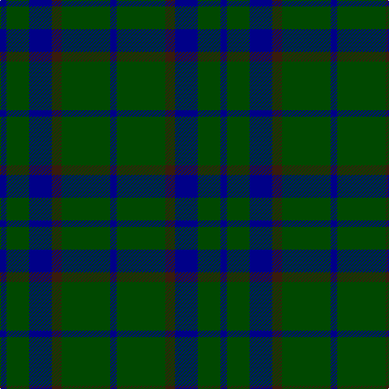

In pattern [BGBBGB](/patterns/bgbbgb/).

This was sourced from tartans-authority.  It is a [6 stripes tartan](/stripes/stripes6/).

Original link http://www.tartansauthority.com/tartan-ferret/display/5112/

## Thread count
DB/8 G28 DB28 K12 G60 DB/8

## Palette
Each colour and its ΔE from the base-6 reference it is a variant of.

| Colour | Shade | Base | ΔE (OKLab) |
|---|---|---|---|
| DB | <code style="background-color:#000088;">#000088</code> `#000088` | B <code style="background-color:#2A418A;">#2A418A</code> | 0.14 |
| G | <code style="background-color:#004800;">#004800</code> `#004800` | G <code style="background-color:#006100;">#006100</code> | 0.08 |
| K | <code style="background-color:#381C0C;">#381C0C</code> `#381C0C` | B <code style="background-color:#2A418A;">#2A418A</code> | 0.22 |

# Sample pattern

## Nearest tartans

The nearest existing variants by ΔTartan distance.

1. [Hamilton Hunting](/setts/s5/b11g2b15g18w2~b2c4084-g005020-we0e0e0~x2/) — ΔT 1.34
1. [Gunn (Logan)](/setts/s6/g2k12g1k12g12r2~g005020-k101010-rdc0000~x2/) — ΔT 1.43
1. [Menez Du](/setts/s9/b5k9g7k3g7k3g7k25g3~b202060-g006818-k101010~x2/) — ΔT 1.45
1. [Campbell of Lochawe Clan Tartan Tartan Number: 1038. Earliest known date: pre 2003 MacKinlay strip. Sample in STS collection. See products available Copyright © Blair Urquhart, Comrie, 2015](/setts/s5/k2b11k26g11k2~b2c2c80-g006818-k101010~x2/) — ΔT 1.52
1. [Letham Personal Tartan Tartan Number: 6718. Earliest known date: pre 2005 Jimmy said, in his recording application, "To allow my family to wear a single tartan" See products available Copyright © Blair Urquhart, Comrie, 2015](/setts/s8/g40k20b10k4b7g13k4b4~b2c2c80-g006428-k101010~x2/) — ΔT 1.54
1. [Unidentified Tweed](/setts/s6/b4w1b12g12b1g4~b2c4084-g005020-we0e0e0~x2/) — ΔT 1.55
1. [Black Watch (variation)](/setts/s6/k5g23k18b21k33b3~b202060-g006818-k101010~x2/) — ΔT 1.58
1. [Murray](/setts/s6/b3k16g16k16ba3b3~b3c82af-ba2c4084-g005020-k101010~x2/) — ΔT 1.58
1. [Lauder Clan Tartan Tartan Number: 709. Earliest known date: 1842 Possibly designed by Sir Thomas Dick Lauder who was a particular friend of the Sobieski brothers. The Setts No: 87. W & A K Johnston(1906). See products available Copyright © Blair Urquhart, Comrie, 2015](/setts/s6/g3b8g3k4g15r2~b2c2c80-g006818-k101010-rc80000~x2/) — ΔT 1.59
1. [Lauder (Family)](/setts/s6/g3b8g3k4g15r2~b202060-g006818-k101010-rc80000~x2/) — ΔT 1.61

## Neighbour map

Every grey dot is one of 15726 variants placed by the first two principal components of the ΔTartan feature space (44% of its variance). Red is this tartan; blue dots are its nearest — click one to open its page.

<svg viewBox="0 0 640 380" role="img" style="max-width:100%;height:auto;border:1px solid #e0e0e0;border-radius:4px;display:block" xmlns="http://www.w3.org/2000/svg"><image href="/nn/cloud.v1.png" width="640" height="380"/><a href="/setts/s5/b11g2b15g18w2~b2c4084-g005020-we0e0e0~x2/"><circle cx="363.5" cy="286.3" r="4" fill="#3465a4"><title>Hamilton Hunting</title></circle></a><a href="/setts/s6/g2k12g1k12g12r2~g005020-k101010-rdc0000~x2/"><circle cx="401.4" cy="265.0" r="4" fill="#3465a4"><title>Gunn (Logan)</title></circle></a><a href="/setts/s9/b5k9g7k3g7k3g7k25g3~b202060-g006818-k101010~x2/"><circle cx="362.6" cy="247.6" r="4" fill="#3465a4"><title>Menez Du</title></circle></a><a href="/setts/s5/k2b11k26g11k2~b2c2c80-g006818-k101010~x2/"><circle cx="382.8" cy="257.5" r="4" fill="#3465a4"><title>Campbell of Lochawe Clan Tartan Tartan Number: 1038. Earliest known date: pre 2003 MacKinlay strip. Sample in STS collection. See products available Copyright © Blair Urquhart, Comrie, 2015</title></circle></a><a href="/setts/s8/g40k20b10k4b7g13k4b4~b2c2c80-g006428-k101010~x2/"><circle cx="328.4" cy="237.3" r="4" fill="#3465a4"><title>Letham Personal Tartan Tartan Number: 6718. Earliest known date: pre 2005 Jimmy said, in his recording application, &quot;To allow my family to wear a single tartan&quot; See products available Copyright © Blair Urquhart, Comrie, 2015</title></circle></a><a href="/setts/s6/b4w1b12g12b1g4~b2c4084-g005020-we0e0e0~x2/"><circle cx="383.3" cy="262.2" r="4" fill="#3465a4"><title>Unidentified Tweed</title></circle></a><a href="/setts/s6/k5g23k18b21k33b3~b202060-g006818-k101010~x2/"><circle cx="344.2" cy="283.1" r="4" fill="#3465a4"><title>Black Watch (variation)</title></circle></a><a href="/setts/s6/b3k16g16k16ba3b3~b3c82af-ba2c4084-g005020-k101010~x2/"><circle cx="298.3" cy="276.9" r="4" fill="#3465a4"><title>Murray</title></circle></a><a href="/setts/s6/g3b8g3k4g15r2~b2c2c80-g006818-k101010-rc80000~x2/"><circle cx="326.0" cy="249.6" r="4" fill="#3465a4"><title>Lauder Clan Tartan Tartan Number: 709. Earliest known date: 1842 Possibly designed by Sir Thomas Dick Lauder who was a particular friend of the Sobieski brothers. The Setts No: 87. W &amp; A K Johnston(1906). See products available Copyright © Blair Urquhart, Comrie, 2015</title></circle></a><a href="/setts/s6/g3b8g3k4g15r2~b202060-g006818-k101010-rc80000~x2/"><circle cx="326.7" cy="250.4" r="4" fill="#3465a4"><title>Lauder (Family)</title></circle></a><circle cx="386.5" cy="284.9" r="5" fill="#c00000"/></svg>

ID: /setts/s6/b2g15ba3b7g7b2~b000088-ba381c0c-g004800~x4/
