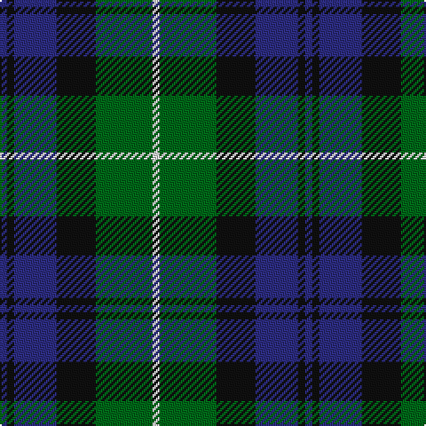

In pattern [BKBKGW](/patterns/bkbkgw/).

This was sourced from register-of-tartans.  It is a [6 stripes tartan](/stripes/stripes6/).

Original link https://www.tartanregister.gov.uk/tartanDetails.aspx?ref=514

## Thread count
DB/4 K4 DB24 K22 G32 LN/4

## Palette
Each colour and its ΔE from the base-6 reference it is a variant of.

| Colour | Shade | Base | ΔE (OKLab) |
|---|---|---|---|
| DB | <code style="background-color:#2C2C80;">#2C2C80</code> `#2C2C80` | B <code style="background-color:#2A418A;">#2A418A</code> | 0.06 |
| G | <code style="background-color:#006818;">#006818</code> `#006818` | G <code style="background-color:#006100;">#006100</code> | 0.02 |
| K | <code style="background-color:#101010;">#101010</code> `#101010` | K <code style="background-color:#000000;">#000000</code> | 0.17 |
| LN | <code style="background-color:#E0E0E0;">#E0E0E0</code> `#E0E0E0` | W <code style="background-color:#F7F7F7;">#F7F7F7</code> | 0.07 |

# Sample pattern

## Nearest tartans

The nearest existing variants by ΔTartan distance.

1. [Morrison Society](/setts/s6/k3g14k14g2b14r3~b1474b4-g006818-k101010-rc80000~x2/) — ΔT 0.55
1. [Unidentified No 26](/setts/s6/w4b4g22k20b20w3~b2c4084-g005020-k101010-we0e0e0/) — ΔT 0.58
1. [Glenturret Corporate Tartan Tartan Number: 1097. Earliest known date: 1988 Glenturret Distillery is open to the public. Visitors can view the whisky making process and taste the final product. Glenturret tartan goods are for sale in the distillery shop. See products available Copyright © Blair Urquhart, Comrie, 2015](/setts/s6/k3g14k14g2b15y2~b202060-g006818-k101010-ye8c000~x2/) — ΔT 0.61
1. [Hudson Valley Reg. Police P & D (Cor](/setts/s6/y5g16k16b16k2b2~b202060-g006818-k101010-ye8c000~x2/) — ΔT 0.66
1. [Redland](/setts/s6/g52w7g9k35b35k7~b2c2c80-g006818-k101010-w98c8e8/) — ΔT 0.67
1. [Blaylock Annandale](/setts/s7/g24b6w3k6b12k15g4~b1f5aba-g10712e-k101010-w9eafdb~x2/) — ΔT 0.74
1. [Ferguson of Balquhidder #2](/setts/s6/g4b24r3k24g25k4~b2c2c80-g006818-k101010-rc80000~x2/) — ΔT 0.75
1. [Graham of Menteith (Clan)](/setts/s6/g8b1g1k6ba6k1~b5c8ca8-ba2c2c80-g006818-k101010~x4/) — ΔT 0.78
1. [Morrison Clan Tartan Tartan Number: 1083. Earliest known date: 1908 The Clan Morrison have strong links with the MacKays and this is evident in the similarity of the tartans. Morrison has an added red stripe. Lord Lyon recorded a new sett in 1968 based on a fragment of Morrison tartan dated 1747. See products available Copyright © Blair Urquhart, Comrie, 2015](/setts/s6/k3g14k14g2b14r3~b2c2c80-g006818-k101010-rc80000~x2/) — ΔT 0.80
1. [Blair Clan Tartan Tartan Number: 416. Earliest known date: pre 1963 Described by MacKinlay as a "Modern family sett". See products available Copyright © Blair Urquhart, Comrie, 2015](/setts/s7/b3r1b10k8g10r1g3~b2c2c80-g006818-k101010-rc80000~x4/) — ΔT 0.84

## Neighbour map

Every grey dot is one of 15726 variants placed by the first two principal components of the ΔTartan feature space (44% of its variance). Red is this tartan; blue dots are its nearest — click one to open its page.

<svg viewBox="0 0 640 380" role="img" style="max-width:100%;height:auto;border:1px solid #e0e0e0;border-radius:4px;display:block" xmlns="http://www.w3.org/2000/svg"><image href="/nn/cloud.v1.png" width="640" height="380"/><a href="/setts/s6/k3g14k14g2b14r3~b1474b4-g006818-k101010-rc80000~x2/"><circle cx="159.5" cy="244.1" r="4" fill="#3465a4"><title>Morrison Society</title></circle></a><a href="/setts/s6/w4b4g22k20b20w3~b2c4084-g005020-k101010-we0e0e0/"><circle cx="146.4" cy="236.8" r="4" fill="#3465a4"><title>Unidentified No 26</title></circle></a><a href="/setts/s6/k3g14k14g2b15y2~b202060-g006818-k101010-ye8c000~x2/"><circle cx="183.1" cy="245.6" r="4" fill="#3465a4"><title>Glenturret Corporate Tartan Tartan Number: 1097. Earliest known date: 1988 Glenturret Distillery is open to the public. Visitors can view the whisky making process and taste the final product. Glenturret tartan goods are for sale in the distillery shop. See products available Copyright © Blair Urquhart, Comrie, 2015</title></circle></a><a href="/setts/s6/y5g16k16b16k2b2~b202060-g006818-k101010-ye8c000~x2/"><circle cx="147.9" cy="236.1" r="4" fill="#3465a4"><title>Hudson Valley Reg. Police P &amp; D (Cor</title></circle></a><a href="/setts/s6/g52w7g9k35b35k7~b2c2c80-g006818-k101010-w98c8e8/"><circle cx="204.1" cy="243.3" r="4" fill="#3465a4"><title>Redland</title></circle></a><a href="/setts/s7/g24b6w3k6b12k15g4~b1f5aba-g10712e-k101010-w9eafdb~x2/"><circle cx="185.9" cy="232.7" r="4" fill="#3465a4"><title>Blaylock Annandale</title></circle></a><a href="/setts/s6/g4b24r3k24g25k4~b2c2c80-g006818-k101010-rc80000~x2/"><circle cx="201.1" cy="243.1" r="4" fill="#3465a4"><title>Ferguson of Balquhidder #2</title></circle></a><a href="/setts/s6/g8b1g1k6ba6k1~b5c8ca8-ba2c2c80-g006818-k101010~x4/"><circle cx="214.6" cy="243.5" r="4" fill="#3465a4"><title>Graham of Menteith (Clan)</title></circle></a><a href="/setts/s6/k3g14k14g2b14r3~b2c2c80-g006818-k101010-rc80000~x2/"><circle cx="180.0" cy="251.8" r="4" fill="#3465a4"><title>Morrison Clan Tartan Tartan Number: 1083. Earliest known date: 1908 The Clan Morrison have strong links with the MacKays and this is evident in the similarity of the tartans. Morrison has an added red stripe. Lord Lyon recorded a new sett in 1968 based on a fragment of Morrison tartan dated 1747. See products available Copyright © Blair Urquhart, Comrie, 2015</title></circle></a><a href="/setts/s7/b3r1b10k8g10r1g3~b2c2c80-g006818-k101010-rc80000~x4/"><circle cx="207.5" cy="229.0" r="4" fill="#3465a4"><title>Blair Clan Tartan Tartan Number: 416. Earliest known date: pre 1963 Described by MacKinlay as a &quot;Modern family sett&quot;. See products available Copyright © Blair Urquhart, Comrie, 2015</title></circle></a><circle cx="181.0" cy="233.9" r="5" fill="#c00000"/></svg>

ID: /setts/s6/b2k2b12k11g16w2~b2c2c80-g006818-k101010-we0e0e0~x2/
