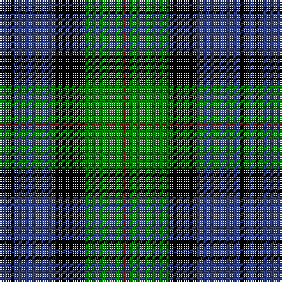

In pattern [BKBKGR](/patterns/bkbkgr/).

This was sourced from weddslist.  It is a [6 stripes tartan](/stripes/stripes6/).

Original link http://www.weddslist.com/cgi-bin/tartans/pg.pl?source=sts

## Thread count
B/4 K4 B24 K16 G22 R/4

## Palette
Each colour and its ΔE from the base-6 reference it is a variant of.

| Colour | Shade | Base | ΔE (OKLab) |
|---|---|---|---|
| B | <code style="background-color:#304080;">#304080</code> `#304080` | B <code style="background-color:#2A418A;">#2A418A</code> | 0.02 |
| G | <code style="background-color:#008000;">#008000</code> `#008000` | G <code style="background-color:#006100;">#006100</code> | 0.10 |
| K | <code style="background-color:#000000;">#000000</code> `#000000` | K <code style="background-color:#000000;">#000000</code> | 0.00 |
| R | <code style="background-color:#C00000;">#C00000</code> `#C00000` | R <code style="background-color:#CC0000;">#CC0000</code> | 0.03 |

# Sample pattern

## Nearest tartans

The nearest existing variants by ΔTartan distance.

1. [Campbell, The White Stripe](/setts/s6/b2k2b12k11g12w2x2~b304080-g008000-k000000-we0e0e0/) — ΔT 0.48
1. [Morrison](/setts/s6/k3g14k14g2b14r3x2~b304080-g008000-k000000-rc00000/) — ΔT 0.56
1. [Forbes](/setts/s7/b1k1b6k6g6k1w1x2~b304080-g008000-k000000-we0e0e0/) — ΔT 0.63
1. [Scottish Airports](/setts/s6/b4g18b3k17b18ba4x2~b102040-ba800070-g008000-k000000/) — ΔT 0.64
1. [Fletcher of Dunans](/setts/s7/b6k1b6k8r1g8r2x2~b304080-g008000-k000000-rc00000/) — ΔT 0.69
1. [Fletcher](/setts/s7/b6k1b6k8r1g8k2x2~b304080-g008000-k000000-rc00000/) — ΔT 0.71
1. [Ferguson](/setts/s6/g4b24r3k24g25k4x2~b304080-g008000-k000000-rc00000/) — ΔT 0.71
1. [Lennie](/setts/s6/g2b8k9ba2g10k2x2~b800080-ba5480b0-g008000-k000000/) — ΔT 0.72
1. [MacArthur of Milton, hunting](/setts/s6/g14b2g2k8ba9k2x2~b304080-ba800080-g008000-k000000/) — ΔT 0.77
1. [Wellington, or Waterloo](/setts/s6/b3g12k14b11r3b3x2~b5480b0-g008000-k000000-rc00000/) — ΔT 0.82

## Neighbour map

Every grey dot is one of 15726 variants placed by the first two principal components of the ΔTartan feature space (44% of its variance). Red is this tartan; blue dots are its nearest — click one to open its page.

<svg viewBox="0 0 640 380" role="img" style="max-width:100%;height:auto;border:1px solid #e0e0e0;border-radius:4px;display:block" xmlns="http://www.w3.org/2000/svg"><image href="/nn/cloud.v1.png" width="640" height="380"/><a href="/setts/s6/b2k2b12k11g12w2x2~b304080-g008000-k000000-we0e0e0/"><circle cx="125.5" cy="236.5" r="4" fill="#3465a4"><title>Campbell, The White Stripe</title></circle></a><a href="/setts/s6/k3g14k14g2b14r3x2~b304080-g008000-k000000-rc00000/"><circle cx="133.2" cy="235.5" r="4" fill="#3465a4"><title>Morrison</title></circle></a><a href="/setts/s7/b1k1b6k6g6k1w1x2~b304080-g008000-k000000-we0e0e0/"><circle cx="138.6" cy="223.6" r="4" fill="#3465a4"><title>Forbes</title></circle></a><a href="/setts/s6/b4g18b3k17b18ba4x2~b102040-ba800070-g008000-k000000/"><circle cx="158.5" cy="251.5" r="4" fill="#3465a4"><title>Scottish Airports</title></circle></a><a href="/setts/s7/b6k1b6k8r1g8r2x2~b304080-g008000-k000000-rc00000/"><circle cx="143.6" cy="227.6" r="4" fill="#3465a4"><title>Fletcher of Dunans</title></circle></a><a href="/setts/s7/b6k1b6k8r1g8k2x2~b304080-g008000-k000000-rc00000/"><circle cx="154.4" cy="232.0" r="4" fill="#3465a4"><title>Fletcher</title></circle></a><a href="/setts/s6/g4b24r3k24g25k4x2~b304080-g008000-k000000-rc00000/"><circle cx="151.1" cy="225.4" r="4" fill="#3465a4"><title>Ferguson</title></circle></a><a href="/setts/s6/g2b8k9ba2g10k2x2~b800080-ba5480b0-g008000-k000000/"><circle cx="123.5" cy="245.8" r="4" fill="#3465a4"><title>Lennie</title></circle></a><a href="/setts/s6/g14b2g2k8ba9k2x2~b304080-ba800080-g008000-k000000/"><circle cx="174.5" cy="226.4" r="4" fill="#3465a4"><title>MacArthur of Milton, hunting</title></circle></a><a href="/setts/s6/b3g12k14b11r3b3x2~b5480b0-g008000-k000000-rc00000/"><circle cx="111.9" cy="249.5" r="4" fill="#3465a4"><title>Wellington, or Waterloo</title></circle></a><circle cx="148.6" cy="240.0" r="5" fill="#c00000"/></svg>

ID: /setts/s6/b2k2b12k8g11r2x2~b304080-g008000-k000000-rc00000/
