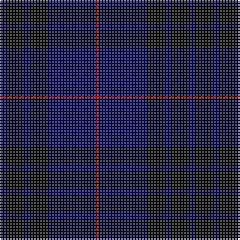

In pattern [BKBKBR](/patterns/bkbkbr/).

This was sourced from weddslist.  It is a [6 stripes tartan](/stripes/stripes6/).

Original link http://www.weddslist.com/cgi-bin/tartans/pg.pl?source=rb

## Thread count
DB/4 K12 DB4 K12 DB32 R/2

## Palette
Each colour and its ΔE from the base-6 reference it is a variant of.

| Colour | Shade | Base | ΔE (OKLab) |
|---|---|---|---|
| DB | <code style="background-color:#000064;">#000064</code> `#000064` | B <code style="background-color:#2A418A;">#2A418A</code> | 0.18 |
| K | <code style="background-color:#000000;">#000000</code> `#000000` | K <code style="background-color:#000000;">#000000</code> | 0.00 |
| R | <code style="background-color:#C80000;">#C80000</code> `#C80000` | R <code style="background-color:#CC0000;">#CC0000</code> | 0.01 |

# Sample pattern

## Nearest tartans

The nearest existing variants by ΔTartan distance.

1. [MacKay VS](/setts/s6/b2k6b2k6b16r1x2~b000052-k000000-raa0000/) — ΔT 0.81
1. [Atlin (Fashion)](/setts/s6/k14b14k14b40k3b2x2~b000060-k000000/) — ΔT 1.39
1. [Williams (New York) (Personal)](/setts/s5/k30b6k6b41w2x2~b000080-k101010-w87ceeb/) — ΔT 1.44
1. [Pride of Kinross](/setts/s8/k20b2k6b2k4b27w2b8x2~b2c2c80-k101010-wfcfcfc/) — ΔT 1.55
1. [Pride of Kinross](/setts/s8/k20b2k6b2k4b27w2b8x2~b2c2c80-k101010-wffffff/) — ΔT 1.55
1. [Argentina](/setts/s7/b5w3b33k3b3k36b3x2~b2c2c80-k00002c-we0e0e0/) — ΔT 1.61
1. [MacKay](/setts/s6/b2k6b2k6b16r1x2~b304080-k000000-rc00000/) — ΔT 1.64
1. [Jon's Theme (Fashion)](/setts/s6/k1y2k3b12k18w1x2~b2c2c80-k00002c-wfcfcfc-ybc8c00/) — ΔT 1.65
1. [St. Georges, Edgbaston](/setts/s7/r4k21w2k20b21k2b2x2~b304080-k000030-rc00000-we0e0e0/) — ΔT 1.65
1. [Argentina](/setts/s7/b5w3b33k3b3k36b3x2~b304080-k000030-we0e0e0/) — ΔT 1.71

## Neighbour map

Every grey dot is one of 15726 variants placed by the first two principal components of the ΔTartan feature space (44% of its variance). Red is this tartan; blue dots are its nearest — click one to open its page.

<svg viewBox="0 0 640 380" role="img" style="max-width:100%;height:auto;border:1px solid #e0e0e0;border-radius:4px;display:block" xmlns="http://www.w3.org/2000/svg"><image href="/nn/cloud.v1.png" width="640" height="380"/><a href="/setts/s6/b2k6b2k6b16r1x2~b000052-k000000-raa0000/"><circle cx="447.1" cy="251.3" r="4" fill="#3465a4"><title>MacKay VS</title></circle></a><a href="/setts/s6/k14b14k14b40k3b2x2~b000060-k000000/"><circle cx="498.1" cy="268.6" r="4" fill="#3465a4"><title>Atlin (Fashion)</title></circle></a><a href="/setts/s5/k30b6k6b41w2x2~b000080-k101010-w87ceeb/"><circle cx="433.3" cy="247.4" r="4" fill="#3465a4"><title>Williams (New York) (Personal)</title></circle></a><a href="/setts/s8/k20b2k6b2k4b27w2b8x2~b2c2c80-k101010-wfcfcfc/"><circle cx="388.1" cy="219.6" r="4" fill="#3465a4"><title>Pride of Kinross</title></circle></a><a href="/setts/s8/k20b2k6b2k4b27w2b8x2~b2c2c80-k101010-wffffff/"><circle cx="387.2" cy="219.2" r="4" fill="#3465a4"><title>Pride of Kinross</title></circle></a><a href="/setts/s7/b5w3b33k3b3k36b3x2~b2c2c80-k00002c-we0e0e0/"><circle cx="376.0" cy="220.8" r="4" fill="#3465a4"><title>Argentina</title></circle></a><a href="/setts/s6/b2k6b2k6b16r1x2~b304080-k000000-rc00000/"><circle cx="386.5" cy="219.6" r="4" fill="#3465a4"><title>MacKay</title></circle></a><a href="/setts/s6/k1y2k3b12k18w1x2~b2c2c80-k00002c-wfcfcfc-ybc8c00/"><circle cx="370.8" cy="193.6" r="4" fill="#3465a4"><title>Jon's Theme (Fashion)</title></circle></a><a href="/setts/s7/r4k21w2k20b21k2b2x2~b304080-k000030-rc00000-we0e0e0/"><circle cx="344.7" cy="221.0" r="4" fill="#3465a4"><title>St. Georges, Edgbaston</title></circle></a><a href="/setts/s7/b5w3b33k3b3k36b3x2~b304080-k000030-we0e0e0/"><circle cx="366.3" cy="216.2" r="4" fill="#3465a4"><title>Argentina</title></circle></a><circle cx="424.4" cy="241.8" r="5" fill="#c00000"/></svg>

ID: /setts/s6/b2k6b2k6b16r1x2~b000064-k000000-rc80000/
