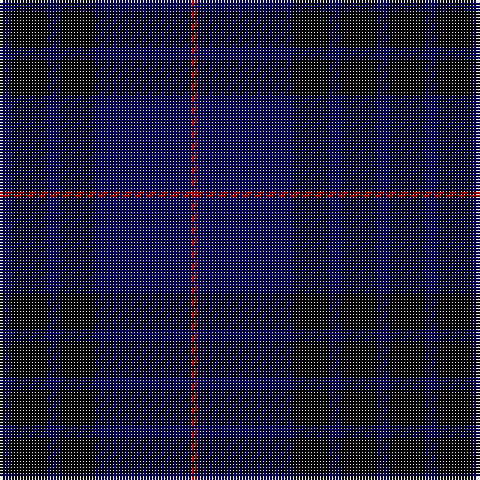

In pattern [BKBKBR](/patterns/bkbkbr/).

This was sourced from weddslist.  It is a [6 stripes tartan](/stripes/stripes6/).

Original link http://www.weddslist.com/cgi-bin/tartans/pg.pl?source=tinsel

## Attestations

This cloth appears in 2 source records; the oldest owns this page.

- undated — MacKay VS (weddslist, [record](http://www.weddslist.com/cgi-bin/tartans/pg.pl?source=tinsel))
- undated — MacKay VS (weddslist, [record](http://www.weddslist.com/cgi-bin/tartans/pg.pl?source=x))

## Thread count
DB/4 K12 DB4 K12 DB32 DR/2

## Palette
Each colour and its ΔE from the base-6 reference it is a variant of.

| Colour | Shade | Base | ΔE (OKLab) |
|---|---|---|---|
| DB | <code style="background-color:#000052;">#000052</code> `#000052` | B <code style="background-color:#2A418A;">#2A418A</code> | 0.20 |
| DR | <code style="background-color:#AA0000;">#AA0000</code> `#AA0000` | R <code style="background-color:#CC0000;">#CC0000</code> | 0.07 |
| K | <code style="background-color:#000000;">#000000</code> `#000000` | K <code style="background-color:#000000;">#000000</code> | 0.00 |

# Sample pattern

## Nearest tartans

The nearest existing variants by ΔTartan distance.

1. [MacKay V](/setts/s6/b2k6b2k6b16r1~b000064-k000000-rc80000~x2/) — ΔT 0.81
1. [Atlin (Fashion)](/setts/s6/k14b14k14b40k3b2~b000060-k000000~x2/) — ΔT 1.15
1. [Williams (New York) (Personal)](/setts/s5/k30b6k6b41w2~b000080-k101010-w87ceeb~x2/) — ΔT 1.30
1. [Largan (?)](/setts/s6/b8k39b8k39b87r6~b2c2c80-k101010-rc80000/) — ΔT 1.50
1. [Perthshire, New /Tourist Board](/setts/s6/b37r10g22b11g3r3~b000050-g003000-r800000~x2/) — ΔT 1.55
1. [The Caledonian Hotel](/setts/s8/k24k3k3k3k3k18g20r4~g003000-k000030-rc00000~x2/) — ΔT 1.71
1. [Gagetown (School)](/setts/s6/b2k11b5k1b5k1~b343498-k101010~x6/) — ΔT 1.77
1. [Pride of Kinross](/setts/s8/k20b2k6b2k4b27w2b8~b2c2c80-k101010-wfcfcfc~x2/) — ΔT 1.77
1. [Marchmont (Personal)](/setts/s7/g1b12k12g1k12b12k1~b2c2c80-g289c18-k101010~x4/) — ΔT 1.78
1. [Pride of Kinross](/setts/s8/k20b2k6b2k4b27w2b8~b2c2c80-k101010-wffffff~x2/) — ΔT 1.79

## Neighbour map

Every grey dot is one of 15726 variants placed by the first two principal components of the ΔTartan feature space (44% of its variance). Red is this tartan; blue dots are its nearest — click one to open its page.

<svg viewBox="0 0 640 380" role="img" style="max-width:100%;height:auto;border:1px solid #e0e0e0;border-radius:4px;display:block" xmlns="http://www.w3.org/2000/svg"><image href="/nn/cloud.v1.png" width="640" height="380"/><a href="/setts/s6/b2k6b2k6b16r1~b000064-k000000-rc80000~x2/"><circle cx="424.4" cy="241.8" r="4" fill="#3465a4"><title>MacKay V</title></circle></a><a href="/setts/s6/k14b14k14b40k3b2~b000060-k000000~x2/"><circle cx="498.1" cy="268.6" r="4" fill="#3465a4"><title>Atlin (Fashion)</title></circle></a><a href="/setts/s5/k30b6k6b41w2~b000080-k101010-w87ceeb~x2/"><circle cx="433.3" cy="247.4" r="4" fill="#3465a4"><title>Williams (New York) (Personal)</title></circle></a><a href="/setts/s6/b8k39b8k39b87r6~b2c2c80-k101010-rc80000/"><circle cx="427.8" cy="248.7" r="4" fill="#3465a4"><title>Largan (?)</title></circle></a><a href="/setts/s6/b37r10g22b11g3r3~b000050-g003000-r800000~x2/"><circle cx="385.4" cy="259.4" r="4" fill="#3465a4"><title>Perthshire, New /Tourist Board</title></circle></a><a href="/setts/s8/k24k3k3k3k3k18g20r4~g003000-k000030-rc00000~x2/"><circle cx="462.0" cy="269.1" r="4" fill="#3465a4"><title>The Caledonian Hotel</title></circle></a><a href="/setts/s6/b2k11b5k1b5k1~b343498-k101010~x6/"><circle cx="411.0" cy="276.4" r="4" fill="#3465a4"><title>Gagetown (School)</title></circle></a><a href="/setts/s8/k20b2k6b2k4b27w2b8~b2c2c80-k101010-wfcfcfc~x2/"><circle cx="388.1" cy="219.6" r="4" fill="#3465a4"><title>Pride of Kinross</title></circle></a><a href="/setts/s7/g1b12k12g1k12b12k1~b2c2c80-g289c18-k101010~x4/"><circle cx="364.4" cy="258.8" r="4" fill="#3465a4"><title>Marchmont (Personal)</title></circle></a><a href="/setts/s8/k20b2k6b2k4b27w2b8~b2c2c80-k101010-wffffff~x2/"><circle cx="387.2" cy="219.2" r="4" fill="#3465a4"><title>Pride of Kinross</title></circle></a><circle cx="447.1" cy="251.3" r="5" fill="#c00000"/></svg>

ID: /setts/s6/b2k6b2k6b16r1~b000052-k000000-raa0000~x2/
