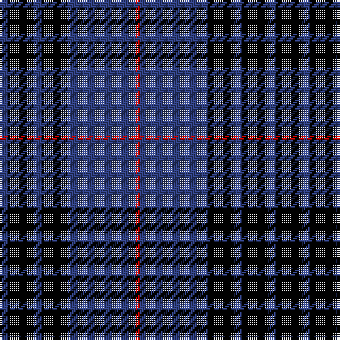

In pattern [BKBKBR](/patterns/bkbkbr/).

This was sourced from weddslist.  It is a [6 stripes tartan](/stripes/stripes6/).

Original link http://www.weddslist.com/cgi-bin/tartans/pg.pl?source=sts

## Thread count
B/4 K12 B4 K12 B32 R/2

## Palette
Each colour and its ΔE from the base-6 reference it is a variant of.

| Colour | Shade | Base | ΔE (OKLab) |
|---|---|---|---|
| B | <code style="background-color:#304080;">#304080</code> `#304080` | B <code style="background-color:#2A418A;">#2A418A</code> | 0.02 |
| K | <code style="background-color:#000000;">#000000</code> `#000000` | K <code style="background-color:#000000;">#000000</code> | 0.00 |
| R | <code style="background-color:#C00000;">#C00000</code> `#C00000` | R <code style="background-color:#CC0000;">#CC0000</code> | 0.03 |

# Sample pattern

## Nearest tartans

The nearest existing variants by ΔTartan distance.

1. [Jon's Theme](/setts/s6/k1y2k3b12k18w1~b555b7c-k010542-wffffff-y9e8f00~x2/) — ΔT 1.25
1. [Jon's Theme (Fashion)](/setts/s6/k1y2k3b12k18w1~b2c2c80-k00002c-wfcfcfc-ybc8c00~x2/) — ΔT 1.25
1. [Press & Journal](/setts/s5/k9b3k28b25w2~b4c5484-k101010-we0e0e0~x2/) — ΔT 1.25
1. [MacKay, Blue](/setts/s5/k15b4k15b28r2~b304080-k000000-rc00000~x2/) — ΔT 1.26
1. [BC Corps of Commissionaires](/setts/s7/b12w1r3w1r3w1b6~b141e46-r800028-we0e0e0~x4/) — ΔT 1.34
1. [Pride of Nova Scotia (Corporate)](/setts/s7/k3y2k36b16k5b2w3~b344454-k00002c-we0e0e0-ybc8c00~x2/) — ΔT 1.34
1. [St. Georges, Edgbaston](/setts/s7/r4k21w2k20b21k2b2~b304080-k000030-rc00000-we0e0e0~x2/) — ΔT 1.41
1. [Scottish Nuclear](/setts/s4/r4b32k15w2~b304080-k000000-rc00000-we0e0e0~x2/) — ΔT 1.43
1. [Oakleigh (Corporate)](/setts/s6/b4k1b20k20y1k4~b1474b4-k101010-ye8c000~x4/) — ΔT 1.49
1. [Embrace, The](/setts/s8/b10r24b4r3b24w2r6b6~b000088-r8c0000-wfcfcfc~x2/) — ΔT 1.54

## Neighbour map

Every grey dot is one of 15726 variants placed by the first two principal components of the ΔTartan feature space (44% of its variance). Red is this tartan; blue dots are its nearest — click one to open its page.

<svg viewBox="0 0 640 380" role="img" style="max-width:100%;height:auto;border:1px solid #e0e0e0;border-radius:4px;display:block" xmlns="http://www.w3.org/2000/svg"><image href="/nn/cloud.v1.png" width="640" height="380"/><a href="/setts/s6/k1y2k3b12k18w1~b555b7c-k010542-wffffff-y9e8f00~x2/"><circle cx="363.3" cy="187.4" r="4" fill="#3465a4"><title>Jon's Theme</title></circle></a><a href="/setts/s6/k1y2k3b12k18w1~b2c2c80-k00002c-wfcfcfc-ybc8c00~x2/"><circle cx="370.8" cy="193.6" r="4" fill="#3465a4"><title>Jon's Theme (Fashion)</title></circle></a><a href="/setts/s5/k9b3k28b25w2~b4c5484-k101010-we0e0e0~x2/"><circle cx="368.4" cy="242.4" r="4" fill="#3465a4"><title>Press &amp; Journal</title></circle></a><a href="/setts/s5/k15b4k15b28r2~b304080-k000000-rc00000~x2/"><circle cx="322.7" cy="247.9" r="4" fill="#3465a4"><title>MacKay, Blue</title></circle></a><a href="/setts/s7/b12w1r3w1r3w1b6~b141e46-r800028-we0e0e0~x4/"><circle cx="393.7" cy="210.4" r="4" fill="#3465a4"><title>BC Corps of Commissionaires</title></circle></a><a href="/setts/s7/k3y2k36b16k5b2w3~b344454-k00002c-we0e0e0-ybc8c00~x2/"><circle cx="411.0" cy="178.0" r="4" fill="#3465a4"><title>Pride of Nova Scotia (Corporate)</title></circle></a><a href="/setts/s7/r4k21w2k20b21k2b2~b304080-k000030-rc00000-we0e0e0~x2/"><circle cx="344.7" cy="221.0" r="4" fill="#3465a4"><title>St. Georges, Edgbaston</title></circle></a><a href="/setts/s4/r4b32k15w2~b304080-k000000-rc00000-we0e0e0~x2/"><circle cx="343.6" cy="212.3" r="4" fill="#3465a4"><title>Scottish Nuclear</title></circle></a><a href="/setts/s6/b4k1b20k20y1k4~b1474b4-k101010-ye8c000~x4/"><circle cx="349.7" cy="201.4" r="4" fill="#3465a4"><title>Oakleigh (Corporate)</title></circle></a><a href="/setts/s8/b10r24b4r3b24w2r6b6~b000088-r8c0000-wfcfcfc~x2/"><circle cx="350.6" cy="214.2" r="4" fill="#3465a4"><title>Embrace, The</title></circle></a><circle cx="386.5" cy="219.6" r="5" fill="#c00000"/></svg>

ID: /setts/s6/b2k6b2k6b16r1~b304080-k000000-rc00000~x2/
