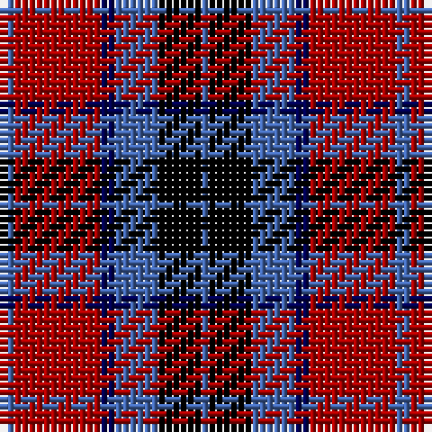

In pattern [BKBBRB](/patterns/bkbbrb/).

This was sourced from weddslist.  It is a [6 stripes tartan](/stripes/stripes6/).

Original link http://www.weddslist.com/cgi-bin/tartans/pg.pl?source=x

## Thread count
B/2 DR12 DB2 B6 K6 B/1

## Palette
Each colour and its ΔE from the base-6 reference it is a variant of.

| Colour | Shade | Base | ΔE (OKLab) |
|---|---|---|---|
| B | <code style="background-color:#4367AE;">#4367AE</code> `#4367AE` | B <code style="background-color:#2A418A;">#2A418A</code> | 0.12 |
| DB | <code style="background-color:#000052;">#000052</code> `#000052` | B <code style="background-color:#2A418A;">#2A418A</code> | 0.20 |
| DR | <code style="background-color:#AA0000;">#AA0000</code> `#AA0000` | R <code style="background-color:#CC0000;">#CC0000</code> | 0.07 |
| K | <code style="background-color:#000000;">#000000</code> `#000000` | K <code style="background-color:#000000;">#000000</code> | 0.00 |

# Sample pattern

## Nearest tartans

The nearest existing variants by ΔTartan distance.

1. [MacTavish](/setts/s6/b4r24ba4b12k12b2-b4367ae-ba000052-k000000-raa0000/) — ΔT 0.00
1. [Graham of Menteith, (Red)](/setts/s6/r52b6r8k32ba32k8-b5480b0-ba304080-k000000-rc00000/) — ΔT 0.85
1. [Graham of Menteith (Red)](/setts/s6/r72w6r10k42b48k6-b2c2c80-k101010-rc80000-wa8ace8/) — ΔT 0.91
1. [Biffy Clyro](/setts/s7/y6b44k6b6k22r40y6-b202060-k101010-rc80000-yfccc00/) — ΔT 0.96
1. [Dunbog Primary (School)](/setts/s6/r24b6g10b32y4g4-b000048-g447438-rc80000-ye8c000/) — ΔT 1.03
1. [Gingles (Personal)](/setts/s5/k60w8y15b74k14-b780078-k101010-we0e0e0-yd87c00/) — ΔT 1.04
1. [Thompson/Thomson/MacTavish](/setts/s6/b8r48ba8b24k24b4-b3c82af-ba2c4084-k101010-rdc0000/) — ΔT 1.06
1. [O2 (Corporate)](/setts/s5/k30b4r30ba12bb2-b2c2c80-ba1474b4-bb2474e8-k00002c-rc80000/) — ΔT 1.07
1. [Wounded Warriors Canada](/setts/s7/r18k8r18k50y6b36k8-b780078-k101010-rc80000-ye8c000/) — ΔT 1.07
1. [Biffy Clyro](/setts/s7/y6b44k6b6k22r40y6-b1c0070-k000000-rdc0000-yffcc00/) — ΔT 1.07

## Neighbour map

Every grey dot is one of 15726 variants placed by the first two principal components of the ΔTartan feature space (44% of its variance). Red is this tartan; blue dots are its nearest — click one to open its page.

<svg viewBox="0 0 640 380" role="img" style="max-width:100%;height:auto;border:1px solid #e0e0e0;border-radius:4px;display:block" xmlns="http://www.w3.org/2000/svg"><image href="/nn/cloud.v1.png" width="640" height="380"/><a href="/setts/s6/b4r24ba4b12k12b2-b4367ae-ba000052-k000000-raa0000/"><circle cx="208.6" cy="196.0" r="4" fill="#3465a4"><title>MacTavish</title></circle></a><a href="/setts/s6/r52b6r8k32ba32k8-b5480b0-ba304080-k000000-rc00000/"><circle cx="204.9" cy="208.8" r="4" fill="#3465a4"><title>Graham of Menteith, (Red)</title></circle></a><a href="/setts/s6/r72w6r10k42b48k6-b2c2c80-k101010-rc80000-wa8ace8/"><circle cx="248.1" cy="194.9" r="4" fill="#3465a4"><title>Graham of Menteith (Red)</title></circle></a><a href="/setts/s7/y6b44k6b6k22r40y6-b202060-k101010-rc80000-yfccc00/"><circle cx="178.1" cy="199.1" r="4" fill="#3465a4"><title>Biffy Clyro</title></circle></a><a href="/setts/s6/r24b6g10b32y4g4-b000048-g447438-rc80000-ye8c000/"><circle cx="222.1" cy="210.0" r="4" fill="#3465a4"><title>Dunbog Primary (School)</title></circle></a><a href="/setts/s5/k60w8y15b74k14-b780078-k101010-we0e0e0-yd87c00/"><circle cx="246.7" cy="217.7" r="4" fill="#3465a4"><title>Gingles (Personal)</title></circle></a><a href="/setts/s6/b8r48ba8b24k24b4-b3c82af-ba2c4084-k101010-rdc0000/"><circle cx="215.5" cy="192.8" r="4" fill="#3465a4"><title>Thompson/Thomson/MacTavish</title></circle></a><a href="/setts/s5/k30b4r30ba12bb2-b2c2c80-ba1474b4-bb2474e8-k00002c-rc80000/"><circle cx="196.0" cy="180.9" r="4" fill="#3465a4"><title>O2 (Corporate)</title></circle></a><a href="/setts/s7/r18k8r18k50y6b36k8-b780078-k101010-rc80000-ye8c000/"><circle cx="228.9" cy="209.9" r="4" fill="#3465a4"><title>Wounded Warriors Canada</title></circle></a><a href="/setts/s7/y6b44k6b6k22r40y6-b1c0070-k000000-rdc0000-yffcc00/"><circle cx="161.8" cy="192.9" r="4" fill="#3465a4"><title>Biffy Clyro</title></circle></a><circle cx="208.6" cy="196.0" r="5" fill="#c00000"/></svg>

ID: /setts/s6/b2r12ba2b6k6b1-b4367ae-ba000052-k000000-raa0000/
