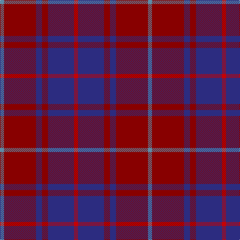

In pattern [BRBRBR](/patterns/brbrbr/).

This was sourced from house-of-tartan.  It is a [6 stripes tartan](/stripes/stripes6/).

Original link http://www.house-of-tartan.scotland.net/house/TartanViewjs.asp?colr=Def&tnam=459

## Thread count
B/8 DR64 DB12 DR12 DB52 R/8

## Palette
Each colour and its ΔE from the base-6 reference it is a variant of.

| Colour | Shade | Base | ΔE (OKLab) |
|---|---|---|---|
| B | <code style="background-color:#5C8CA8;">#5C8CA8</code> `#5C8CA8` | B <code style="background-color:#2A418A;">#2A418A</code> | 0.23 |
| DB | <code style="background-color:#2C2C80;">#2C2C80</code> `#2C2C80` | B <code style="background-color:#2A418A;">#2A418A</code> | 0.06 |
| DR | <code style="background-color:#880000;">#880000</code> `#880000` | R <code style="background-color:#CC0000;">#CC0000</code> | 0.15 |
| R | <code style="background-color:#C80000;">#C80000</code> `#C80000` | R <code style="background-color:#CC0000;">#CC0000</code> | 0.01 |

# Sample pattern

## Nearest tartans

The nearest existing variants by ΔTartan distance.

1. [MacArthur-Fox, dress](/setts/s6/b2r16ba3r3ba13ra2~b5480b0-ba304080-r800000-rac00000~x4/) — ΔT 0.73
1. [Eglington](/setts/s6/b2r2b17ra17rb2ra2~b1c1c1c-rec34c4-ra880000-rba07c58~x4/) — ΔT 1.28
1. [Montgomrie/Montgomery of Eglinton](/setts/s7/k4g5k4b28k4r5k4~b440044-g006818-k101010-rc80000~x2/) — ΔT 1.34
1. [Hillsdale (Corporate?)](/setts/s5/b13ba6r51b51ba5~b1c1c50-ba5c5c5c-r880000~x2/) — ΔT 1.34
1. [Rajput](/setts/s6/b6r39b10r10b21y5~b2c2c80-r880000-ye8c000~x2/) — ΔT 1.41
1. [Cameron Hunting Brown Clan Tartan Tartan Number: 1745. Earliest known date: 1916 Nothing See products available Copyright © Blair Urquhart, Comrie, 2015](/setts/s6/g15r5g30b32g4y3~b2c2c80-g604000-rc80000-ye8c000~x2/) — ΔT 1.50
1. [Wounded Warriors Canada](/setts/s7/r9k4r9k25ra3b18k4~b780078-k101010-ra00000-raa07c00~x2/) — ΔT 1.53
1. [Robbins](/setts/s6/b1r3b1r3b6g1~b304080-g008000-r900030~x4/) — ΔT 1.54
1. [Perthshire Tourist Board (Corporate)](/setts/s6/b26r6g16b8g3r2~b500048-g006818-r880000~x2/) — ΔT 1.56
1. [Balfour blue & brown](/setts/s6/b18y2r6y2r19ra3~b304080-r806050-rac00000-yf0c000~x2/) — ΔT 1.56

## Neighbour map

Every grey dot is one of 15726 variants placed by the first two principal components of the ΔTartan feature space (44% of its variance). Red is this tartan; blue dots are its nearest — click one to open its page.

<svg viewBox="0 0 640 380" role="img" style="max-width:100%;height:auto;border:1px solid #e0e0e0;border-radius:4px;display:block" xmlns="http://www.w3.org/2000/svg"><image href="/nn/cloud.v1.png" width="640" height="380"/><a href="/setts/s6/b2r16ba3r3ba13ra2~b5480b0-ba304080-r800000-rac00000~x4/"><circle cx="347.4" cy="239.4" r="4" fill="#3465a4"><title>MacArthur-Fox, dress</title></circle></a><a href="/setts/s6/b2r2b17ra17rb2ra2~b1c1c1c-rec34c4-ra880000-rba07c58~x4/"><circle cx="323.1" cy="217.6" r="4" fill="#3465a4"><title>Eglington</title></circle></a><a href="/setts/s7/k4g5k4b28k4r5k4~b440044-g006818-k101010-rc80000~x2/"><circle cx="331.3" cy="222.7" r="4" fill="#3465a4"><title>Montgomrie/Montgomery of Eglinton</title></circle></a><a href="/setts/s5/b13ba6r51b51ba5~b1c1c50-ba5c5c5c-r880000~x2/"><circle cx="386.1" cy="262.7" r="4" fill="#3465a4"><title>Hillsdale (Corporate?)</title></circle></a><a href="/setts/s6/b6r39b10r10b21y5~b2c2c80-r880000-ye8c000~x2/"><circle cx="348.3" cy="248.6" r="4" fill="#3465a4"><title>Rajput</title></circle></a><a href="/setts/s6/g15r5g30b32g4y3~b2c2c80-g604000-rc80000-ye8c000~x2/"><circle cx="354.7" cy="231.9" r="4" fill="#3465a4"><title>Cameron Hunting Brown Clan Tartan Tartan Number: 1745. Earliest known date: 1916 Nothing See products available Copyright © Blair Urquhart, Comrie, 2015</title></circle></a><a href="/setts/s7/r9k4r9k25ra3b18k4~b780078-k101010-ra00000-raa07c00~x2/"><circle cx="254.9" cy="224.8" r="4" fill="#3465a4"><title>Wounded Warriors Canada</title></circle></a><a href="/setts/s6/b1r3b1r3b6g1~b304080-g008000-r900030~x4/"><circle cx="364.0" cy="282.5" r="4" fill="#3465a4"><title>Robbins</title></circle></a><a href="/setts/s6/b26r6g16b8g3r2~b500048-g006818-r880000~x2/"><circle cx="377.9" cy="237.7" r="4" fill="#3465a4"><title>Perthshire Tourist Board (Corporate)</title></circle></a><a href="/setts/s6/b18y2r6y2r19ra3~b304080-r806050-rac00000-yf0c000~x2/"><circle cx="316.2" cy="222.9" r="4" fill="#3465a4"><title>Balfour blue &amp; brown</title></circle></a><circle cx="330.2" cy="231.3" r="5" fill="#c00000"/></svg>

ID: /setts/s6/b2r16ba3r3ba13ra2~b5c8ca8-ba2c2c80-r880000-rac80000~x4/
